# Cairn

**Persistent memory for expensive computation.**

Your expensive command already ran. Somewhere — on a laptop, in CI, on a Fargate
task in another region. Cairn decides whether that result can be used, joins the
run that is already in flight instead of starting a second one, takes over work
whose owner disappeared, and repairs only the fragments a change could actually
have touched. It reuses a result only when recorded evidence says it may.

<div align="center">

[](https://github.com/darved2305/Cairn/actions/workflows/ci.yml)
[](LICENSE)
[](pyproject.toml)
[](tui-rs)
[](docs/architecture/SUBSTRATES.md)
[](infra)

[Quickstart](#quickstart) · [How it works](#how-cairn-thinks-about-a-run) ·
[Coordination](#distributed-coordination) · [CLI](#cli) ·
[Support boundary](#support-boundary) · [Docs](docs/README.md)

</div>

---

<div align="center">
  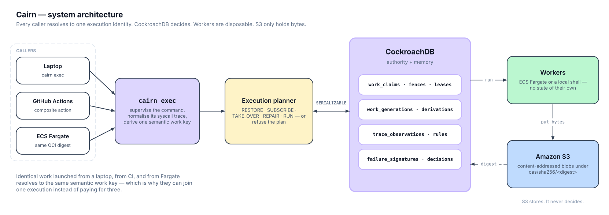
</div>

---

## The problem

Expensive compute gets repeated for reasons that have little to do with whether
the output would actually be different.

Every build cache you already use — Make, Bazel, DVC, Metaflow, W&B artifacts,
Dagster asset caches, Docker layers — is a **declared-input hasher**. It keys on
the inputs you declared and invalidates when that key changes. Correct,
conservative, and lossy in one specific way:

> A change to a declared input is treated as proof of invalidation. It is not.
> It is only *evidence of possible* invalidation.

And declared-input hashing says nothing at all about the other three ways
compute gets wasted:

| | What happens without Cairn |
| --- | --- |
| **Duplicate work** | Two machines start the same expensive job at the same time. Both finish. You paid twice. |
| **Orphaned work** | The machine holding a half-finished job dies. Everything it did is thrown away. |
| **Known failures** | A run that failed for a well-understood reason last week is attempted again, at full cost, before failing the same way. |

---

## What Cairn does

<table>
<tr>
<td width="50%" valign="top">

### Remember completed computation

A command's identity is derived from what it *actually read* — argv, cwd,
declared environment, the immutable image digest, and the normalised syscall
trace — not from a directory hash. When the evidence still supports it, the
recorded result is restored instead of recomputed.

</td>
<td width="50%" valign="top">

### Join work already running

Identical semantic work anywhere produces an identical work key. The first
caller becomes the owner; every later caller becomes a subscriber on the same
generation and adopts the result. No second execution starts.

</td>
</tr>
<tr>
<td valign="top">

### Recover ownership

When a lease expires, the next contender takes the claim, increments the fence,
and writes an `ownership_transfers` row — all in one transaction. The
dispossessed owner's publication is then structurally rejected.

</td>
<td valign="top">

### Remember failures

Every failed run writes a structured feature vector plus a 1024-d embedding of a
normalised failure summary. A new plan is checked against that memory *before*
any claim is taken.

</td>
</tr>
<tr>
<td valign="top">

### Repair changed fragments

Under `jsonl-map/v1`, the input is bucketed into 64 stable leaves. One changed
record invalidates one leaf. The other 63 are restored by digest, and the root
republishes only after every current child leaf is re-verified.

</td>
<td valign="top">

### Refuse, and say why

Missing evidence never becomes a cache hit. Every refusal carries the coverage
state that caused it, the rule revision in force, and the decision row that
recorded it.

</td>
</tr>
</table>

---

## Execution memory, live

Bare `cairn` on a TTY launches a native terminal UI (Rust + `ratatui`) that
keeps the pipeline, the live claim race, the decision ledger, and failure memory
on screen at once. The Python side never renders it: it writes a versioned
NDJSON event stream at real state transitions, and the TUI tails that and
spawns real `cairn <subcommand>` calls of its own.

```
 cairn │ Searching causal memory │ 1/5 stages │ run 1111111… │ worker-a @ us-east-1 │ 1 live claim
┏ 1 Pipeline (5) ━━━━━━━━━━━━━━━━━━━━━━━━━━━━━━━━━━━━━━━━━━━━━━━━━━━━━━━━━━━━━━━━━━━━━━━━━━━━━━━━━━━━━━━━━━━━━━━━━━━━━━━━━━━━━━━━━━┓
┃▸● env                   →  ○ dataset              →  ○ features              →  ○ checkpoint           →  ○ eval                 ┃
┃  done                       planned                   planned                    planned                   planned               ┃
┃  REUSE                                                unsound                                                                    ┃
┃  cosmetic                                                                                                                        ┃
┃  probe ok                                                                                                                        ┃
┃  ████▏░ 69%                                                                                                                      ┃
┃  0ms                                                                                                                             ┃
┃  art-env                                                                                                                         ┃
┗━━━━━━━━━━━━━━━━━━━━━━━━━━━━━━━━━━━━━━━━━━━━━━━━━━━━━━━━━━━━━━━━━━━━━━━━━━━━━━━━━━━━━━━━━━━━━━━━━━━━━━━━━━━━━━━━━━━━━━━━━━━━━━━━━━┛
┌ 2 Claims (1) ─────────────────────────────────────────────────────────┐┌ 3 Ledger (1) ───────────────────────────────────────────┐
│features  [contended]  wk-features                                     ││REUSE                env        reused                   │
│  owner  worker-b @ eu-west-1 #3                                       ││  by probe  cosmetic  12ms                               │
│  waiting worker-a @ us-east-1                                         ││  probe passed at tolerance                              │
│  lease  ████████████████████████ 45.0s                                ││                                                         │
│  beat   next in 10.0s   1 beats                                       ││                                                         │
└───────────────────────────────────────────────────────────────────────┘└─────────────────────────────────────────────────────────┘
┌ 4 Memory (2) ─────────────────────────────────────────────────────────┐┌ 5 Log (9) ──────────────────────────────────────────────┐
│"cuda oom"  2 match(es), 1 verified  stage checkpoint                  ││12:04:31   Run started · target eval · us-east-1         │
│                                                                       ││12:04:31   Planned 5 stage(s) · structurally unsound: fea│
│◆ OutOfMemoryError  checkpoint   d=0.041                               ││12:04:31   stage env started                             │
│  batch 64 OOMs on g5.xlarge                                           ││12:04:31   probe sampled_equivalence · 88/128 · passed   │
│  verified remediation   wasted 1m31s                                  ││12:04:31   Reuse env · reused · probe passed at tolerance │
│                                                                       ││12:04:31   stage env REUSE ·                             │
│· ValueError  checkpoint   d=0.312                                     ││12:04:31   claim.contended features · contended · worker-│
│  shape mismatch                                                       ││12:04:31   claim.heartbeat wk-features · contended · work│
│  advisory — does not block   wasted 400ms                             ││12:04:31   memory search · 2 match(es), 1 with verified r│
└───────────────────────────────────────────────────────────────────────┘└─────────────────────────────────────────────────────────┘
 / command  ? help  m memory search  q quit
 Pipeline j/k stage · enter explain artifact · r run stage · R run all · p plan  │  1-5/tab panel · z zoom · t theme · ? keys
```

> This is the binary's own renderer, not a drawing of it. The full 132×38 frame
> lives at [`docs/assets/tui/tui-overview.txt`](docs/assets/tui/tui-overview.txt)
> and is regenerated by the `layout_snapshot` test in
> [`tui-rs/crates/cairn-tui/src/draw.rs`](tui-rs/crates/cairn-tui/src/draw.rs),
> driven through the same event payloads `src/cairn/obs/events.py` emits. Note
> the memory panel: the weak match is labelled *advisory — does not block*,
> because it is.

---

## The core principle

> ### Models may propose. Deterministic evidence authorizes.

<div align="center">
  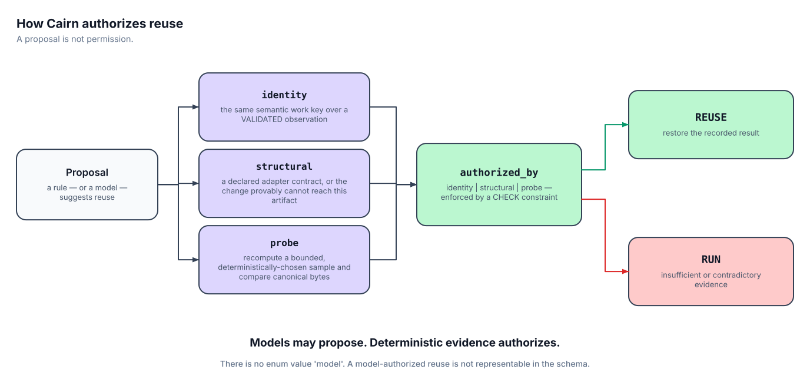
</div>

`reuse_decisions.authorized_by` accepts exactly three values — `identity`,
`structural`, `probe` — and `db/migrations/0005_decisions.sql` carries a `CHECK`
constraint over them. **There is no enum value `model`.** A model-authorized
reuse is not representable in the schema, and
`tests/integration/test_decisions.py` proves the constraint still rejects a raw
`INSERT` that tries to bypass the Python layer.

| Evidence | What it establishes |
| --- | --- |
| `identity` | The same semantic work key over a `VALIDATED` trace observation. |
| `structural` | A declared adapter contract, or a proof that the change cannot reach this artifact through the recorded `artifact_inputs` edges. |
| `probe` | A bounded, deterministically-selected sample recomputed and compared as canonical bytes. Six probe types, each with a stated **non**-guarantee — see [`docs/internals/PROBES.md`](docs/internals/PROBES.md). |

The complement matters just as much. Coverage is what decides whether reuse is
even on the table, and unknown always means run:

<div align="center">
  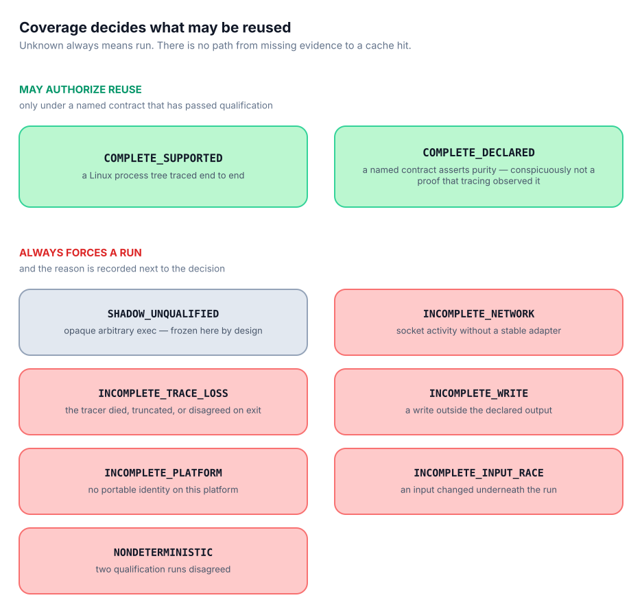
</div>

---

## How Cairn thinks about a run

<div align="center">
  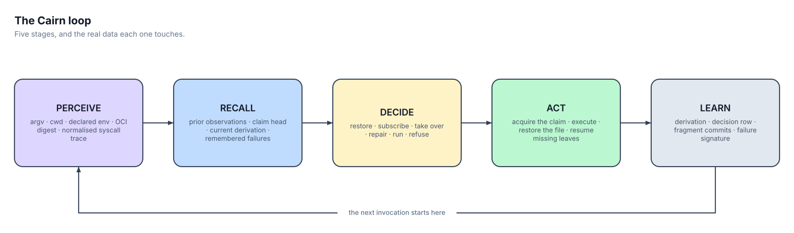
</div>

<details>
<summary><b>What each stage actually reads and writes</b></summary>

<br>

| Stage | Reads | Writes |
| --- | --- | --- |
| **perceive** | argv, cwd, declared environment names, the OCI image digest, and the normalised `strace -f` process-tree trace | `execution_specs`, `trace_contents`, `trace_resources` |
| **recall** | prior observations for this compatibility selector, the current generation head, the published derivation, remembered failures | — |
| **decide** | coverage state, observation lifecycle, rule revision, failure tier | the chosen `PlanAction` |
| **act** | the claim it acquired, and the fence it was handed | fragment commits, blobs under `cas/sha256/<digest>` |
| **learn** | the outcome | `derivations`, `reuse_decisions`, `failure_signatures`, `remediations` |

The planner's vocabulary is a closed enum in `src/cairn/flight/types.py`:
`RESTORE`, `SUBSCRIBE`, `TAKE_OVER`, `REPAIR`, `RUN_LOCAL`, `RUN_ECS`,
`RUN_SHADOW_LEARN`, `RUN_ISOLATED_QUALIFICATION`, `REFUSE_REUSE`,
`REPLAN_FAILURE`.

</details>

---

## Distributed coordination

This is the part that cannot be faked. **There is no in-memory lock anywhere in
Cairn.** Every ownership decision is one `SERIALIZABLE` transaction against
CockroachDB, replayed whole on a `40001` retry
([`src/cairn/db/txn.py`](src/cairn/db/txn.py)).

<div align="center">
  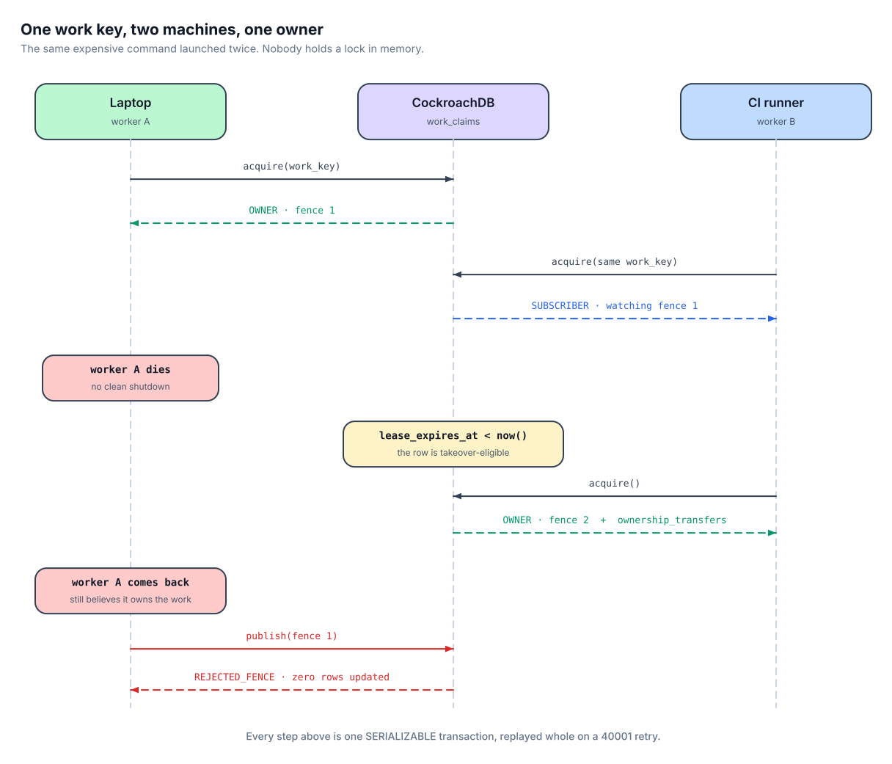
</div>

Walking the diagram against
[`src/cairn/db/flight.py`](src/cairn/db/flight.py):

1. `open_generation` reads the work head `FOR UPDATE`, creating generation 1 if
   this work has never been seen.
2. `_acquire_claim_on_cursor` attempts `INSERT ... ON CONFLICT DO NOTHING`. The
   caller that inserts is the **owner**, at fence 1.
3. A second caller finds the row, sees a live lease, and becomes a
   **subscriber** — it registers interest and adopts the owner's result rather
   than starting a second execution.
4. If the row's `lease_expires_at` has passed, or its state is terminal, the
   contender takes it: `state='CLAIMED'`, `fence = fence + 1`, and an
   `ownership_transfers` row recording `{from_owner, to_owner, from_fence,
   to_fence, reason}` — all inside the same transaction.
5. A published result already on the head short-circuits everything to
   **`RESTORE`**.

### Fencing

<div align="center">
  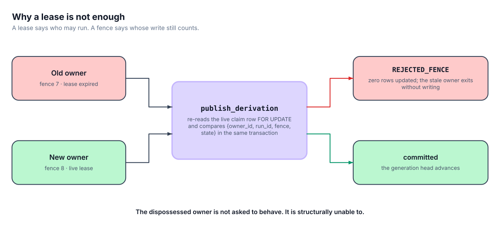
</div>

A lease alone does not solve this. A lease can expire while the old owner is
still alive, still holding a finished result in memory, and still perfectly
willing to write it. Cairn closes that window at the write, not at the clock:
every fenced write re-reads the live claim row `FOR UPDATE` and compares
`{owner_id, run_id, fence, state}` inside the same transaction. A mismatch
returns `PublishOutcome.REJECTED_FENCE` and updates zero rows.

The same check guards `commit_microchunk` in
[`src/cairn/db/flight.py`](src/cairn/db/flight.py) and every fragment write in
[`src/cairn/db/fragments.py`](src/cairn/db/fragments.py), so a dispossessed
owner cannot even leave partial state behind.
`tests/integration/test_stale_owner_fragment.py` is the adversarial proof.

### Authority plane vs data plane

<div align="center">
  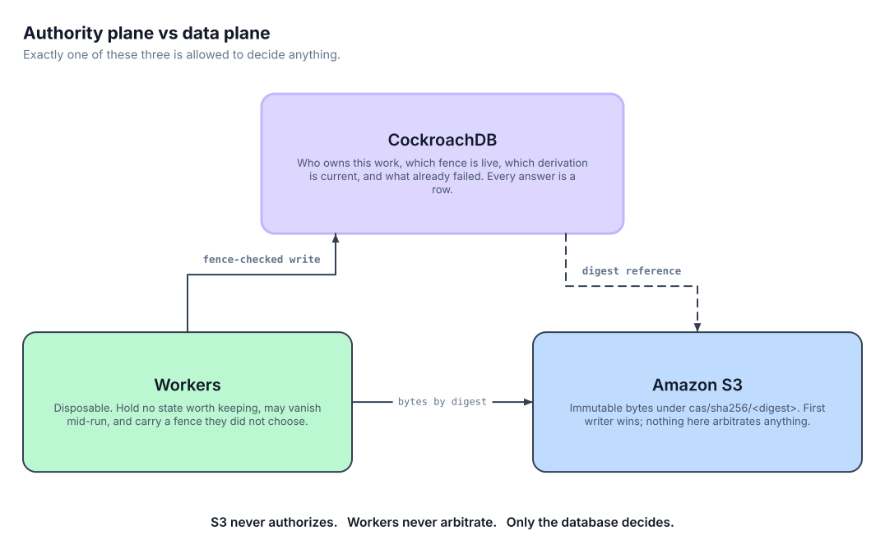
</div>

---

## Fragment repair

<div align="center">
  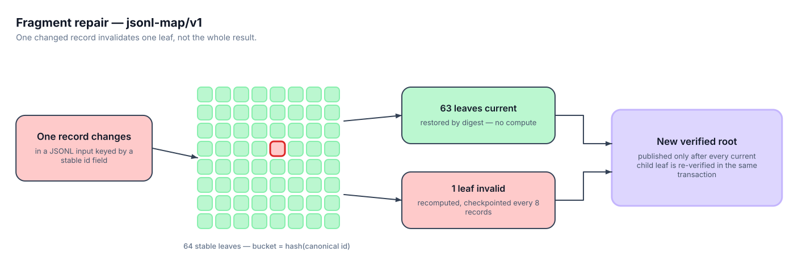
</div>

Under the bundled `jsonl-map/v1` adapter contract
([`src/cairn/adapters/jsonl_map.py`](src/cairn/adapters/jsonl_map.py)):

- Each record's bucket is `hash(canonical typed id)` across a fixed 64
  partitions, so `7` and `"7"` are different ids by construction and row
  placement is stable across machines.
- Each leaf is claimed, executed, and published independently, checkpointed
  every 8 records through the same fenced `commit_microchunk` primitive.
- Leaves carry `Authority.STRUCTURAL` — a declared adapter contract, explicitly
  *not* an empirical trace.
- The root publishes only after every current child leaf is re-verified in the
  same transaction that writes it.

**Support boundary, stated plainly:** this is not generic decomposition of
arbitrary programs. It applies to the bundled JSONL map/reduce contract, whose
partitioner, reducer, and verifier digests are part of the identity. Arbitrary
opaque commands stay at `SHADOW_UNQUALIFIED` coverage and are never fragmented.

---

## Failure memory

<div align="center">
  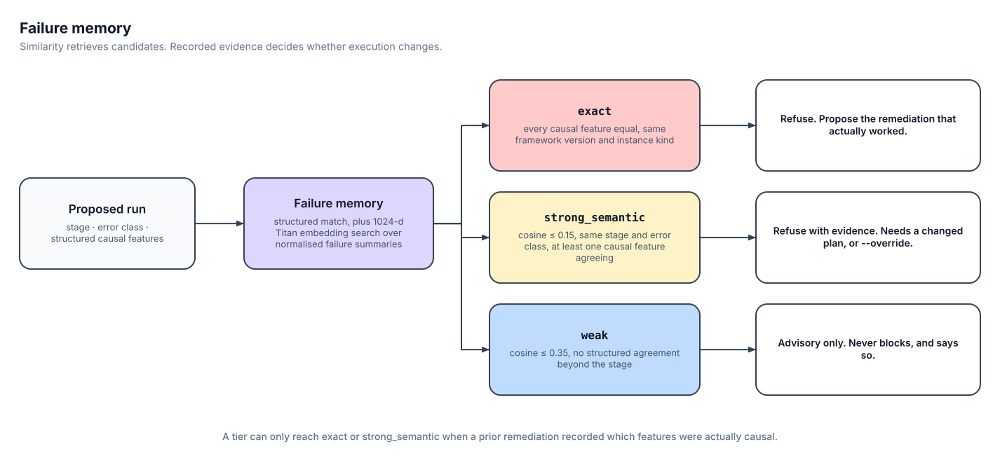
</div>

Two mechanisms, deliberately kept separate:

- **Structured matching** compares causal features, stage, error class,
  framework version, and instance kind. This is what can block.
- **Vector similarity** (1024-d Amazon Titan embeddings of a normalised failure
  summary) *retrieves candidates*. It never authorizes a behaviour change on its
  own.

`tier()` in [`src/cairn/db/memory.py`](src/cairn/db/memory.py) implements this
exactly, and `BLOCKING_TIERS` is a frozen set containing only `exact` and
`strong_semantic`. `weak` is advisory by construction — there is no code path in
that module that returns a blocking verdict for it, and the UI labels every weak
match *advisory — does not block*.

Both blocking tiers additionally require a **recorded, succeeded remediation**,
because that is the only thing that establishes which structured features were
actually causal for a signature. Without that provenance, cosine distance alone
can never lift a match past `weak`.

### When a reuse turns out to be wrong

<div align="center">
  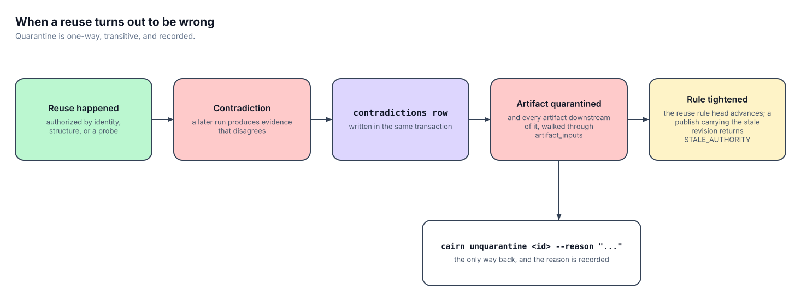
</div>

`contradict_and_tighten` advances the reuse rule head to a tightened revision.
`publish_derivation` then rejects any publish carrying the superseded revision
with `STALE_AUTHORITY`. Quarantine walks downstream through
`artifact_inputs.input_kind = 'upstream'` and is one-way; the only exit is
`cairn unquarantine <id> --reason "<text>"`, and the reason is recorded.

---

## Progressive trust

<div align="center">
  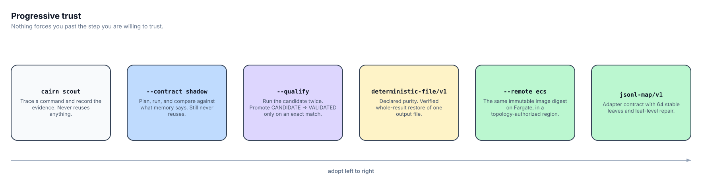
</div>

You do not have to trust Cairn on day one, and nothing pushes you further than
you want to go. `shadow` is the default contract, and it never reuses anything.

---

## Quickstart

<div align="center">
  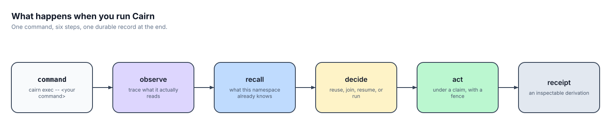
</div>

```bash
git clone https://github.com/darved2305/Cairn && cd Cairn
uv sync                                     # pinned Python environment
```

Then pick a cluster. Either works; the schema and the semantics are the same.

```bash
# A. Single-node CockroachDB in Docker — no cloud account needed
./scripts/local_cluster.sh up               # prints the CAIRN_DATABASE_URL to export

# B. CockroachDB Cloud — needs the `ccloud` CLI, writes .env for you
./scripts/provision_cluster.sh
```

```bash
make migrate                                # apply db/migrations/*, in order
cairn doctor                                # database, schema, vector index, AWS
cairn plan                                  # deterministic work keys, no execution
```

`cairn plan` against a live cluster, verbatim:

```console
$ cairn plan
STAGE       WORK KEY                                                          INPUTS
env         9102236e6bfe4c9a6674f5576a7cb5e966133dbfb53bcbd2e31e2af6576d7514  0 config / 10 code (unsound)
            escape hatches: importlib.metadata
dataset     15229e4f9cd128e1693d0ca873fd0e1362c21e1509bf06597a9b938394607d88  1 config / 16 code (sound, provisional upstream)
features    135c446fc832578caaa26b6ef6aaa841d3f931df1a3f9dd5ef78db9436e7ab99  5 config / 25 code (sound, provisional upstream)
checkpoint  1ac64a48bc33935ba9b32fbda3ebe7111eabcfe393921e1d6f2fa8018c02579e  6 config / 27 code (sound, provisional upstream)
eval        6d51f301ba3519087b2658e95978632e74d73f34e53edae53599293ba4286b68  1 config / 22 code (sound, provisional upstream)
```

Note `env`'s honesty: `unsound`, with the escape hatch that caused it named. A
stage whose reachability analysis cannot be trusted does not get to claim it can.

Wrapping a real command starts in `shadow`, which never reuses. Here it is on
Windows, where Cairn has no portable identity and says so rather than guessing
(the `owner` line, `user/host`, is elided):

```console
$ cairn exec --contract shadow --output-file .cairn/out/demo.bin -- python --version
Python 3.13.12
action     RUN_SHADOW_LEARN
coverage   INCOMPLETE_PLATFORM
reasons    not_linux; native_windows_no_strace; incomplete_platform; not_linux_or_unpinned_image
child_exit 0
```

The child's exit status passes through unchanged, so `cairn exec` stays
transparent to whatever script wraps it.

Then graduate to a named contract when you want reuse:

```bash
uv run python scripts/cairnbench_generate.py --output data/cairnbench.jsonl

cairn exec --contract jsonl-map/v1 \
    --input-file data/cairnbench.jsonl \
    --id-field id \
    --partitions 64 \
    --output-file out/features.jsonl \
    --oci-image "$CAIRN_IMAGE_DIGEST" \
    -- python /workspace/examples/embed_mapper.py
```

Requires Python 3.12+, [uv](https://docs.astral.sh/uv/), Docker or the
[`ccloud`](https://www.cockroachlabs.com/docs/cockroachcloud/ccloud-get-started)
CLI, Node 22+ for the console, and Rust 1.82+ for the TUI. AWS credentials with
Bedrock model access enable embeddings and the LLM paths; without them,
`CAIRN_NO_LLM=1` runs the deterministic-only path.

---

## CLI

| Command | Purpose |
| --- | --- |
| `cairn` | Launch the interactive terminal (TTY only; prints help otherwise) |
| `cairn scout -- <cmd>` | Trace a command under the Flight Recorder collector. Evidence only, never reuse |
| `cairn exec -- <cmd>` | Plan, then restore / subscribe / take over / repair / run under a named contract |
| `cairn plan [stage]` | Deterministic work keys and reachability for the five-stage pipeline. Exits non-zero on a doomed plan |
| `cairn run <stage> [--all]` | The agent loop against a live cluster. Exits 2 on refusal, 3 on escalation |
| `cairn receipt --run <id> [--verify]` | Canonical receipt. `--verify` re-fetches every blob from S3 and rehashes it |
| `cairn explain <artifact_id>` | Provenance and the decision chain for a five-stage artifact |
| `cairn explain --run\|--work\|--artifact` | The Flight leaf path: bucket → slice digest → leaf action → owner/fence → root verifier |
| `cairn memory search "<text>"` | Query failure memory directly, with tiers shown |
| `cairn memory why-blocked` | Explain the most recent refusal |
| `cairn unquarantine <id> --reason` | The audited one-way exit from quarantine |
| `cairn claim-demo` | Drive the claim protocol by hand — what ECS RunTask invokes for the cross-region race |
| `cairn doctor [--cloud] [--json]` | Database, schema, vector index, `ccloud` topology, AWS credentials |
| `cairn init` | Scaffold a `cairn.yaml` stage registry |

`cairn plan` and `cairn run` exit non-zero on a refusal, which makes either one
usable as a CI gate: the pipeline stops before spending money on a run that
memory says will fail.

---

## Cloud architecture

<div align="center">
  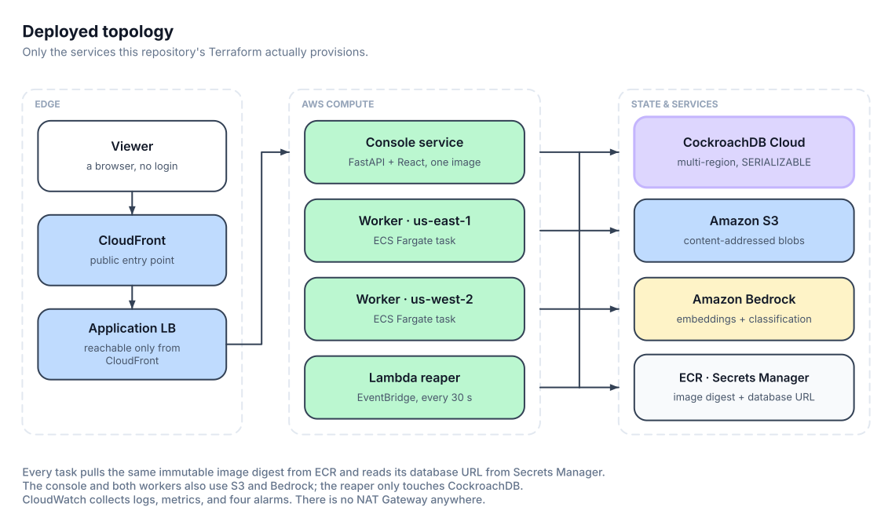
</div>

Terraform in [`infra/`](infra) provisions exactly what is drawn above: ECR with
a lifecycle policy, an encrypted and versioned S3 bucket with public access
blocked, two-region ECS Fargate, an ALB behind CloudFront, the Lambda reaper on
a 30-second EventBridge schedule, four CloudWatch alarms, and per-task
least-privilege IAM.

```bash
cd infra && terraform init && terraform plan     # review before applying
```

`terraform apply` creates resources that bill by the hour. Read
[`docs/operations/COST.md`](docs/operations/COST.md) first — it explains why
there is no NAT Gateway anywhere, and what teardown removes.

### Why CockroachDB is load-bearing

Not "Cairn stores data in CockroachDB." Remove it and the product stops
existing:

- **Claims are decided by the database, not by a process.** `INSERT ... ON
  CONFLICT DO NOTHING` inside a `SERIALIZABLE` transaction *is* the win/loss
  decision. There is no lock service, no leader, and no in-memory mutex.
- **Retries are handled at the right granularity.** CockroachDB surfaces
  conflicts as `40001`, and `in_txn` replays the *whole* closure — which is why
  every closure in `src/cairn/db/` is a pure function of its arguments, with no
  S3 calls and no event emission inside.
- **Fences, leases, and transfers are rows.** Ownership history is queryable,
  not reconstructed from logs.
- **Reachability has exactly one writer.** `publish_derivation` is the only
  function permitted to point a generation at a derivation, and it verifies the
  claim, the observation lifecycle, the rule revision, and every child leaf
  before it does.
- **Failure memory and vector search live next to the coordination state.** One
  `VECTOR(1024)` column, one query path, one consistency story — no separate
  vector service to keep in sync with the claims table.
- **Multi-region topology is authority, not configuration.** `ccloud cluster
  info` regions are the *only* thing allowed to authorize an ECS routing
  decision; an unknown, stale, or non-AWS region set fails closed rather than
  inventing a region from the environment.

[`docs/architecture/SUBSTRATES.md`](docs/architecture/SUBSTRATES.md) covers each
CockroachDB and AWS capability and what breaks without it.

---

## The record a run leaves behind

<div align="center">
  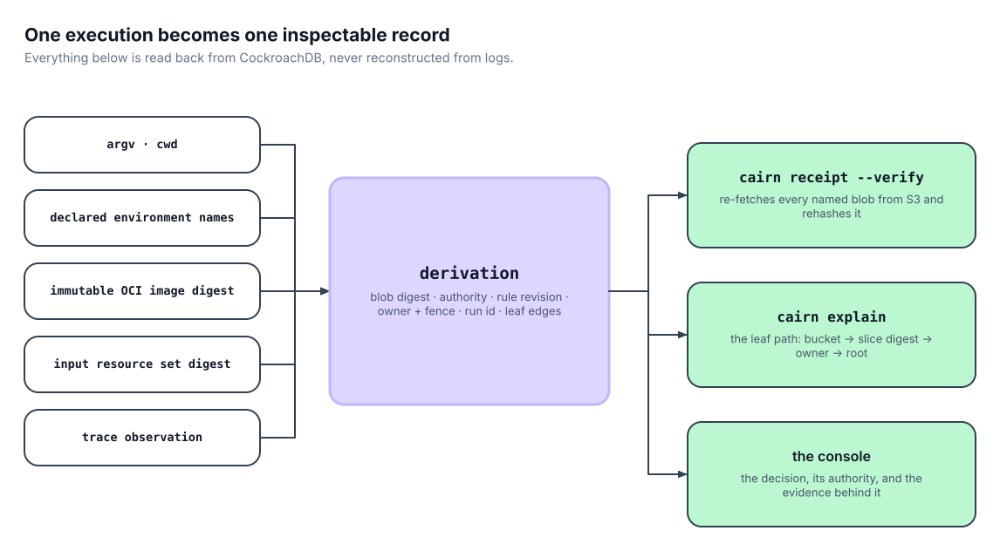
</div>

The console (`src/cairn/console/` + `console/frontend/`, FastAPI + React built
into one image serving one port) reads all of this live from CockroachDB across
five panels — Causal Graph, Decision Ledger, Claim Theatre, Negative Memory, and
a Memory Inspector that answers natural-language questions over the live cluster
via the CockroachDB Cloud MCP Server **with the executed SQL shown under every
answer**. Every read route is backed by exactly one plain `SELECT` in
`console/queries.py`.

```bash
make console-build && make console      # http://localhost:8000
```

---

## Project structure

```text
cairn/
├── src/cairn/          # CLI, flight recorder, trace collector, agent loop, probes, db, console API
├── tui-rs/             # the native terminal UI (Rust workspace, ratatui)
├── console/frontend/   # the React SPA
├── db/migrations/      # forward-only schema
├── infra/              # Terraform
├── lambda/reaper/      # the lease reaper
├── scripts/            # provisioning, migrations, race harnesses, gate scripts
├── examples/           # the project-controlled mapper used by the contracts
├── tests/              # unit · property (Hypothesis) · trace · integration (no mocks)
└── docs/               # architecture, internals, operations, security, project record
```

<details>
<summary><b>Internal component map</b></summary>

<br>

<div align="center">
  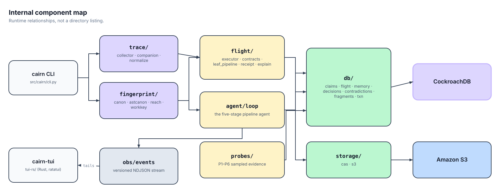
</div>

</details>

---

## Tests and evidence

```bash
make check                 # ruff check + ruff format --check + mypy --strict + unit/property tests
make test-integration      # needs CAIRN_DATABASE_URL — a real cluster, never a mock
make tui-test              # cargo test --workspace
make console-check         # tsc --noEmit
```

**No test in this repository that claims to be an integration test mocks the
database.** The concurrency tests in particular are only meaningful against a
real `SERIALIZABLE` engine; running them against a stub would produce a green
check that means nothing. `.github/workflows/ci.yml` therefore *skips* the
integration job with a stated reason until a real cluster credential exists,
rather than faking a pass.

The tests worth reading, because each one proves a claim on this page:

| Test | What it establishes |
| --- | --- |
| `tests/integration/test_claims.py` | Contention, dispossessed writes, and safe takeover |
| `tests/integration/test_race_50.py` | At most one committed derivation survives a concurrent race |
| `tests/integration/test_stale_owner_fragment.py` | A dispossessed owner cannot record a fragment or commit a microchunk |
| `tests/integration/test_decisions.py` | The `authorized_by` `CHECK` rejects a raw `INSERT`, not just the Python layer |
| `tests/integration/test_qualification.py` | `CANDIDATE → VALIDATED` promotion, and what refuses to promote |
| `tests/integration/test_contradiction_tightening.py` | A tightened rule revision refuses the shortcut it used to allow |
| `tests/property/test_workkey.py`, `test_flight_identity.py` | Identity digests are stable and order-independent |
| `tests/property/test_jsonl_leaves.py` | Leaf bucketing and reconstruction, over generated inputs |
| `tests/trace/test_c2_matrix.py` | The tracer conformance matrix |

---

## Support boundary

Cairn is `0.1.0`. Where the guarantees stop, stated exactly:

- **Linux-first.** Full trace coverage requires a Linux process tree under
  `strace -f`. Native Windows runs report `INCOMPLETE_PLATFORM` and have no
  portable identity.
- **The kernel collector is the coverage boundary.** The Python audit-hook
  companion may add resource rows and refine labels; it can never upgrade
  `coverage_state`, because audit hooks are not a sandbox boundary.
- **Opaque commands are frozen at `SHADOW_UNQUALIFIED`.** Observation alone
  never authorizes generic verified reuse. Reuse requires a named contract.
- **`deterministic-file/v1` is a user assertion.** Its `COMPLETE_DECLARED`
  coverage means *you declared this pure*, conspicuously not *tracing proved it*.
- **One regular output file** per `cairn exec` in v0.1. Restore is atomic for a
  regular file on one filesystem; directory-replace semantics are not claimed.
- **Fragment repair is contract-scoped.** It applies to `jsonl-map/v1`, not to
  arbitrary application code.
- **Network is checked, not enforced.** `--network deny` is a declared property
  the tracer verifies. Socket activity without a stable adapter yields
  `INCOMPLETE_NETWORK` and a non-reusable result; it does not block traffic.
- **Time, randomness, devices, and unversioned network or database state** are
  not modelled as inputs. A command that depends on them will not qualify.
- **Probes prove sampled equality, not artifact equivalence.** Every probe
  records `sample_spec`, `population_size`, and `sample_size` so the UI can show
  a fraction rather than imply a proof.
- **Namespaces are a data boundary, not yet an authentication boundary.** The
  `namespace_principals` schema exists; the OIDC token exchange that would
  enforce it does not. A caller holding `CAIRN_DATABASE_URL` can address any
  namespace. See
  [`docs/security/SECURITY_MODEL.md`](docs/security/SECURITY_MODEL.md) §3.
- **On a single-node local cluster, the vector index is unavailable.** Search
  falls back to exact brute-force cosine — correct, just slower — and says so.

---

## Roadmap

- OIDC → `namespace_principals` token exchange, so namespaces become an
  authentication boundary rather than a data boundary.
- Multi-file and directory output contracts.
- Additional adapter contracts beyond `jsonl-map/v1`.
- eBPF collection as an alternative to `strace -f`, for lower tracing overhead.
- Console read-only role wired through its own Secrets Manager secret in the
  deployed stack.

---

## Documentation

| Document | What it covers |
| --- | --- |
| [Architecture overview](docs/architecture/OVERVIEW.md) | System design, component boundaries, and the invariants across them |
| [Substrates](docs/architecture/SUBSTRATES.md) | Every CockroachDB and AWS capability, and what breaks without it |
| [Probes](docs/internals/PROBES.md) | Each probe's guarantee **and** its explicit non-guarantee |
| [Security model](docs/security/SECURITY_MODEL.md) | Where each boundary is enforced, and what is deliberately not defended |
| [Cost](docs/operations/COST.md) | Spend guardrails and the emergency stop |
| [Project](docs/project/PROJECT.md) | The authoritative design, including the full data model |
| [Plan](docs/project/PLAN.md) · [Flight Recorder plan](docs/project/WINNING_PLAN_9_DAY.md) | Implementation history and scope decisions |
| [Validation log](docs/project/VALIDATION_2026-08-09.md) | Adversarial end-to-end validation against real infrastructure |

Vulnerability reports and credential-handling practice: [`SECURITY.md`](SECURITY.md).

---

## Non-goals

Cairn is not compliance software, a policy engine, a CI/CD replacement, a
generic observability dashboard, a chatbot, a RAG application, or a
static-analysis product. The static analysis here exists solely to answer
reachability for reuse decisions; it emits no diagnostics and no report. Cairn
does not replace your orchestrator — it plugs into Make, GitHub Actions, or
Dagster — and it does not claim to prove full artifact equivalence.

It is also not a sandbox. Cairn observes the command you give it; it does not
confine it.

---

## License and credits

Apache-2.0 — see [`LICENSE`](LICENSE) and [`NOTICE`](NOTICE).

Built on CockroachDB, Amazon Web Services (ECS Fargate, S3, ECR, Lambda,
EventBridge, CloudFront, CloudWatch, Secrets Manager, Bedrock), and open source
including psycopg, Typer, FastAPI, React, Vite, PyTorch, sentence-transformers,
Hypothesis, and ratatui. Embeddings are Amazon Titan Text Embeddings v2;
classification uses Anthropic Claude via Bedrock. The evaluation corpus and its
provenance are documented in [`data/DATASET.md`](data/DATASET.md).

The CockroachDB [Agent Skills](https://github.com/cockroachlabs/cockroachdb-skills)
(Apache-2.0) are vendored under `.agents/skills/` and materially changed this
codebase — whole-transaction retry scope, `FOR UPDATE` contention handling, and
covering-index design. What each skill changed, with file references, is in
[`docs/project/SKILLS_USAGE.md`](docs/project/SKILLS_USAGE.md).
