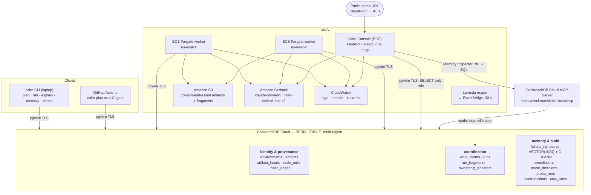
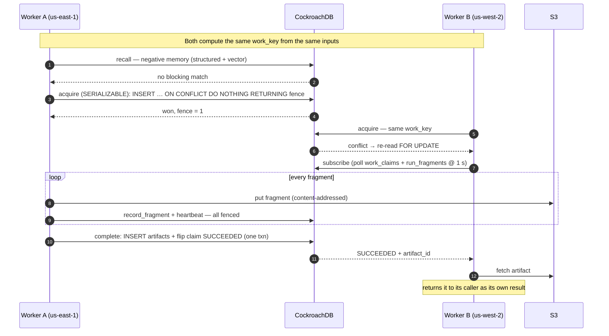
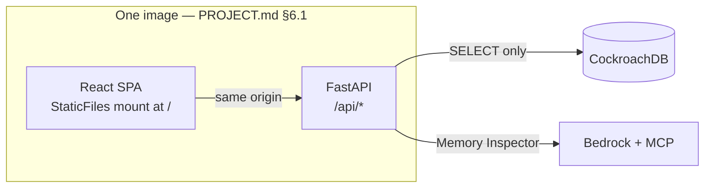

# Architecture

Cairn is a **causal reuse memory for expensive compute**: a durable,
transactional, queryable record of computational work that is shared across
machines. This document describes the pieces, why the boundaries fall where
they do, and the invariants that hold across them.

---

## The whole system



## Request-level view: what one `cairn run features` does



If A dies mid-run, the sequence diverges at the heartbeat: the lease expires,
the reaper marks it takeover-eligible, B takes over in a serializable
transaction that bumps `fence` to 2 and writes an `ownership_transfers` row,
then reads `run_fragments`, validates each fragment's content hash against S3,
and resumes from `max(index) + 1`. If A revives, its next fenced write matches
zero rows, it detects the zero row count, logs `dispossessed`, and exits
without writing.

---

## Components

### `cairn` CLI — the entry point

`init` · `plan` · `run` · `explain` · `memory search` · `memory why-blocked` ·
`doctor` · `unquarantine` · `claim-demo`.

`cairn plan` exits non-zero on a `REFUSE_DOOMED`, which is what makes it usable
as a CI gate: the pipeline stops *before* spending money on a run that memory
says will fail.

### The agent loop

Every invocation runs the same five phases (`src/cairn/agent/loop.py`):

```
perceive  →  git diff, config diff, env fingerprint, dataset fingerprint
recall    →  causal graph (SQL) + negative memory (structured pre-filter + vector)
decide    →  one of nine actions
act       →  claim / subscribe / probe / launch / resume / refuse
learn     →  decision, probe, fragments, artifact, failure signature, remediation
```

The nine actions each have a distinct code path and a distinct database effect:
`REUSE`, `PARTIAL_REUSE`, `RECOMPUTE`, `REFUSE_DUPLICATE`, `SUBSCRIBE`,
`REFUSE_DOOMED`, `REMEDIATE_AND_REPLAN`, `RESUME`, `ESCALATE`. Approval is
required only for `ESCALATE` — triggered by projected cost above
`CAIRN_APPROVAL_USD`, a destructive override of a `strong_semantic` refusal, or
a quarantine event. Everything else is autonomous, which is the point: an agent
that asks permission for every decision is a wizard, not an agent.

### CockroachDB Cloud — the memory

Not a cache and not a queue. It holds five things that must be *mutually*
consistent, which is the reason they are in one store:

1. **Identity and provenance** — what was built, from exactly which typed
   inputs, in which environment.
2. **Coordination** — who owns which work right now, at which fence, until when.
3. **Negative memory** — which configurations have already failed, and which
   remediation actually fixed them.
4. **Decisions** — every verdict, its actor, its authority, its latency.
5. **Evidence** — probe runs, contradictions, and the rate table.

A vector search that returns a signature whose remediation is committed but not
yet visible produces a *wrong decision*, not a stale read. That is why the
embedding lives in the same transaction as the relational rows rather than in a
separate vector database.

### ECS Fargate workers — the compute

Two regions, one cluster. Two regions is what makes the claim race a genuine
distributed race rather than two processes on one box. Workers are launched
on demand via `RunTask`, not run as an always-on service — a hackathon demo
does not need to burn Fargate-hours between sessions.

### Lambda reaper + EventBridge — liveness

Every 30 seconds, the reaper finds leases whose `lease_expires_at` has passed
and marks them takeover-eligible. **It does not delete anything.** It exists
because the thing that notices a dead worker cannot itself be the worker.

### S3 — artifact durability

Content-addressed: the key *is* the sha256 of the payload. Two consequences fall
out for free — completion is idempotent (re-running it is a no-op because the
`artifacts` primary key is the content address), and a fragment can be verified
against its recorded digest before a resuming worker trusts it.

### The console — the judged surface

One FastAPI app serving both a read-only JSON API and the built React SPA,
from one container and one port (`src/cairn/console/`, `console/frontend/`).



Five panels, all reading live: **Causal Graph**, **Decision Ledger**, **Claim
Theatre**, **Negative Memory**, **Memory Inspector** — plus a persistent
Savings strip and judge-mode Run/Reset controls.

---

## Invariants

These are the properties the design exists to guarantee. Each is enforced
structurally, not by convention.

### 1. An LLM can never authorize reuse

```sql
CHECK (verdict <> 'reuse'
       OR (authorized_by IS NOT NULL
           AND authorized_by IN ('probe','structural','identity')))
```

There is no enum value `'model'`. The `IS NOT NULL` is load-bearing: SQL's
three-valued logic makes `authorized_by IN (...)` evaluate to NULL when the
column is NULL, and a `CHECK` only rejects a row when the expression is FALSE —
so without it, a `verdict='reuse'` row with no authority at all would pass
silently, which is exactly the case the constraint exists to prevent.

### 2. Two workers never hold the same `(work_key, fence)`

Serializable isolation on the claim row, plus a fence that increases by exactly
1 on every ownership transfer and rides every subsequent write as
`WHERE work_key=$1 AND owner_id=$2 AND fence=$3`. A stale writer updates zero
rows and terminates. There is no in-memory lock anywhere in Cairn.

### 3. The retry unit is the whole transaction

`db/txn.py` takes a closure and replays it entirely on SQLSTATE `40001`
(exponential backoff with jitter: 50 ms base, ×2, ±25%, cap 2 s, 8 attempts).
Every transaction body must therefore be a pure function of its arguments — no
S3 puts, no Bedrock calls inside one. A partial replay could commit a mix of
pre- and post-conflict state; a duplicated retry of a stray API call is how a
training run gets launched twice.

### 4. Every number shown is measured, or shows its formula

Measured values come from columns a worker actually wrote. The single derived
value — cost — is computed from the user-editable `cost_rates` table and always
renders its own arithmetic (`95.2s × $0.0000274/s = $0.0026`). When no rate row
exists, the API returns `cost: null` with the reason, and the UI prints the
reason. There is no code path that produces an invented dollar figure.

### 5. A probe never claims full equivalence

Sample and population are rendered as a fraction, always. See
[`PROBES.md`](PROBES.md) for each probe's explicit non-guarantee.

### 6. Contradictions quarantine, one way

If later evidence contradicts an earlier reuse, Cairn writes a `contradictions`
row, sets `artifacts.quarantined_at`, invalidates every `reuse_decision` citing
that artifact, and alarms. Reversal requires an explicit, audited
`cairn unquarantine <id> --reason "<text>"`. This is what makes "the model may
propose reuse" survivable: if the deterministic authority was ever wrong, the
system finds out and stops trusting the artifact.

---

## The pipeline being memoized

Real work, chosen to be small, deterministic, and legible — not synthetic.

```
env → dataset → features → checkpoint → eval
```

| Stage | What it does | Runtime (2 vCPU / 4 GiB Fargate) |
|---|---|---|
| `env` | Resolve lockfile, capture image digest, `pip freeze`, torch config | ~2 s |
| `dataset` | 20 Newsgroups (4 categories), strip headers/footers/quotes, normalize, stable sort, split | ~9 s |
| `features` | `all-MiniLM-L6-v2`, 384-d, fp32, batch 32, 3 shards × ~800 docs | **~95 s** |
| `checkpoint` | 2-layer MLP (384→256→4), AdamW, 12 epochs, seed 1337 | **~28 s** |
| `eval` | Accuracy + macro-F1 on the held-out split | ~4 s |

Cold: ~2 min 18 s. Fully warm: ~4 s (probes only). Partial, after an
architecture change: ~34 s. That spread is what makes the behaviour legible
without a single `sleep()`.

Determinism is pinned — `PYTHONHASHSEED=0`, `OMP_NUM_THREADS=1`,
`MKL_NUM_THREADS=1`, `torch.manual_seed(1337)`,
`torch.use_deterministic_algorithms(True)`, sorted input order, fixed batch
composition — and asserted by a CI test over three consecutive runs.

---

## Security boundaries

| Boundary | Enforcement |
|---|---|
| Console cannot write | A `SELECT`-only SQL role (`db/migrations/0008_console_readonly_role.sql`), its own Secrets Manager secret wired only to the console task, and `console/queries.py` containing nothing but SELECTs. The role is the boundary; the code discipline is the first line, not the last. |
| Model-authored SQL cannot escape read-only | Three layers: a pre-flight keyword/shape guard, `SET TRANSACTION READ ONLY`, and the read-only role. `crdb_internal`, DDL, DML, and session control are all refused before the database is contacted. |
| Bedrock scope | `bedrock:InvokeModel` on exactly two foundation-model ARNs, plus `bedrock-mantle:CreateInference` on one project ARN. Nothing wildcarded. |
| S3 scope | Object access granted per-prefix (`dataset/*`, `features/*`, `checkpoint/*`, `eval/*`, `fragments/*`, `datasets/*`, `models/*`), never bucket-wide. Public access blocked. |
| Network | ALB reachable only from CloudFront; workers egress-only with no inbound; no NAT Gateway anywhere (see [`COST.md`](COST.md)). |
| Judge mode | No login by design. Read-only is enforced at the role layer, not in the UI. |

---

## Where to read next

- [`TOOLS.md`](TOOLS.md) — the four CockroachDB tools and six AWS services, and what breaks without each.
- [`PROBES.md`](PROBES.md) — each probe's guarantee and its explicit non-guarantee.
- [`COST.md`](COST.md) — spend guardrails and the emergency stop.
- [`SKILLS_USAGE.md`](SKILLS_USAGE.md) — which CockroachDB skills changed which files.
- [`../PROJECT.md`](../PROJECT.md) — the authoritative design, including the full schema in §11.
