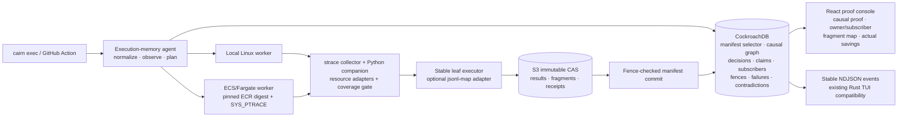

# Cairn — 9-Day Winning Plan

> Research and repository audit completed 2026-08-09. “Current” product and contest claims in this document are current to that date. This is an execution decision, not a menu of agreeable possibilities.

## Claim labels

- **VERIFIED** — supported by inspected Cairn code/validation output or a directly linked primary source.
- **STRONG INFERENCE** — the evidence is good enough to make a build or product decision, but it is not a proved universal fact.
- **SPECULATIVE** — an experiment or research direction whose correctness, performance, or market demand is not yet established.

Unless a target capability is explicitly described as already present, the proposed Flight Recorder, fragment protocol, schema, UX, benchmark, prices, and demo are **SPECULATIVE until implemented and measured**. Rankings, time estimates, and market conclusions are **STRONG INFERENCE**. Linked descriptions of existing systems and official rules are **VERIFIED** to the primary sources cited.

## Contents

**Decide** — [1. Executive Verdict](#1-executive-verdict) · [2. Hackathon Reality](#2-hackathon-reality) · [3. Competitive Landscape](#3-competitive-landscape) · [4. What Is and Is Not Novel](#4-what-is-and-is-not-novel) · [5. Cairn's Defensible Technical Wedge](#5-cairns-defensible-technical-wedge)

**Choose** — [6. 36 Candidate Capabilities](#6-36-candidate-capabilities) · [7. Feature Scoring Matrix](#7-feature-scoring-matrix) · [8. Top 10](#8-top-10) · [9. Top 5](#9-top-5) · [10. Top 3](#10-top-3) · [11. The One "Holy-Shit" Feature](#11-the-one-holy-shit-feature)

**Design** — [12. Proposed Final Architecture](#12-proposed-final-architecture) · [13. CockroachDB Deep Integration](#13-cockroachdb-deep-integration) · [14. AWS Deep Integration](#14-aws-deep-integration) · [15. Developer Experience](#15-developer-experience) · [16. GitHub/CI Product Surface](#16-githubci-product-surface) · [17. Runtime Instrumentation](#17-runtime-instrumentation) · [18. Distributed Compute Behaviors](#18-distributed-compute-behaviors)

**Build** — [19. Nine-Day Engineering Plan](#19-nine-day-engineering-plan) · [20. Schema Changes](#20-schema-changes) · [21. API / CLI Changes](#21-api--cli-changes) · [22. Frontend Changes](#22-frontend-changes) · [23. Testing Strategy](#23-testing-strategy) · [24. Failure Modes](#24-failure-modes)

**Ship** — [25. Exact Final Demo Script](#25-exact-final-demo-script) · [26. README Hero](#26-readme-hero) · [27. Open-Source Launch Strategy](#27-open-source-launch-strategy) · [28. Product Roadmap After the Hackathon](#28-product-roadmap-after-the-hackathon) · [29. Monetization](#29-monetization) · [30. Things We Explicitly Should Not Build](#30-things-we-explicitly-should-not-build) · [31. Final Build Order](#31-final-build-order) · [Final Answer](#final-answer-what-i-would-submit-on-august-18)

**Implement** — [A. Repository work inventory](#appendix-a--repository-work-inventory) · [B. Implementation skeleton](#appendix-b--implementation-skeleton) · [C. Evidence collector specification](#appendix-c--evidence-collector-specification) · [D. Adversarial review of this plan](#appendix-d--adversarial-review-of-this-plan) · [E. Daily acceptance gates](#appendix-e--daily-acceptance-gates-as-executable-checks)

If you are implementing rather than deciding, start at §19, then read Appendix A (what the repository actually is today), Appendix B (module boundaries and signatures), and Appendix E (what "done" means each day).

## 1. Executive Verdict

### The decision

Submit **Cairn Flight Recorder: a correctness-first memory runtime for expensive commands**.

The public interface is deliberately ordinary:

```bash
cairn exec --output-file artifacts/features.bin -- python build_features.py
```

That generic surface records and runs in shadow mode unless the user selects a named deterministic contract. The one-row/64-leaf claim in the submission uses the explicit `jsonl-map/v1` interface in §11; it is not inferred for arbitrary `build_features.py` commands.

On a learning run Cairn records the command's actual file, module, selected environment, subprocess, upstream-artifact, and versioned S3 reads; records its writes; and commits a typed execution manifest beside the resulting content-addressed artifact. On the next machine, branch, or CI run, Cairn re-observes the recorded resources, derives the same work identity without using the Git SHA, and then does exactly one of five things:

1. restore a deterministically authorized result;
2. subscribe to the one equivalent computation already running elsewhere;
3. take over an expired fenced claim and resume valid fragments;
4. repair only the changed Merkle leaves of a partitioned artifact; or
5. fail closed and execute normally because trace coverage or identity is incomplete.

CockroachDB is the serialized memory and coordination substrate. S3 is the immutable byte store. ECS/Fargate supplies a second real execution location. The existing agent decides among reuse, subscribe, takeover, repair, local execution, and remote execution; models may advise but never authorize correctness.

**VERIFIED:** The present repository already implements the five-stage ML path, causal/static work keys, deterministic probes, negative failure memory, S3 content addressing, CockroachDB `SERIALIZABLE` claims, leases, heartbeats, fenced final completion/takeover, fragment rows, Rust TUI, React/FastAPI console, and live ECS workers. The clean validation report records 180 Python tests, 72 Rust tests, type/lint/build passes, cold and warm runs, S3 `HeadObject`, and live cloud-degradation behavior.

**VERIFIED critical audit finding:** the current fragment checkpoint path is **not yet safe for the proposed takeover claim**. `src/cairn/db/fragments.py::record_fragment()` blindly upserts without reading the live claim owner/fence, while `src/cairn/storage/s3.py::fragment_key()` uses an overwriteable `fragments/{work_key}/{index}.bin` key. A stale owner can therefore overwrite bytes or metadata after takeover. The plan below treats fence-checked immutable microchunk publication as a Day-1 blocking repair, not as an existing capability. Likewise, the current `artifacts` row mixes blob identity with one derivation; the generic path must split immutable bytes from work-result publications before cross-run provenance is truthful.

**VERIFIED:** The current adopter-facing primitive is not yet general. `cairn init` writes a fixed `env → dataset → features → checkpoint → eval` demonstration and `plan_pipeline()` loops over those hard-coded stages. The fragment rows resume crashes inside one whole-stage work key; they do not currently repair unchanged leaves across a changed input dataset.

**VERIFIED:** Runtime tracing, content-addressed caching, affected-test selection, remote action merging, checkpointing, and incremental dataflow all have strong prior art. Cairn must not claim to have invented any of them.

**STRONG INFERENCE:** The defensible and judge-legible wedge is their combination under one safety model: **observed causal evidence becomes active cross-machine execution memory, and CockroachDB transactions make every reuse, subscription, takeover, fragment publication, and contradiction a durable globally consistent decision.** I did not find that complete combination in a mainstream developer product.

### Why this is the best winning move

- It fixes the largest product weakness: a stranger can wrap an existing expensive command instead of adopting Cairn's demo pipeline.
- It makes “agentic memory” literal and load-bearing: history changes what the execution agent does, not what a chat panel says.
- It creates a three-minute escalation from cache hit, to organization-wide singleflight, to crash takeover, to one-row fragment repair.
- It uses the repository's hardest existing systems rather than replacing them.
- It is honest about novelty. The outrageous part is an integrated, running correctness protocol—not a renamed cache.

### Non-negotiable scope boundary

The nine-day implementation is **Linux-first and Python-enhanced**, not a claim to safely incrementalize every arbitrary binary. First-run tracing learns a manifest. An unannotated command stays in shadow mode. Verified reuse additionally requires a named deterministic/purity contract—shipped for the seeded `jsonl-map` adapter or explicitly asserted for a pure file command—because `strace` cannot prove the absence of vDSO clock reads, CPU randomness, shared memory, or device state. Subsequent exact-observation matches may reuse only within that contract. Changed observed code normally recomputes unless an existing structural rule plus deterministic probe authorizes reuse. Unversioned network/database reads, wall-clock dependence, randomness without a captured seed, interactive input, tracer loss, or writes outside declared outputs make the run non-reusable. Generic mid-process checkpointing is impossible without application cooperation; Cairn resumes only opt-in fragments/checkpoints.

That boundary is a feature. “Unknown means run” is how the demo remains real.

## 2. Hackathon Reality

### Rules that should drive the build

**VERIFIED:** The official submission window closes **August 18, 2026 at 5:00 PM EDT**, which is **August 19 at 2:30 AM IST**. Judging runs August 19 through September 15; winners are scheduled on or about September 21. Sources: [official rules](https://cockroachdb-ai.devpost.com/rules) and [hackathon overview](https://cockroachdb-ai.devpost.com/).

**VERIFIED:** After a pass/fail fit-and-integration gate, five criteria are equally weighted at 20%:

1. Agentic Memory Design
2. Technological Implementation
3. Real-World Impact
4. Product Readiness
5. Creativity and Originality

Ties are broken in that order, then by judge vote. This makes persistent agentic memory—not visual novelty—the first scoring and tie-breaking priority.

**VERIFIED:** The project must be an agentic application with CockroachDB as persistent memory, deployed on AWS, and must meaningfully use at least **two** of these enumerated CockroachDB tools:

- Cloud Managed MCP Server;
- Distributed Vector Indexing;
- agent-ready `ccloud` CLI;
- CockroachDB Agent Skills repository.

Plain SQL use or merely hosting on CockroachDB Cloud is not one of those two named tool choices. At least one AWS service must power the agent environment; Bedrock is one option, not a requirement. ECS and S3 already satisfy the AWS side. Sources: [official resources and requirements](https://cockroachdb-ai.devpost.com/resources) and [official build-session FAQ](https://devpost.notion.site/CockroachDB-AWS-Hackathon-Build-Session-FAQ-399bf3c6a91d808ba1bbf1e0de57d9d9?pvs=74).

**VERIFIED:** The live-session FAQ says deterministic, stateless worker swarms can qualify as agentic when the system makes decisions; vector/RAG is optional; a single-node CockroachDB deployment is acceptable; and development-side read-only Managed MCP usage can satisfy MCP usage. This supports an execution-planning agent without pretending a chatbot is central.

### Eligibility action, not paperwork

Use these as the primary, runtime-proven pair:

1. **Distributed Vector Indexing, in the execution agent:** the inspected live validation reports the legacy `fs_sem` vector index active, but current 1024-dimensional rows may mix Titan and the explicitly non-semantic hash fallback without row-level provider provenance. Never resize or relabel them. Add a new versioned 384-dimensional embedding table/index, regenerate vectors from stored `summary_text` with the already-used `sentence-transformers/all-MiniLM-L6-v2`, and store provider ID, exact model revision/weights digest, source-text digest, dimension, and normalization on every row. Query only one compatible provider/version and prove the filtered query uses the new C-SPANN index with `EXPLAIN`; CockroachDB requires equality/`IN` constraints on every vector-index prefix column for that index shape to be eligible ([official vector-index documentation](https://www.cockroachlabs.com/docs/stable/vector-indexes)). The pinned model revision is Apache-2.0 ([model license](https://huggingface.co/sentence-transformers/all-MiniLM-L6-v2/blob/826711e54e001c83835913827a843d8dd0a1def9/LICENSE)). If that gate misses, show only that the legacy vector storage/indexed query path executes; do **not** narrate hash-derived vectors as semantic matches. In either case structured conditions and a verified prior run—not similarity—decide whether the plan may change.
2. **`ccloud` CLI, in a real planner decision:** keep cluster provisioning, user creation, connection discovery, and health reporting in `cairn doctor --cloud`, then invoke the documented `ccloud cluster info <name>` command, parse its labeled `id`, `cloud`, `state`, and `regions/region nodes` fields with a version-pinned parser, and retain a redacted raw-output digest. The planner selects an ECS region only from the live cluster's reported AWS regions under an explicit colocation policy and persists `{ccloud_version, parser_version, raw_output_digest, cluster_id, cluster_cloud, cluster_state, cluster_regions, selected_ecs_region, reason, observed_at, valid_until, credential_scope_evidence}` on the execution decision. `valid_until` applies the configured maximum age, and `credential_scope_evidence` is a redacted proof that the invocation used the least-privilege available identity; stale, unknown, or over-privileged evidence cannot authorize routing. The demo must show that persisted input and reason. The current official reference documents human-readable `cluster info` output but does not promise a JSON flag, so add a golden parser test and fail closed on unknown output rather than inventing one ([`ccloud` command reference](https://www.cockroachlabs.com/docs/cockroachcloud/ccloud-reference)). If the live cluster is not on AWS or no matching ECS region exists, record that fact and use Agent Skills or a genuinely authenticated Managed MCP session as the second qualifying tool rather than pretending adjacent provisioning changed agent behavior.

**VERIFIED audit correction:** current `src/cairn/cli.py::_doctor_ccloud()` calls `ccloud cluster list --json`, while the current official reference does not document that flag; the real-validation report does not record a successful `ccloud` result. `docs/project/PROJECT.md`/`docs/architecture/SUBSTRATES.md` therefore overstate this integration until the installed CLI help and a successful redacted transcript prove it. Day 1 must fix the command/parser and globally downgrade the claim if it cannot be proved.

Cloud Managed MCP is supplemental: make a real authenticated read-only development/inspection query, retain a redacted transcript, and never label the pgwire fallback as MCP. The Agent Skills repo is another credible supplemental tool because the installed skills already caused documented file-level changes to whole-transaction `40001` retry scope, contention indexes, and vector access; add the new trace/fragment schema review to `docs/project/SKILLS_USAGE.md`. Runtime vector retrieval plus operational `ccloud` is safer than depending on a development-only exemption.

### Submission requirements and operational deadline

**VERIFIED:** Submit a public source repository with a visible license, dependencies/config/examples/setup and run instructions, a functional unrestricted demo URL, English project description, and a public YouTube/Vimeo video under three minutes. The video must show the product functioning and the CockroachDB memory layer working, and the text must identify the selected CockroachDB tools and AWS services and how they are used. The demo must remain accessible through judging. Judges are allowed to judge only the page, images, and video rather than installing the product. Substantive edits after the deadline are prohibited; disclose pre-existing work. Source: [official rules](https://cockroachdb-ai.devpost.com/rules).

**VERIFIED from the local repository:** the first Git commit is dated August 6, 2026, inside the submission window, and the repository has an Apache-2.0 `LICENSE`. Preserve the full history and still disclose any incorporated code/assets that predate the event; a Git timestamp is supporting evidence, not a substitute for an honest disclosure.

Therefore the engineering freeze is **August 17**, the upload should happen early on **August 18 IST**, and the final hours are contingency—not feature time.

**VERIFIED:** Official cash prizes are $5,000, $2,500, and $1,250 for first through third. There is no separate Bedrock/vector/AWS service-count prize, so architecture decoration has no scoring upside. The rules control any discrepancy with promotional prize copy.

### Submission landscape

**VERIFIED:** The overview showed 3,172 registered participants on 2026-08-09, but that is not a submission count. The [official gallery](https://cockroachdb-ai.devpost.com/project-gallery) was not yet published, so an exhaustive competitor census is impossible.

**STRONG INFERENCE:** Publicly indexed event-linked projects cluster around vector/RAG memory with Bedrock, incident/SRE agents, memory integrity/provenance/privacy, and consumer assistants. Treat this as directional sampling, not a complete leaderboard. Cairn is already visually and technically distinct because it remembers computation itself rather than conversation.

The discoverable sample is strongest in these groups:

| Cluster | Visible examples | Why Cairn must avoid that framing |
|---|---|---|
| Memory integrity, contradiction, provenance, forgetting | [Continuum Memory Firewall](https://devpost.com/software/continuum-memory-firewall), [Quorum](https://devpost.com/software/quorum-wa7lh6), [Rumor Memory Village](https://devpost.com/software/rumor-memory-village), [Naaba](https://devpost.com/software/naaba), [erasure-proof](https://devpost.com/software/erasure-proof-provable-crypto-erasure-for-agent-memory) | “Safe memory,” contradiction handling, quarantine, and provenance alone are already crowded pitches. |
| Incident/SRE/security agents | [AI Incident Commander](https://devpost.com/software/ai-incident-commander-5ajvg7), [SentinelAgent](https://devpost.com/software/sentinelagent-79qeux), [VPC Flow Agent](https://devpost.com/software/vpc-flow-agent), [TraceGuard](https://devpost.com/software/traceguard-pu0bo5), [Throughline](https://devpost.com/software/throughline-zbqsuh) | Do not reposition Cairn as an incident copilot or RAG over runbooks. |
| Shared multi-agent memory | [CommonMind](https://devpost.com/software/commonmind-shared-memory-for-humans-and-agents), [CogniMesh](https://devpost.com/software/cognimesh), Rumor Memory Village | “Agents share persistent context” is the default contest story, not a differentiator. |
| Domain/consumer memory | [AURA Memory](https://devpost.com/software/aura-memory), [Hearsay](https://devpost.com/software/hearsay-tc7jia), [wallet-memory](https://devpost.com/software/wallet-memory), [Timely](https://devpost.com/software/timely-4hcm7r) | Cairn should stay a developer infrastructure primitive, not bolt memory onto a consumer assistant. |

**SPECULATIVE:** The unpublished gallery can still contain hidden CI/MLOps/distributed-execution entries. Say “different from the visible field,” never “no competitor exists.”

What makes Cairn impossible to confuse with another entry is this sentence:

> **Change one row, launch the same expensive command from three machines, kill its owner, and watch CockroachDB allow exactly one fenced replacement worker to rebuild exactly one Merkle leaf while everyone else subscribes.**

No chat window belongs in that sentence.

### Judge-criteria mapping

| Criterion | Proof, not claim |
|---|---|
| Agentic Memory Design | Durable manifests, causal edges, results, failures, contradictions, claims, subscriptions, fragments, and decisions alter the next execution plan. |
| Technological Implementation | A real `SERIALIZABLE` race, transaction-wide `40001` retries, monotonically increasing fences, immutable S3 objects, fail-closed trace coverage, and kill/takeover test. |
| Real-World Impact | Measured shadow/whole-result evidence for an ordinary command, plus a cooperative `jsonl-map/v1` proof where a one-row delta repairs one stable partition rather than the entire feature artifact. |
| Product Readiness | One-command overlay, local/cloud parity, scoped outputs, integrity checks, cancellation semantics, graceful cloud failure, public deployment. |
| Creativity and Originality | Runtime evidence is not merely provenance: it becomes a distributed execution optimizer with contradiction memory. |

## 3. Competitive Landscape

The landscape invalidates several easy marketing claims. That is useful: it tells Cairn exactly where not to bluff.

### Build, cache, and remote execution

| System | What exists today | Consequence for Cairn |
|---|---|---|
| Bazel / Remote Execution API | Actions are keyed from command, declared inputs, environment, and platform; action cache and CAS are standard. Bazel also supports dependency/unused-input mechanisms. [Bazel remote caching](https://bazel.build/remote/caching) | Content addressing and remote cache are Category A, not novelty. |
| Buck2 | Target graphs, dep files, change detection, remote execution/caching, and affected CI exist. [Buck2 change detector](https://github.com/facebookincubator/buck2-change-detector) | “Run only affected targets” is not enough; Cairn must operate below declared target/package granularity or outside build DSLs. |
| Pants | Static import-based dependency inference substantially reduces manual BUILD metadata. [Pants dependency inference](https://www.pantsbuild.org/blog/2020/10/29/dependency-inference) | Automatic dependency discovery is not itself new; runtime resource edges broaden coverage but introduce soundness risk. |
| Nx | Project-graph affected selection, configurable inputs, plugin inference, remote task cache, and task sandboxing exist. Its docs warn that a missing input can produce stale results. [affected](https://nx.dev/docs/features/ci-features/affected), [inputs](https://nx.dev/docs/guides/tasks--caching/configure-inputs) | Causal CI must prove finer evidence and fail-closed coverage, not just draw a nicer graph. |
| Turborepo / Vercel | Team/CI remote cache shares logs and task outputs using content awareness. [Vercel remote caching](https://vercel.com/docs/monorepos/remote-caching) | Cross-machine cache is commodity in JS monorepos. |
| Gradle / Develocity | Shared build cache and predictive test selection already reduce work; PTS preserves safety classes such as new/flaky tests. [build cache](https://docs.gradle.com/develocity/2026.1/using-develocity/build-cache), [PTS](https://docs.gradle.com/develocity/predictive-test-selection) | “AI selects tests” is neither unusual nor safe enough as a hero. |
| BuildBuddy | **Action Merging** merges identical in-flight remote actions, with TTL/heartbeat behavior, cancellation concerns, and hedged fallback. [Action Merging](https://www.buildbuddy.io/blog/action-merging/) | Organization-wide singleflight already exists for exact build actions. Cairn's differentiation is observed causal identity plus durable fragment ownership/takeover outside a build graph. |
| GitHub Actions / GitLab CI | User-specified keys, paths, restore/fallback keys, branch scopes, and S3-backed distributed runner caches exist. [GitHub cache](https://docs.github.com/en/actions/reference/workflows-and-actions/dependency-caching), [GitLab cache](https://docs.gitlab.com/ci/caching/) | Cairn should consume these ecosystems through one Action, not replace their workflow language. |
| ccache / sccache / Recc | Compiler wrappers and Remote Execution clients provide local/remote result reuse. ccache direct mode maintains manifests of headers actually read. [ccache manual](https://ccache.dev/manual/latest.html), [sccache](https://github.com/mozilla/sccache) | A prior observed-input manifest is established prior art and has known “new header” correctness corners. |
| Nix / Guix / BuildStream / Earthly | Derivations, substitutes/artifact keys, hermetic layers, explicit cache mounts, and reproducible environments are mature ideas. [Nix derivations](https://nix.dev/manual/nix/latest/store/derivation/), [BuildStream artifacts](https://docs.buildstream.build/2.0/using_commands.html), [Earthly caching](https://docs.earthly.dev/docs/caching) | Cairn should be an overlay for commands, not another package/build DSL. |

### Workflows, ML systems, and compute platforms

| System | Existing capability | Remaining opening |
|---|---|---|
| DVC | Run cache remembers outputs across commits from declared deps, params, and commands. [DVC run cache](https://dvc.org/blog/dvc-1-0-release/) | Trace actual resources and preserve safe identities across irrelevant Git changes without demanding full declarations. |
| redun | Hashes tasks/arguments, centrally memoizes results, records historical call graphs, and incrementally re-executes across workflows; its own design notes limits around plain helper-function hashing and effective purity. [redun design](https://insitro.github.io/redun/design.html) | Historical Python computation memory is not new. Cairn must win on drop-in observation, refusal, fragment ownership, and cross-location takeover. |
| Dagster | Explicit asset partitions and backfills track stale materializations. [Dagster backfills](https://dagster.io/blog/backfills-in-ml) | Stable automatic leaves for an existing command are a different adoption surface; general reducers remain opt-in. |
| Pachyderm | Pipeline inputs form datums, transforms run code over those datum groups, and `datumBatching` can process batches rather than one datum per invocation. [HPE Pachyderm 2.9 transform specification](https://support.hpe.com/hpesc/public/docDisplay?docId=a00pachyderm29en_us&docLocale=en_US&page=latest%2Fbuild-dags%2Fpipeline-spec%2Ftransform.html), [input join specification](https://support.hpe.com/hpesc/public/docDisplay?docId=a00pachyderm29en_us&docLocale=en_US&page=latest%2Fbuild-dags%2Fpipeline-spec%2Finput-join.html) | This is direct prior art for incremental partition recomputation. Cairn's narrower opening is a drop-in command evidence layer plus CockroachDB generations, fenced subscribers, and cross-context takeover—not partitioning itself. |
| Prefect | Cache keys derive from policies such as inputs/task source; shared cache requires shared storage. [Prefect caching](https://docs.prefect.io/v3/concepts/caching) | It orchestrates declared tasks; it does not by default discover arbitrary process resources and attach fenced cross-machine leaf ownership. |
| Flyte | Explicit task caching, cache versions, and intra-task checkpointing exist. [Flyte caching](https://docs.flyte.org/en/latest/user_guide/advanced_composition/caching.html) | Annotation-free first value and cross-system overlay are potential wedges. |
| Metaflow | Task/step resume and opt-in checkpoint APIs exist. [checkpoints](https://docs.metaflow.org/scaling/checkpoint/introduction) | Do not call ordinary checkpoint resume novel. Combine it with transferable ownership and fragment identity. |
| Temporal | Durable workflow replay makes workflow state crash-proof. [Temporal documentation](https://docs.temporal.io/) | Durable orchestration is not result equivalence or cross-run compute reuse. |
| Ray | Object lineage can reconstruct lost deterministic-task objects. [Ray object fault tolerance](https://docs.ray.io/en/latest/ray-core/fault_tolerance/objects.html) | Cairn can coordinate across execution systems and historical runs rather than require Ray's object model. |
| Modal / Runhouse / SkyPilot | Remote functions/compute, volumes, checkpoints, spot recovery, and local-to-cloud execution interfaces exist. [Modal Volumes](https://modal.com/docs/guide/volumes), [Runhouse remote functions](https://www.run.house/kubetorch/api-reference/python/fn), [SkyPilot managed jobs](https://docs.skypilot.co/en/latest/examples/spot-jobs.html) | “Run remotely” is commodity. Correct cross-location identity and shared recovery are the value. |
| MLflow / experiment trackers | MLflow records run parameters, code versions, metrics, artifacts, and inputs for search/visualization. [MLflow Tracking](https://mlflow.org/docs/latest/ml/tracking/) | Provenance and artifact catalogs are established; Cairn's graph must actively change whether and where computation occurs. |
| Blacksmith / Depot / Namespace / WarpBuild / RunsOn / Buildkite | Faster runners, warm pools, colocated caches, BYOC, and per-second compute are crowded. [Blacksmith cache](https://docs.blacksmith.sh/blacksmith-caching/dependencies-actions), [Depot runners](https://depot.dev/docs/github-actions/overview), [WarpBuild](https://www.warpbuild.com/products/enterprise), [RunsOn](https://runs-on.com/pricing/), [Buildkite](https://buildkite.com/pricing/) | Do not build or price Cairn as another runner vendor. Integrate above them and remove executions. |

### Research and older systems Cairn must acknowledge

| Work | What it demonstrates | Honest implication |
|---|---|---|
| ReproZip | `ptrace`-based syscall tracing records files, libraries, and environment for reproducibility. [packing docs](https://docs.reprozip.org/en/1.x/packing.html), [TaPP paper](https://www.usenix.org/conference/tapp13/technical-sessions/presentation/chirigati) | “Trace a program's dependencies” is Category A. |
| Fabricate, fsatrace, Rattle | Existing build approaches discover dependencies by observing file access; Rattle studies correctness hazards and speculation. [Fabricate](https://pypi.org/project/fabricate/), [fsatrace](https://fuchsia.googlesource.com/third_party/github.com/jacereda/fsatrace/), [Rattle paper](https://arxiv.org/abs/2007.12737) | A trace is evidence only to the extent that coverage and determinism assumptions hold. |
| LaForge | A simple full-build script is traced into TraceIR, then incrementally reevaluated with automatically captured dependencies. [paper](https://arxiv.org/abs/2108.12469) | “Incremental execution for an unmodified script” is established research, not Cairn's invention. |
| Incr (OSDI 2026) | Bolt-on incrementalization of unmodified shell programs reports 34.2× average and 373.3× max re-execution acceleration, with effect analysis and 10,000 behavioral tests. [USENIX paper page](https://www.usenix.org/conference/osdi26/presentation/xie-yizheng) | This is the most direct novelty challenge. Cairn should not promise a more general shell incrementalizer in nine days. |
| Nectar | A 2010 Microsoft system used datacenter-wide caching to share common LINQ subcomputations, regenerate derived data, garbage collect it, and incrementally process new extents on a 240-node deployment. [Microsoft Research](https://www.microsoft.com/en-us/research/publication/nectar-automatic-management-of-data-and-computation-in-data-centers/) | “Memory layer for computation,” datacenter-wide reuse, and subcomputation reuse all have historical prior art. |
| Differential Dataflow / Naiad | Stateful operators maintain differences so updates touch only affected keys, including iterative dataflows. [overview](https://www.frankmcsherry.org/differential/dataflow/2015/04/07/differential.html), [Google Research publication](https://research.google/pubs/incremental-iterative-data-processing-with-timely-dataflow/) | Row/partition-level incremental updates are mature in a purpose-built dataflow model. Cairn's opening is an overlay and a durable control plane, not the algorithm itself. |
| Adapton / self-adjusting computation | Language/runtime structures can memoize dynamic dependency graphs with from-scratch consistency research. [miniAdapton](https://arxiv.org/abs/1609.05337), [Nominal Adapton](https://arxiv.org/abs/1503.07792) | Safe arbitrary-program semantic incrementalization is research-level; do not put it on the nine-day critical path. |
| mkcheck2 (ICSE 2026) | eBPF plus incremental analysis reports major overhead reduction for dependency verification. [ICSE abstract](https://conf.researchr.org/details/icse-2026/icse-2026-research-track/162/Efficient-Build-Dependency-Verification-Using-eBPF-and-Incremental-Analysis) | `strace` is a shippable Linux prototype, not the performance end state. eBPF is a post-hackathon path. |
| Provenance reuse research | Prior work uses execution provenance to repeat, subset, and partially reuse research objects. [Reusable Research Objects](https://arxiv.org/abs/1806.06452) | Provenance-to-reuse is not unprecedented; Cairn must make coordination, safety authority, recovery, and UX distinctive. |

### The market gap, stated narrowly

**STRONG INFERENCE:** Mainstream CI/build products optimize declared actions inside their ecosystem. Research systems can trace or incrementalize unmodified programs. Workflow systems cache declared tasks and partitions. Remote compute vendors accelerate where a job runs. What remains visibly underserved is a low-adoption-friction overlay that:

- learns typed evidence from an ordinary expensive command;
- shares that evidence and immutable results across laptop, CI, repository, and cloud boundaries;
- treats concurrent equivalent work, abandoned work, and reusable sub-artifacts as one transactionally coordinated state machine;
- records why reuse was authorized and quarantines evidence after a contradiction; and
- degrades to normal execution when completeness cannot be proved.

This is a defensible product wedge, not proof of academic novelty. A literature-grade novelty claim would require a formal model and a much broader search.

### Real pain signals, without inventing a market gap

**VERIFIED:** These are reports/proposals that exist; they prove failure modes occur, not their population-wide frequency.

- A GitLab Runner report describes concurrent jobs racing such that an empty cache writer can replace a newly populated cache. [GitLab Runner #38852](https://gitlab.com/gitlab-org/gitlab-runner/-/issues/38852)
- A GitLab chart report describes a killed cache extractor leaving corrupted local JARs while later handling can appear successful. [GitLab Runner chart #496](https://gitlab.com/gitlab-org/charts/gitlab-runner/-/issues/496)
- A 2026 GitHub community proposal calls out weak cache-writer isolation/provenance across workflow contexts. [GitHub discussion #194493](https://github.com/orgs/community/discussions/194493)
- Turborepo users reported deleted outputs neither restored nor rebuilt because retained state concluded the outputs were unchanged. [Turborepo #4137](https://github.com/vercel/turborepo/issues/4137)
- Nx users reported surprising misses after delete/recreate despite identical content. [Nx #27880](https://github.com/nrwl/nx/issues/27880)
- A Bazel report describes unchanged builds being rechecked/rebuilt after remote-cache metadata expiration. [Bazel #26140](https://github.com/bazelbuild/bazel/issues/26140)

Practitioner threads also describe non-hermetic dependency debugging as specialist work, question organization-wide cache correctness across diverse environments, and complain about repeated eight-minute CI feedback cycles; this evidence is anecdotal, not a market-size estimate. [Experienced Developers discussion](https://www.reddit.com/r/ExperiencedDevs/comments/rcwex7), [Hacker News hermeticity discussion](https://news.ycombinator.com/item?id=23184843), [2026 CI feedback thread](https://www.reddit.com/r/devops/comments/1rdrpzz/whats_your_biggest_frustration_with_github/). The grounded gap is not “nobody has a cache”; it is that unconstrained jobs remain difficult to key correctly, cache races/corruption are expensive, and the most capable solutions often require a build/workflow model or expert configuration.

## 4. What Is and Is Not Novel

### A. Already exists — never market these as inventions

- Content-addressed artifacts, remote cache, CAS/action cache.
- Declared-input work keys and cross-branch exact cache hits.
- Remote execution, local-to-cloud dispatch, fast runners, warm pools, spot recovery.
- In-flight merging/singleflight for identical actions.
- Leases, heartbeats, fencing tokens, work stealing, checkpoint resume.
- Static dependency inference and affected-target/test selection.
- Runtime syscall/file dependency tracing and prior-input manifests.
- Partitioned assets, incremental dataflow, differential updates, lineage reconstruction.
- Provenance graphs, experiment lineage, portable reproducibility bundles.
- Predictive test selection and speculative/hedged execution.
- Failure signature similarity search and retry/remediation history.

### B. Existing pieces Cairn can combine unusually well

- Runtime-observed manifests + static reachable-code graph + deterministic reuse probes.
- Trace-derived identity + CockroachDB `SERIALIZABLE` claim + S3 CAS publication.
- Stable Merkle leaves + fenced per-leaf ownership + subscriber-aware takeover.
- Negative failure memory + preflight condition match + deterministic remediation validation.
- Cross-repository provenance receipts + namespace-scoped trust + artifact transport.
- Causal affected selection + exact execution receipts in a GitHub check.
- Speculative verification/recomputation race + one authoritative publication transaction.

### C. Genuinely unusual in mainstream developer infrastructure

These are **STRONG INFERENCE**, not universal novelty claims:

1. **A general command wrapper whose learned runtime evidence enters an organization-wide, durable subscribe/takeover protocol.** BuildBuddy merges declared actions; tracing systems learn dependencies; the combination outside a build DSL is unusual.
2. **Cross-run fragment repair where each stable leaf has independent fenced ownership and the new composite result commits transactionally.** Workflow partitioning and lineage recovery exist, but this ownership/reassembly combination is not a mainstream general developer tool.
3. **Contradiction-driven authority tightening.** A later failed proof quarantines an artifact and disables the rule/evidence class that authorized it until revalidated; execution history changes the optimizer's future proof obligations.
4. **Provenance as a live optimizer rather than a passive record.** The same graph decides restore, subscribe, takeover, repair, or execute and emits a machine-verifiable receipt.

### D. Research-level or risky

- Safely proving semantic equivalence after arbitrary observed code changes.
- Automatically incrementalizing arbitrary binaries into reusable subcommands better than Incr/LaForge.
- Sound tracking of arbitrary database queries without snapshot/version semantics.
- Transparent checkpoint/migration of arbitrary process memory.
- Learned verification policies that reduce checking without a deterministic lower bound.
- General semantic artifact patching without an application-supplied partition/reducer algebra.
- Time-travel assembly across arbitrary historical environments with no retained image/data versions.
- Cross-tenant reuse without an explicit trust, confidentiality, and reproducibility boundary.

## 5. Cairn's Defensible Technical Wedge

### Product promise

> **Your expensive command already ran. Somewhere. Cairn proves whether you can use it, joins it if it is still running, and repairs only the pieces that changed.**

### The technical invariant

A result may be reused only if all five conditions hold:

```text
named deterministic/purity contract
∧ complete observation coverage within that contract
∧ identical normalized resource identities
∧ intact immutable output bytes
∧ authority ∈ {identity, structural, deterministic_probe}
```

A model score, historical correlation, matching Git SHA, or “similar enough” embedding is never authority. “Complete” is relative to the explicit contract; the report must never claim that syscall tracing proves a general program is pure or deterministic.

### Why CockroachDB is load-bearing

**VERIFIED:** CockroachDB defaults to `SERIALIZABLE`; concurrent transactions appear as a serial order, and clients must replay the whole transaction on unrecoverable `40001` contention errors. [CockroachDB serializable transactions](https://www.cockroachlabs.com/docs/stable/demo-serializable) and [retry reference](https://www.cockroachlabs.com/docs/stable/transaction-retry-error-reference).

That gives Cairn one consistent transaction for “is this work already done, owned, expired, or available for takeover?” and one monotonic fence that prevents a paused former owner from publishing after dispossession. A plain object store lock or eventual cache index cannot by itself provide this decision. Fencing is essential because a lease alone cannot stop a delayed client from writing; see [Kleppmann's fencing-token explanation](https://martin.kleppmann.com/2016/02/08/how-to-do-distributed-locking.html).

CockroachDB also joins structured failure conditions with vector similarity, stores the causal and temporal state, and can place/replicate coordination close to multiple worker regions. Multi-region survival trades write latency for region resilience; do not claim “free global writes.” [Multi-region survival goals](https://www.cockroachlabs.com/docs/stable/multiregion-survival-goals).

### Why AWS is visible, not decorative

- **S3:** immutable content-addressed result and leaf objects, verified by checksum/`HeadObject`; object bytes are uploaded before metadata commits. Orphans are safe and garbage-collected later.
- **ECS/Fargate:** real second execution location and a kill/takeover target. Linux task definitions add only `SYS_PTRACE` for the tracer; AWS documents that Fargate supports this capability for syscall tracing. [Fargate security guidance](https://docs.aws.amazon.com/AmazonECS/latest/developerguide/security-fargate.html).
- **ECR:** pins the execution environment by image digest. It matters to identity; it is not counted as an ornamental service.
- **CloudWatch:** operational alarms/logs for lease loss, 40001 retry spikes, and worker failure. It is product readiness evidence, not the product.

Do not add Step Functions, SQS, Lambda, DynamoDB, or Bedrock unless a shipped behavior actually requires them. The current control plane already exists in CockroachDB; duplicating it would weaken the story.

## 6. 36 Candidate Capabilities

Each entry explicitly covers the requested twelve fields in this order: **(1) exact behavior; (2) developer value; (3) technical interest; (4) competitor/prior-art status; (5) Cairn advantage; (6) difficulty; (7) fast-engineer time; (8) judging impact; (9) product impact; (10) demo value; (11) correctness/failure risk; (12) nine-day verdict.** “Ship” means production-quality enough for the submission's stated boundary, not universal support.

### Runtime and adoption surface

#### 1. Flight Recorder: evidence-backed `cairn exec`

1. **Behavior:** `cairn exec --output-file PATH -- COMMAND...` learns a typed read/write/process manifest, derives future work identities, restores or subscribes for a qualified deterministic contract, and otherwise executes normally in shadow mode. 2. **Developer:** wraps an existing expensive job with no pipeline rewrite. 3. **Technical:** joins observation coverage, identity, claims, artifacts, and authority. 4. **Prior art:** ReproZip/LaForge/Incr trace programs; DVC/redun cache tasks. 5. **Edge:** Cairn already owns fenced distributed claims, probes, failure memory, S3 CAS, and recovery. 6. **Difficulty:** 9/10. 7. **Time:** 4–6 focused days for a narrow Linux/Python contract. 8. **Judging:** category-changing; memory visibly acts. 9. **Product:** fixes the hard-coded-demo adoption ceiling. 10. **Demo:** a Git SHA changes yet a measured expensive command safely returns immediately on another machine. 11. **Risk:** incomplete traces or an invalid purity declaration cause stale reuse; fail closed, expose coverage, and restrict the hero to the seeded adapter. 12. **Verdict:** **MUST SHIP; holy-shit feature.**

#### 2. Linux syscall evidence collector

1. **Behavior:** run the process tree under `strace -f` and normalize file/open/stat/readlink/rename/exec/chdir/mmap-relevant evidence. 2. **Developer:** native dependencies and subprocesses stop being invisible. 3. **Technical:** turns noisy syscalls into stable resources and access modes. 4. **Prior art:** ReproZip, fsatrace, Rattle, LaForge, and mkcheck2. 5. **Edge:** observations become durable execution decisions rather than a reproducibility archive. 6. **Difficulty:** 8/10. 7. **Time:** 2–3 days for Linux, known syscall set, and tests. 8. **Judging:** deep systems credibility. 9. **Product:** broadens beyond Cairn-aware Python. 10. **Demo:** expand one command into its real causal resources. 11. **Risk:** a missed syscall invalidates the proof; unsupported/parse-loss runs must be `INCOMPLETE`. 12. **Verdict:** **MUST SHIP as a constrained collector.**

#### 3. Python typed-resource companion

1. **Behavior:** a `sitecustomize` hook records imports, file/directory operations, selected environment reads, globbing, subprocesses, and Cairn-aware resource adapters. 2. **Developer:** explanations use Python modules/config keys rather than only file descriptors. 3. **Technical:** merges high-level events with kernel evidence. 4. **Prior art:** Python audit hooks and memoizing Python runtimes exist. 5. **Edge:** the current AST/config graph and probes already speak Python concepts. 6. **Difficulty:** 6/10. 7. **Time:** 1–2 days. 8. **Judging:** makes automatic causality legible. 9. **Product:** better diagnostics and fewer explicit declarations. 10. **Demo:** `cairn explain --run <id>` shows `module:function → config key → S3 version`. 11. **Risk:** Python hooks are bypassable and do not audit every environment read; they are enrichment, not a sandbox. 12. **Verdict:** **MUST SHIP.**

#### 4. Versioned S3 read adapter

1. **Behavior:** instrument the existing boto3/Cairn boundary and record bucket, key, `VersionId`, checksum/ETag, and operation; reject mutable/list-only identities. 2. **Developer:** cloud data participates in work identity. 3. **Technical:** converts a network side effect into a versioned resource. 4. **Prior art:** workflow systems track object URIs; S3 version identities are standard. 5. **Edge:** Cairn already verifies S3 outputs and can put input/output lineage in one graph. 6. **Difficulty:** 5/10. 7. **Time:** 0.5–1.5 days. 8. **Judging:** makes AWS visibly causal. 9. **Product:** material for real ML/data jobs. 10. **Demo:** change one object version and show only its leaf invalidate. 11. **Risk:** multipart ETags are not universal content hashes; prefer checksum or version ID. 12. **Verdict:** **MUST SHIP for `GetObject`/`HeadObject`; list semantics later.**

#### 5. Database snapshot/query adapter

1. **Behavior:** a plugin records database identity, normalized query, bound parameters, and an explicit snapshot/change token. 2. **Developer:** data pulled from SQL can be reused safely. 3. **Technical:** maps a logical read to a stable external version. 4. **Prior art:** materialized views and lineage systems track queries. 5. **Edge:** CockroachDB can issue consistent `AS OF SYSTEM TIME` snapshots. 6. **Difficulty:** 9/10. 7. **Time:** 4–7 days even for one driver. 8. **Judging:** intellectually strong but visually secondary. 9. **Product:** large future market. 10. **Demo:** weak within three minutes. 11. **Risk:** a query string is not a result identity; phantom/schema/session dependencies are easy to miss. 12. **Verdict:** **DO NOT SHIP; publish interface contract only.**

#### 6. Hermetic replay/enforcement mode

1. **Behavior:** the named adapter/container contract itself constrains execution to read-only inputs, one writable regular output file, a sanitized environment, pinned image, and locally denied/adapter-declared network; unexpected observations are violations. No separate `--enforce` switch implies broader sandboxing. 2. **Developer:** converts cache trust into a debuggable contract. 3. **Technical:** separates observation from authority and exposes dependency drift. 4. **Prior art:** sandboxed build systems and Nx Sandbox do this. 5. **Edge:** Cairn can attach violations to historical evidence and future planning. 6. **Difficulty:** 8/10. 7. **Time:** 3–5 days for a narrow container contract, much longer generally. 8. **Judging:** strong correctness signal. 9. **Product:** valuable for CI. 10. **Demo:** a hidden network read makes Cairn refuse a hit. 11. **Risk:** `strace` observes but does not block and even a filesystem/network sandbox does not prove absence of vDSO/RDRAND/shared-memory inputs; Fargate's trusted mapper boundary is declared, not hostile-code isolation. 12. **Verdict:** **MUST SHIP the narrow adapter/container contract; general enforcement is bonus.**

#### 7. Determinism profiler

1. **Behavior:** execute a command twice in isolated temp roots, compare output Merkle roots and observed resources, and label volatile channels. 2. **Developer:** gets a qualification check before enabling verified reuse. 3. **Technical:** detects time/random/untracked side effects empirically. 4. **Prior art:** reproducible-build checkers rerun builds. 5. **Edge:** the result gates activation of a declared contract but never replaces that contract. 6. **Difficulty:** 5/10. 7. **Time:** 1–2 days. 8. **Judging:** demonstrates intellectual honesty. 9. **Product:** prevents common high-cost cache corruption. 10. **Demo:** intentional randomness flips status to `NONDETERMINISTIC`. 11. **Risk:** two equal runs do not prove future determinism. 12. **Verdict:** **MUST SHIP for the verified adapter; never call it proof.**

#### 8. Portable compute receipt/bundle

1. **Behavior:** `cairn export receipt` packages a signed/canonical JSON manifest, artifact digests, resource identities, and fetch references without secrets. 2. **Developer:** a clone can inherit computational knowledge. 3. **Technical:** trust-scoped identity moves across control planes. 4. **Prior art:** Nix closures, provenance crates, research objects, and remote caches. 5. **Edge:** receipt includes authorization, contradiction, and claim history. 6. **Difficulty:** 6/10. 7. **Time:** 2–3 days. 8. **Judging:** good product imagination. 9. **Product:** strong OSS distribution loop. 10. **Demo:** clone a repo and restore a verified result. 11. **Risk:** signatures do not make untrusted code/artifacts safe; namespaces must gate import. 12. **Verdict:** **BONUS; JSON receipt without federation is feasible.**

### Fragment memory and distributed execution

#### 9. Stable Merkle fragment repair

1. **Behavior:** deterministically map records to stable buckets, key each leaf by exact slice/code/config/env, reuse unchanged leaves, recompute changed leaves, and form a new canonical root. 2. **Developer:** one changed record no longer rebuilds a whole feature table. 3. **Technical:** sub-artifact causality crosses run identities. 4. **Prior art:** Pachyderm, Spark/Ray lineage, differential dataflow, and explicit partitions. 5. **Edge:** each missing leaf enters Cairn's durable claim/takeover protocol and every decision is explained. 6. **Difficulty:** 8/10. 7. **Time:** 3–4 days for the existing feature workload. 8. **Judging:** exceptional. 9. **Product:** directly saves ML/data/GPU compute. 10. **Demo:** change one row; 63/64 leaves restore and one rebuilds. 11. **Risk:** unstable partitioning or non-associative merge silently changes outputs. 12. **Verdict:** **MUST SHIP for one typed artifact.**

#### 10. Partitioner and reducer algebra SDK

1. **Behavior:** plugins declare `key(record)`, `leaf(records)`, canonical ordering, associative merge, and final verifier. 2. **Developer:** generalizes fragment repair beyond the demo. 3. **Technical:** makes semantic patching's assumptions executable. 4. **Prior art:** Beam/Dagster/Pachyderm/dataflow APIs. 5. **Edge:** automatically inherits claims, CAS, probes, and explanations. 6. **Difficulty:** 7/10. 7. **Time:** 3–5 days for a good public API. 8. **Judging:** less visible than one working adapter. 9. **Product:** crucial extension point. 10. **Demo:** two adapters appear real but dilute the story. 11. **Risk:** users can declare an invalid algebra; require conformance/property tests. 12. **Verdict:** **SHOULD SHIP as a narrow protocol plus one adapter, not a framework.**

#### 11. Transactional composite artifact manifest

1. **Behavior:** commit a sorted set of immutable leaf artifact IDs and one root digest in the same transaction that completes the current fenced claim. 2. **Developer:** consumers never see half-old/half-new outputs. 3. **Technical:** separates S3 byte publication from authoritative reachability. 4. **Prior art:** snapshot manifests and lakehouse commits exist. 5. **Edge:** reuses the current artifact and fence model. 6. **Difficulty:** 6/10. 7. **Time:** 1–2 days. 8. **Judging:** load-bearing CockroachDB proof. 9. **Product:** required correctness for repair. 10. **Demo:** live table moves atomically from old root to new root. 11. **Risk:** stale owners can upload but must not commit; orphan cleanup is asynchronous. 12. **Verdict:** **MUST SHIP with #9.**

#### 12. Durable organization-wide subscribers

1. **Behavior:** persist subscribers per work/leaf key; waiters receive progress/result, and caller cancellation decrements a reference rather than killing shared work. 2. **Developer:** 50 launches yield one computation without surprising cancellation. 3. **Technical:** shared-work lifecycle survives API/worker restarts. 4. **Prior art:** BuildBuddy action merging explicitly handles reference counting. 5. **Edge:** subscribers can follow a fenced takeover and fragment progress. 6. **Difficulty:** 6/10. 7. **Time:** 1.5–2.5 days atop current claims. 8. **Judging:** high when shown across laptop/CI/ECS. 9. **Product:** essential multi-user behavior. 10. **Demo:** three clients show owner/subscriber/takeover states. 11. **Risk:** leaked subscribers retain work; leases and terminal GC are mandatory. 12. **Verdict:** **MUST SHIP.**

#### 13. Subscriber-aware cancellation and abandonment

1. **Behavior:** cancel physical work only when the owner and all live subscribers release it; otherwise detach the caller. 2. **Developer:** closing one laptop does not destroy teammates' job. 3. **Technical:** reference leases and race-safe transition to `cancel_requested`. 4. **Prior art:** action-merging systems face the same corner. 5. **Edge:** current claim schema already has cancellation and leases. 6. **Difficulty:** 5/10. 7. **Time:** 1 day. 8. **Judging:** product-readiness detail. 9. **Product:** prevents costly surprise. 10. **Demo:** cancel subscriber while owner continues. 11. **Risk:** disconnect detection and retrying decrement can double-release; use subscriber IDs and idempotent terminal updates. 12. **Verdict:** **MUST SHIP with #12.**

#### 14. Transparent local ↔ CI ↔ ECS planner

1. **Behavior:** the same command restores locally, subscribes remotely, takes over, or dispatches to ECS based on memory, resource request, and policy. 2. **Developer:** compute location becomes secondary. 3. **Technical:** one state machine crosses execution substrates. 4. **Prior art:** Modal/Runhouse/SkyPilot provide local-to-cloud; remote builders route work. 5. **Edge:** selection starts with reuse/active-work memory, not only resource placement. 6. **Difficulty:** 8/10. 7. **Time:** 3–5 days using the existing ECS worker. 8. **Judging:** extremely visible. 9. **Product:** compelling daily UX. 10. **Demo:** one CLI joins a job whose owner is an ECS ARN. 11. **Risk:** environment and credential equivalence; require pinned image and capability policy. 12. **Verdict:** **MUST SHIP for local plus existing ECS, not Kubernetes.**

#### 15. Spot/locality/cost-aware routing

1. **Behavior:** choose worker region/shape/spot policy from artifact locality, predicted duration, checkpoint density, and historical failure rates. 2. **Developer:** lowers compute and transfer cost. 3. **Technical:** a counterfactual scheduler consumes execution memory. 4. **Prior art:** cloud schedulers and SkyPilot optimize cost/availability. 5. **Edge:** Cairn knows reuse probability and surviving fragments. 6. **Difficulty:** 8/10. 7. **Time:** 4–6 days for more than heuristics. 8. **Judging:** good architecture, crowded feature. 9. **Product:** future commercial value. 10. **Demo:** difficult to prove honestly in three minutes. 11. **Risk:** stale prices/quotas and pathological choices. 12. **Verdict:** **DO NOT SHIP; show a deterministic planner interface only if ahead.**

#### 16. Verification-versus-recompute race

1. **Behavior:** when a candidate needs an expensive probe, launch verification and safe recomputation concurrently; commit the first valid result and cancel/detach the loser. 2. **Developer:** caps worst-case validation latency. 3. **Technical:** two different proof paths race into one fenced publication. 4. **Prior art:** hedged requests and BuildBuddy hedged execution. 5. **Edge:** one contender validates history while the other computes new bytes. 6. **Difficulty:** 7/10. 7. **Time:** 2–3 days. 8. **Judging:** visually exciting. 9. **Product:** useful for high-variance GPU jobs. 10. **Demo:** two progress bars; verified result wins. 11. **Risk:** doubles cost, side effects, and cancellation races; only pure jobs. 12. **Verdict:** **INSANE BONUS.**

#### 17. Counterfactual time/cost planner

1. **Behavior:** before running, compare restore/verify/recompute/remote plans using historical durations, transfer sizes, and configured rates; store prediction and error. 2. **Developer:** sees blast radius, ETA, and cost before launch. 3. **Technical:** historical provenance becomes a cost model. 4. **Prior art:** build timelines and cloud schedulers estimate time/cost. 5. **Edge:** includes reuse probability, active claims, and fragment deltas. 6. **Difficulty:** 6/10. 7. **Time:** 1.5–3 days for deterministic estimates. 8. **Judging:** clearly agentic. 9. **Product:** strong planning UX. 10. **Demo:** “63 restore, 1 run, 17m42s avoided” before execution. 11. **Risk:** fake precision; output ranges and actual-vs-estimated calibration. 12. **Verdict:** **SHOULD SHIP after real fragment measurements.**

#### 18. Causal garbage collection

1. **Behavior:** retain roots pinned by runs/receipts/subscribers, mark reachable manifests/leaves, and sweep unreferenced S3 bytes after a grace period. 2. **Developer:** storage does not grow forever. 3. **Technical:** GC spans transactional metadata and object storage. 4. **Prior art:** Nix stores, Nectar, registries, and CAS systems garbage-collect. 5. **Edge:** savings/cost and recomputation history can drive retention. 6. **Difficulty:** 7/10. 7. **Time:** 2–4 days. 8. **Judging:** readiness, not wow. 9. **Product:** mandatory at scale. 10. **Demo:** poor. 11. **Risk:** deletion is irreversible and races with readers; use mark epoch, grace, tombstone, second pass. 12. **Verdict:** **DO NOT SHIP destructive sweep; ship dry-run report only.**

### CI, repositories, and explanation

#### 19. Runtime-evidence Causal CI

1. **Behavior:** map a Git diff through prior static and observed resource edges to tests/jobs/artifacts, then output `run`, `reuse`, or `unknown`; unknown always runs. 2. **Developer:** avoids unaffected CI beyond package/path filters. 3. **Technical:** hybrid graph reachability with evidence coverage. 4. **Prior art:** Buck2/Nx affected and Develocity/Meta PTS are mature. 5. **Edge:** resulting work can restore, subscribe, take over, or repair rather than merely skip. 6. **Difficulty:** 7/10. 7. **Time:** 2–4 days for Python tests and Cairn jobs. 8. **Judging:** high. 9. **Product:** enormous distribution surface. 10. **Demo:** PR comment shows one causal path and saved jobs. 11. **Risk:** false negatives are unacceptable; new/unobserved tests run. 12. **Verdict:** **DO NOT SHIP in the nine-day release; first post-hackathon CI expansion.**

#### 20. `cairn-action` GitHub Action

1. **Behavior:** install Cairn, wrap a workflow command, publish a check summary/receipt, and use the same remote memory as laptops/ECS. 2. **Developer:** adoption is three YAML lines. 3. **Technical:** carries identity and subscriber state across ephemeral runners. 4. **Prior art:** cache and remote-execution Actions are plentiful. 5. **Edge:** it can eliminate a job or join it, not just download a keyed tarball. 6. **Difficulty:** 4/10. 7. **Time:** 1 day plus example. 8. **Judging:** converts system work into product readiness. 9. **Product:** strongest OSS acquisition channel. 10. **Demo:** laptop and Action race the same leaf. 11. **Risk:** fork secrets/cache poisoning; no write credentials for untrusted PRs and namespace by trust domain. 12. **Verdict:** **SHOULD SHIP only after the core is stable by Day 6; two ECS callers are the required fallback.**

#### 21. Cross-repository computation namespace

1. **Behavior:** scope identity by organization/trust namespace rather than repository/commit, allowing equivalent manifests to share results across repos. 2. **Developer:** forks, services, and branches stop repeating common data preparation. 3. **Technical:** separates semantic identity from access authority. 4. **Prior art:** remote caches already share by instance/namespace. 5. **Edge:** observed resources can prove equivalence despite different repository histories. 6. **Difficulty:** 7/10. 7. **Time:** 2–4 days. 8. **Judging:** ambitious. 9. **Product:** strong team/network value. 10. **Demo:** two repos restore one result. 11. **Risk:** secret/code leakage and malicious cache injection; require explicit namespace, signer, and read/write roles. 12. **Verdict:** **SHOULD SHIP only as same-organization opt-in.**

#### 22. Causal bisect

1. **Behavior:** traverse historical resource/output changes to schedule the minimum candidate executions needed to locate an output regression. 2. **Developer:** reduces expensive `git bisect` runs. 3. **Technical:** uses provenance to prune commits incapable of changing the target. 4. **Prior art:** git bisect, provenance difference research, and test-impact tools. 5. **Edge:** historical artifacts and fragments can answer many candidates without execution. 6. **Difficulty:** 9/10. 7. **Time:** 5–8 days for one artifact type. 8. **Judging:** research-project energy. 9. **Product:** valuable but episodic. 10. **Demo:** compelling only with setup. 11. **Risk:** missing edges falsely prune the culprit; unknown must remain candidate. 12. **Verdict:** **DO NOT SHIP.**

#### 23. Time-travel computation assembly

1. **Behavior:** `cairn run --at COMMIT` assembles a historical result from retained environments, artifacts, and leaves, executing only missing pieces. 2. **Developer:** reproduces old results quickly. 3. **Technical:** temporal graph resolution across code/data/image histories. 4. **Prior art:** Nix, DVC, workflow versioning, and provenance objects. 5. **Edge:** can subscribe/take over missing historical work. 6. **Difficulty:** 9/10. 7. **Time:** 6–10 days for a narrow case. 8. **Judging:** very high. 9. **Product:** good research/reproducibility wedge. 10. **Demo:** visual but competes with core. 11. **Risk:** deleted dependencies/images and incompatible checkpoints. 12. **Verdict:** **INSANE BONUS only after all must-ship work.**

#### 24. Symbol-level Python executed-code trace

1. **Behavior:** record executed modules/functions/lines and merge them with the existing reachable AST graph to refine code-change impact. 2. **Developer:** unrelated functions in one file need not invalidate a job. 3. **Technical:** combines dynamic coverage with conservative static reachability. 4. **Prior art:** coverage-guided test selection and dependency inference. 5. **Edge:** current work-key code already hashes reachable AST units. 6. **Difficulty:** 8/10. 7. **Time:** 3–5 days. 8. **Judging:** sophisticated. 9. **Product:** useful for large Python modules. 10. **Demo:** edit an unexecuted function and show unchanged causal identity. 11. **Risk:** prior path coverage misses new control-flow dependencies; dynamic evidence may prune only when controlling static code is unchanged. 12. **Verdict:** **DO NOT SHIP as authority; optional explanation-only trace.**

#### 25. Hybrid predictive test selection

1. **Behavior:** rank tests from runtime/static graph plus historical failures, but run all `unknown`, new, flaky, or policy-required tests. 2. **Developer:** faster large suites. 3. **Technical:** blends hard reachability with soft ranking. 4. **Prior art:** Meta, Develocity, Azure, CloudBees, and testmon. 5. **Edge:** selected test computations also enter shared memory. 6. **Difficulty:** 7/10. 7. **Time:** 3–5 days. 8. **Judging:** less original than fragment memory. 9. **Product:** broad demand. 10. **Demo:** familiar rather than shocking. 11. **Risk:** missed tests; soft score never authorizes omission. 12. **Verdict:** **DO NOT SHIP during nine days.**

#### 26. Fragment-level causal explanation

1. **Behavior:** `cairn explain --artifact ROOT` renders changed resource → bucket/slice digest → leaf action → owner/subscriber/fence → root verifier. 2. **Developer:** can audit why 63 leaves reused and one ran. 3. **Technical:** queries graph, decisions, claims, and manifests coherently. 4. **Prior art:** cache-miss and build-scan explanations exist. 5. **Edge:** includes cross-run recovery and proof authority at leaf level. 6. **Difficulty:** 5/10. 7. **Time:** 1–2 days. 8. **Judging:** turns invisible correctness into a story. 9. **Product:** creates trust. 10. **Demo:** core visual. 11. **Risk:** explanation can drift from actual transaction path; generate it from persisted decision IDs, never reconstructed guesses. 12. **Verdict:** **MUST SHIP.**

### Memory, failure, and self-improvement

#### 27. Failure immunity preflight

1. **Behavior:** exact structured failure conditions trigger a previously successful plan mutation before expensive execution; the mutation is validated and recorded. 2. **Developer:** does not pay twice for a known deterministic failure. 3. **Technical:** negative memory changes execution rather than producing a warning. 4. **Prior art:** retry policy and failure databases exist; automatic validated mutation is less common. 5. **Edge:** much of the mechanism already exists. 6. **Difficulty:** 5/10 incremental. 7. **Time:** 1–2 days to make generic/configurable. 8. **Judging:** directly matches agentic memory. 9. **Product:** useful for expensive ML jobs. 10. **Demo:** doomed batch size is repaired before ECS starts. 11. **Risk:** a similar failure is not the same condition; structured exact gates first, embeddings retrieve candidates only. 12. **Verdict:** **MUST KEEP and integrate into `exec`; do not rebuild.**

#### 28. Environment delta minimizer

1. **Behavior:** after an environment-dependent failure or nondeterminism, systematically vary a bounded set of captured env/config values to find a smaller causal delta, then verify it. 2. **Developer:** gets a reproducible fix rather than a vague traceback. 3. **Technical:** active causal experimentation over execution memory. 4. **Prior art:** delta debugging and configuration troubleshooting. 5. **Edge:** manifests enumerate candidate inputs and runs already store failures/remediations. 6. **Difficulty:** 8/10. 7. **Time:** 4–6 days for a narrow domain. 8. **Judging:** high research appeal. 9. **Product:** real debugging value. 10. **Demo:** strong but time-consuming. 11. **Risk:** combinatorial runs and unsafe side effects. 12. **Verdict:** **DO NOT SHIP; one bounded batch-size remediation is enough.**

#### 29. Contradiction-driven proof tightening

1. **Behavior:** when later deterministic evidence conflicts with a reused artifact, quarantine the artifact and descendants, record the authorizing rule/evidence class, and raise that class's future proof requirement. 2. **Developer:** the runtime stops repeating a discovered unsafe assumption. 3. **Technical:** history changes the optimizer's proof obligations. 4. **Prior art:** cache poisoning quarantine and adaptive systems exist; the execution-authority feedback loop is unusual. 5. **Edge:** contradictions, quarantine, decisions, and probes already exist. 6. **Difficulty:** 7/10. 7. **Time:** 2–3 days for rule-version disablement and descendant walk. 8. **Judging:** outstanding agentic memory depth. 9. **Product:** builds trust after inevitable edge cases. 10. **Demo:** inject a real failed probe; future plan refuses the formerly valid shortcut. 11. **Risk:** false contradiction can cause broad recompute; never auto-delete bytes or loosen rules. 12. **Verdict:** **SHOULD SHIP after fragment core.**

#### 30. Adaptive verification budget

1. **Behavior:** use historical probe cost/reliability to choose which deterministic probes to run and when to race recomputation. 2. **Developer:** spends less time proving cheap/low-risk reuse. 3. **Technical:** online policy over proof strategies. 4. **Prior art:** adaptive testing and learned schedulers. 5. **Edge:** Cairn has probe and contradiction outcomes. 6. **Difficulty:** 8/10. 7. **Time:** 4–7 days. 8. **Judging:** sounds intelligent but easily becomes AI slop. 9. **Product:** possible latency win. 10. **Demo:** hard to prove. 11. **Risk:** probability must never become correctness authority; maintain a deterministic minimum. 12. **Verdict:** **DO NOT SHIP.**

#### 31. Artifact integrity and descendant quarantine

1. **Behavior:** verify restored bytes, quarantine corrupt/missing artifacts, recursively mark dependent manifests unusable, and recompute. 2. **Developer:** avoids silent cache corruption. 3. **Technical:** integrity state propagates through immutable lineage. 4. **Prior art:** CAS verification/quarantine is standard. 5. **Edge:** current S3 verification and contradiction tables provide the base. 6. **Difficulty:** 5/10. 7. **Time:** 1–2 days for fragment descendants. 8. **Judging:** readiness. 9. **Product:** mandatory safety. 10. **Demo:** corrupt an object, observe refusal and repair. 11. **Risk:** availability loss from transient S3 errors; distinguish `UNAVAILABLE` from digest mismatch. 12. **Verdict:** **MUST SHIP for new manifests.**

#### 32. Machine-verifiable execution receipts

1. **Behavior:** emit canonical JSON with command identity, observed resources, decisions, authority, claim/fence transitions, artifact digests, checks, actual time/cost, and versions. 2. **Developer:** CI and humans can consume proof without the dashboard. 3. **Technical:** one append-only projection spans distributed state. 4. **Prior art:** SLSA/provenance attestations and build receipts. 5. **Edge:** receipt proves reuse/recovery choices, not supply-chain compliance. 6. **Difficulty:** 5/10. 7. **Time:** 1–2 days. 8. **Judging:** excellent inspectability. 9. **Product:** API surface for integrations. 10. **Demo:** download and verify the exact run shown. 11. **Risk:** secret/path leakage; canonical redaction and workspace-relative paths. 12. **Verdict:** **SHOULD SHIP.**

#### 33. Trust-scoped artifact namespaces

1. **Behavior:** separate read/write/share domains for local, trusted branches, untrusted forks, and organizations; include namespace in claims and lookup, not content digest. 2. **Developer:** safe team sharing without fork poisoning. 3. **Technical:** decouples byte identity from authorization. 4. **Prior art:** remote cache instance names and CI branch scopes. 5. **Edge:** required for cross-repo causal evidence. 6. **Difficulty:** 7/10. 7. **Time:** 2–4 days. 8. **Judging:** product-readiness depth. 9. **Product:** prerequisite for hosted service. 10. **Demo:** low. 11. **Risk:** ACL mistakes leak proprietary artifacts; default private and deny cross-namespace joins. 12. **Verdict:** **MUST SHIP a minimal `namespace_id`; full sharing later.**

### Ecosystem and proof

#### 34. Fragment adapter/plugin SDK

1. **Behavior:** define resource observers, version resolvers, partitioners, reducers, verifiers, and checkpoint adapters behind documented protocols. 2. **Developer:** adds PyTorch, pandas, S3, dbt, pytest, or compiler support without forking Cairn. 3. **Technical:** makes safety contracts explicit per boundary. 4. **Prior art:** every mature build/workflow system has plugins. 5. **Edge:** one adapter gains distributed memory automatically. 6. **Difficulty:** 7/10. 7. **Time:** 4–6 days for stable API. 8. **Judging:** ecosystem signal, limited demo. 9. **Product:** key to GitHub growth. 10. **Demo:** one bundled `jsonl-map/v1` adapter is enough. 11. **Risk:** premature abstraction and unsafe third-party claims. 12. **Verdict:** **SHIP an internal protocol and one reference adapter; freeze public API later.**

#### 35. CairnBench public correctness/benefit corpus

1. **Behavior:** replay controlled changes—comment, unused code, one row, config, hidden read, crash, race, corruption—and publish cold/warm/delta time plus expected decisions. 2. **Developer:** can evaluate Cairn against understandable cases. 3. **Technical:** tests performance and false-reuse boundaries together. 4. **Prior art:** tool benchmarks exist, but often emphasize speed only. 5. **Edge:** current P1–P6 scenarios and live validation provide seeds. 6. **Difficulty:** 5/10. 7. **Time:** 1–2 days for a credible small corpus. 8. **Judging:** replaces assertions with evidence. 9. **Product:** reproducible launch content. 10. **Demo:** final savings panel links to raw receipt. 11. **Risk:** benchmark gaming/fake long sleeps; use real CPU/data work and publish methodology. 12. **Verdict:** **MUST SHIP a five-case benchmark.**

#### 36. Digest-pinned ECS execution adapter

1. **Behavior:** serialize the normalized `jsonl-map/v1` spec, full ECR image digest, slice/credential policy, and one-file output contract; launch the allowlisted existing ECS task; stream events and attach its task ARN to the run. General user argv stays local shadow-only. 2. **Developer:** sends the supported computation to real cloud compute through the same CLI. 3. **Technical:** preserves identity and fencing across the local/cloud boundary. 4. **Prior art:** remote runners/functions are common. 5. **Edge:** ECS is one contender in Cairn's memory-led state machine. 6. **Difficulty:** 6/10 using current infrastructure. 7. **Time:** 1.5–3 days. 8. **Judging:** makes AWS unmistakably real. 9. **Product:** foundation for later remote compute contracts. 10. **Demo:** kill the named task and show a fenced replacement. 11. **Risk:** command injection, secrets, and image mismatch; v0.1 accepts only the project-controlled mapper/task family, argv array, pinned digest, and scoped role. 12. **Verdict:** **MUST SHIP for the bundled workload; generic remote execution is post-hackathon.**

## 7. Feature Scoring Matrix

Scores are 1–10. They are comparative estimates, not measurements. `Class` maps each candidate to §4: A already exists, B is an existing idea Cairn can combine unusually, C is genuinely unusual in mainstream tooling, and D is research-level/risky; a slash marks an integrated bundle that straddles two classes. `W` is a weighted score using: originality 15%, technical depth 14%, usefulness 11%, demo 13%, hackathon impact 22%, GitHub-star potential 8%, commercial potential 5%, and nine-day feasibility 12%. Hackathon impact is deliberately largest because that is the stated objective.

| # | Capability | Class | O | Depth | Useful | Demo | Hack | Stars | $ | 9d | W |
|---:|---|:---:|---:|---:|---:|---:|---:|---:|---:|---:|---:|
| 1 | Flight Recorder / `cairn exec` | B/C | 8 | 9 | 10 | 10 | 10 | 10 | 9 | 8 | **9.27** |
| 2 | Linux syscall collector | A | 6 | 9 | 9 | 9 | 10 | 9 | 8 | 7 | **8.48** |
| 3 | Python typed-resource companion | A/B | 6 | 7 | 8 | 8 | 8 | 8 | 7 | 9 | **7.63** |
| 4 | Versioned S3 adapter | A | 4 | 6 | 8 | 7 | 8 | 6 | 7 | 9 | **6.90** |
| 5 | Database snapshot adapter | A | 6 | 8 | 7 | 6 | 7 | 6 | 8 | 3 | **6.35** |
| 6 | Hermetic replay/enforcement | A | 6 | 9 | 9 | 8 | 8 | 8 | 8 | 5 | **7.59** |
| 7 | Determinism profiler | A | 6 | 7 | 8 | 8 | 8 | 8 | 7 | 7 | **7.39** |
| 8 | Portable receipt/bundle | B | 6 | 7 | 8 | 7 | 7 | 9 | 7 | 6 | **7.00** |
| 9 | Stable Merkle fragment repair | B/C | 8 | 10 | 10 | 10 | 10 | 9 | 9 | 7 | **9.21** |
| 10 | Partitioner/reducer SDK | A | 5 | 8 | 8 | 5 | 6 | 8 | 8 | 5 | **6.36** |
| 11 | Transactional composite manifest | A/B | 6 | 9 | 9 | 8 | 9 | 7 | 8 | 8 | **8.09** |
| 12 | Durable organization subscribers | B | 5 | 9 | 10 | 9 | 10 | 8 | 9 | 9 | **8.65** |
| 13 | Subscriber-aware cancellation | A/B | 4 | 8 | 8 | 7 | 8 | 6 | 8 | 8 | **7.11** |
| 14 | Local/CI/ECS planner | B | 6 | 9 | 9 | 10 | 10 | 9 | 9 | 6 | **8.54** |
| 15 | Spot/locality/cost routing | A | 5 | 8 | 8 | 7 | 7 | 6 | 9 | 4 | **6.61** |
| 16 | Verify-versus-recompute race | D | 6 | 9 | 7 | 9 | 8 | 7 | 8 | 6 | **7.54** |
| 17 | Counterfactual planner | B | 7 | 8 | 9 | 8 | 9 | 8 | 9 | 7 | **8.11** |
| 18 | Causal garbage collection | A | 4 | 7 | 8 | 4 | 5 | 5 | 8 | 6 | **5.60** |
| 19 | Runtime-evidence Causal CI | B | 6 | 8 | 10 | 9 | 9 | 10 | 9 | 7 | **8.36** |
| 20 | GitHub Action | A | 4 | 5 | 10 | 9 | 9 | 10 | 9 | 9 | **7.88** |
| 21 | Cross-repository namespace | B | 7 | 8 | 9 | 8 | 8 | 9 | 9 | 5 | **7.73** |
| 22 | Causal bisect | C/D | 8 | 9 | 8 | 8 | 8 | 9 | 7 | 4 | **7.69** |
| 23 | Time-travel assembly | D | 8 | 9 | 8 | 10 | 9 | 9 | 7 | 3 | **8.05** |
| 24 | Symbol-level Python trace | A/B | 6 | 9 | 8 | 8 | 8 | 9 | 7 | 4 | **7.39** |
| 25 | Hybrid test selection | A | 3 | 7 | 9 | 8 | 7 | 8 | 8 | 5 | **6.64** |
| 26 | Fragment causal explanation | B/C | 6 | 7 | 9 | 10 | 9 | 8 | 8 | 9 | **8.27** |
| 27 | Failure immunity preflight | B/C | 8 | 8 | 9 | 9 | 9 | 8 | 8 | 8 | **8.46** |
| 28 | Environment delta minimizer | D | 7 | 9 | 8 | 9 | 8 | 9 | 7 | 4 | **7.67** |
| 29 | Contradiction-driven tightening | C/D | 9 | 10 | 8 | 8 | 9 | 8 | 8 | 7 | **8.53** |
| 30 | Adaptive verification budget | D | 7 | 9 | 7 | 7 | 7 | 7 | 8 | 3 | **6.85** |
| 31 | Integrity/descendant quarantine | A/B | 5 | 7 | 9 | 8 | 8 | 6 | 8 | 9 | **7.48** |
| 32 | Execution receipts | A/B | 6 | 8 | 8 | 8 | 9 | 8 | 8 | 8 | **7.92** |
| 33 | Trust-scoped namespaces | A | 4 | 7 | 8 | 5 | 7 | 6 | 9 | 7 | **6.42** |
| 34 | Fragment/plugin SDK | A | 5 | 8 | 9 | 6 | 6 | 9 | 8 | 5 | **6.68** |
| 35 | CairnBench | A/B | 6 | 7 | 9 | 8 | 9 | 10 | 7 | 8 | **8.00** |
| 36 | Digest-pinned ECS adapter | A/B | 5 | 8 | 9 | 10 | 10 | 8 | 8 | 8 | **8.36** |

The formula rewards coherent dependencies separately. Therefore the table is an input, not an automatic roadmap: #11 is inseparable from #9, and #2/#3/#4 are components of #1.

## 8. Top 10

These are ranked as shippable capability bundles, not merely by the arithmetic table.

1. **Flight Recorder / generic `cairn exec`** (#1 with #2–#4): removes the pipeline rewrite and produces trustworthy runtime evidence.
2. **Stable Merkle fragment repair** (#9 + #11 + #26 + #31): makes a one-row delta visibly different from stage-level caching.
3. **Durable organization-wide subscribe/takeover** (#12 + #13): extends the existing claim protocol into a correct shared-work lifecycle.
4. **Local ↔ CI ↔ ECS execution planner** (#14 + #36): proves the same computational memory acts across actual machines.
5. **Contradiction-driven proof tightening** (#29): makes execution memory self-correcting without letting a model decide truth.
6. **Failure-immunity preflight** (#27): preserve and generalize the strongest already-built agentic behavior.
7. **Runtime-evidence Causal CI** (#19): turns the core into a distribution channel once reuse is correct.
8. **GitHub Action** (#20): three-line adoption and laptop/CI singleflight proof.
9. **Counterfactual plan with actual calibration** (#17): show expected leaves/time/cost, then compare to the real outcome.
10. **CairnBench plus execution receipts** (#35 + #32): make every performance and correctness statement independently inspectable.

Notably absent: predictive test selection, generic time travel, DB tracing, adaptive verification, and a new runner fleet. They are either crowded, unsafe, or a distraction from the actual proof.

## 9. Top 5

1. **Flight Recorder** — generic command, complete/incomplete coverage, runtime manifest, safe exact-evidence reuse.
2. **Evidence-backed Merkle fragment memory** — stable leaf identities, transactional composite roots, one-row repair.
3. **Durable subscribe + fenced takeover across local/CI/ECS** — at-most-one committed publisher even after owner death.
4. **Contradiction and failure memory that change future execution** — preflight remediation plus authority tightening.
5. **Cross-context singleflight Action and proof receipt** — a small integration that proves the same digest-pinned work can join across GitHub, laptop, and ECS. Affected-test selection is deferred.

## 10. Top 3

### 1. Flight Recorder

This is the adoption breakthrough. The current repository asks the user to inhabit Cairn's fixed example. Flight Recorder lets Cairn inhabit the user's command.

### 2. Fenced Merkle fragment memory

This is the systems-research breakthrough. It proves Cairn is not a stage cache: a new artifact can be assembled from immutable leaves produced by different historical runs while missing leaves are independently singleflighted and stale owners cannot publish.

### 3. Cross-context singleflight across laptop, GitHub Actions, and ECS

This is the distribution and product breakthrough. The same digest-pinned execution bundle launched in a developer shell, a GitHub runner, and an ECS task becomes one CockroachDB-coordinated computation rather than three caches in three silos. Affected-test selection remains deferred; this capability is not marketed as Causal CI.

## 11. The One “Holy-Shit” Feature

If exactly one **integrated demo scenario** can be added, build:

> **Flight Recorder for one deterministic `jsonl-map` contract, with fenced crash takeover inside its single changed leaf.**

This is one product story but several dependent systems; a shared CLI does not make the engineering free. The exact supported command is:

```bash
cairn exec \
  --contract jsonl-map/v1 \
  --oci-image "$CAIRN_DEMO_IMAGE_REF" \
  --input-file data/cairnbench-3890.jsonl \
  --id-field id \
  --output-file .cairn/out/features.jsonl \
  --partitions 64 \
  -- python /workspace/examples/embed_mapper.py
```

`CAIRN_DEMO_IMAGE_REF` is a full immutable OCI reference such as `ACCOUNT.dkr.ecr.us-east-1.amazonaws.com/cairn-demo@sha256:<64-hex>`, not a bare digest or mutable tag. Everything after `--` is an argv array; Cairn never evaluates a mapper shell string.

The adapter, not syscall inference, canonicalizes a frozen 3,890-record input into immutable bucket slices and fixed 8-record microchunks. It invokes one **cooperative, project-controlled mapper process per missing leaf** so the model loads once, then the mapper emits each completed microchunk through the versioned checkpoint channel in §18. Cairn independently validates each chunk's input/output bijection, commits that immutable checkpoint, canonical-sorts leaf/final output by `id`, and atomically publishes a clean-no-cache-matching root. This is not an unmodified arbitrary command. The published input must be a newly generated, clearly disclosed CairnBench corpus whose generator and output are released under the repository's Apache-2.0 license; the currently validated 3,890-row 20 Newsgroups-derived snapshot proves scale but has no affirmative content license in `data/DATASET.md`, so it must not be redistributed in the submission without permission.

Why this one:

- **Tracing alone loses to Incr/LaForge/ReproZip.**
- **Singleflight alone loses to BuildBuddy.**
- **Partition reuse alone loses to Pachyderm/dataflow systems.**
- **Crash resume alone loses to workflow platforms.**
- Their narrow, correctness-first integration over an ordinary Python job is a credible and startling Cairn demonstration.

The nine-day version must say “supported recordwise adapter,” not “automatic incremental computation for any program.” An opaque command still receives trace-derived whole-result reuse, subscribe, and takeover; sub-artifact repair requires a declared partition/reducer contract.

The primary demo moment is exact: modify one of the **3,890 frozen, project-generated and openly licensed CairnBench records**, start the changed leaf on ECS, then attach the digest-pinned laptop and GitHub Action as subscribers, trigger `StopTask` automatically after the first positive committed-microchunk event, and watch 63 leaf decisions remain `REUSED`, one claim transfer to a higher fence, `[REAL_RESUMED_MICROCHUNKS]` verified checkpoints resume, and the final clean-recompute digest match. The generator must create disclosed, distinct deterministic documents—not duplicate rows merely to inflate a number—and every bracketed value is replaced only from the frozen receipt.

The true fallback holy-shit capability is smaller: **cross-machine, whole-result verified singleflight with a killed ECS owner and fenced takeover** for one pinned deterministic command. If immutable fragment publication, adapter conformance, or clean-root equality is not green by the Day-4 gate, drop leaf repair from the video and ship that result. If takeover is not green by Day 5, fall back again to a verified cross-Git-SHA restore with an evidence receipt. These fallbacks are less novel but far more credible than a staged animation.

## 12. Proposed Final Architecture



### Control plane and data plane

- **CockroachDB is the authority plane.** It decides reachability, ownership, fencing, subscriptions, terminal state, and which evidence authorized a result.
- **S3 is the immutable data plane.** It stores bytes named by digest. It never decides who owns work and it cannot enforce a fence.
- **Workers are disposable.** A local process and ECS task execute the same normalized spec. Heartbeats and publication carry `{claim_key, owner_id, fence}`.
- **The agent is the planner/state machine.** It retrieves execution memory and chooses `RESTORE`, `SUBSCRIBE`, `TAKE_OVER`, `REPAIR`, `RUN_LOCAL`, `RUN_ECS`, `REFUSE_REUSE`, or `REPLAN_FAILURE`. An LLM is optional only for proposing a remediation/explanation.

### Identity model: selector is not the work key

A program cannot hash runtime dependencies it has not discovered yet. Avoid hand-waving this bootstrap problem.

```text
compatibility_key = H(
  schema_version,
  normalized argv,
  workspace-relative cwd,
  output contract,
  platform contract,
  deterministic/purity + network policy,
  declared environment-name set,
  tracer/adapters/partitioner versions
)
```

The `compatibility_key` locates a bounded set of immutable, validated historical trace variants. `spec_digest` identifies the exact immutable policy/spec revision; a policy change creates a new spec rather than mutating historical meaning. Neither key is sufficient to reuse.

For a subsequent run, Cairn re-resolves every resource from that manifest, including negative existence checks and directory snapshots, then computes:

```text
semantic_work_key = H(
  execution_spec_digest,
  pinned image + platform + sanitized-environment digest,
  sorted INPUT {resource_kind, normalized_ref, version_digest, access_mode},
  partition/reducer/verifier digests,
  output contract digest
)

claim_key = H("cairn/claim/v1", namespace_id, semantic_work_key, generation)
```

`INPUT` excludes declared writes/output evidence; a resource read before write remains an input. The namespace and generation belong in the claim key, but hashing is not access control: the service authenticates the namespace and every result lookup joins through its namespace-scoped current derivation. Content digests may remain globally deterministic; S3 stays private and digest knowledge never grants reachability.

### First run and trace drift

**First run:** no validated manifest exists, so Cairn executes and learns. It cannot safely singleflight unknown work across machines merely because argv matches. It stores a `CANDIDATE` trace observation and the command's result, but does not authorize reuse.

**Qualification run:** the candidate's inputs are resolved and a second isolated shadow execution runs. Only matching resolved inputs, complete supported/declared coverage, and an identical canonical output promote that candidate to `VALIDATED`. This is empirical qualification inside a declared contract, not proof of arbitrary future determinism.

**Steady-state run:** a validated observation predicts the input set, so Cairn can derive and claim the semantic key before executing.

**Trace drift:** if an execution sees a new input, loses an event, changes a negative/directory dependency, or detects an input mutation during the run, it must not publish under the predicted generation. One transaction marks the predicted observation/generation `INVALIDATED`, bumps its fence, advances the work head, and inserts a new `CANDIDATE` under the actual observations. The old validated observation is `SUPERSEDED` and cannot be selected forever. Waiters replan against the new head. Duplicate compute is acceptable; false reuse is not.

### Coverage contract

A manifest has one of these explicit states:

- `COMPLETE_SUPPORTED` — all channels permitted by a named, enforced supported execution contract were observed/versioned; eligible only when that contract also fixes or forbids time/random/device/shared-memory dependence.
- `COMPLETE_DECLARED` — external behavior and purity are covered by an explicit adapter/user declaration; eligible only within that declared contract.
- `SHADOW_UNQUALIFIED` — observations are useful but no deterministic/purity contract exists; may predict and compare, never reuse.
- `INCOMPLETE_NETWORK`, `INCOMPLETE_TRACE_LOSS`, `INCOMPLETE_WRITE`, `INCOMPLETE_PLATFORM`, or `NONDETERMINISTIC` — execution succeeds normally but the result cannot authorize a future reuse.

The Linux collector must conservatively account for successful and failed path lookup, `open/openat`, `stat` family, `access`, directory enumeration, symlinks, process execution, current directory, renames/writes, and files mapped after open. Track `ENOENT` as a negative dependency and hash directory entry snapshots; otherwise a newly created file can create a false hit—the same class of corner documented by compiler manifest caches.

For the first release:

- run inside a pinned container or hash the executable and loaded system files;
- pass a sanitized child environment and hash the entire passed environment, storing only digests/HMACs for secret values;
- use Python audit/monkeypatch events only as typed enrichment. Python's own documentation says audit hooks are not a security sandbox. [Python `sys.addaudithook`](https://docs.python.org/3/library/sys.html#sys.addaudithook);
- mark raw socket/connect activity volatile unless a registered adapter returns a stable version;
- prohibit interactive stdin;
- v0.1 permits exactly one declared regular output file plus Cairn's private temp directory; directory, symlink, device, socket, and multiple-output contracts stay shadow-only;
- restore to a verified temporary regular file in the destination directory, `fsync` it, then replace with same-filesystem `os.replace`; this is atomic for the supported file target. Do not claim that POSIX rename atomically replaces a non-empty directory.

The verified demo adapter runs a seeded deterministic, project-controlled mapper over immutable input slices in a pinned image, with a sanitized environment and one read-only-input/regular-file-output boundary. Local Docker enforces `--network none`. Fargate's supervisor still needs network/task-role access and does not provide a proven hostile-child boundary, so the ECS mapper uses `COMPLETE_DECLARED`, any observed socket/connect invalidates publication, and the receipt states that limitation. Its qualification runs twice and compares full output digests; this detects common nondeterminism but is explicitly empirical, not a universal proof. Arbitrary `cairn exec` remains shadow/local-only unless the user selects a supported contract; arbitrary remote verified execution is out of v0.1.

### Exact plan algorithm

```text
plan(spec, namespace):
  authenticate namespace; validate platform, outputs, contract, credentials
  compatibility = hash_compatibility(spec)
  priors = newest bounded VALIDATED observations(compatibility, limit=8)

  if priors exist:
      snapshot exact candidate input bytes
      prior, resolved_inputs = first prior whose every INPUT resolves in snapshot
      if none resolves:
          persist REFUSED_REUSE(reason)
          return RUN_SHADOW_LEARN_LOCALLY
  else if adapter has a declared complete input manifest:
      resolved_inputs = resolve_and_snapshot_declared_adapter_inputs()
      # named adapter authority permits first-run coalescing, not future reuse
  else:
      return RUN_SHADOW_LEARN_LOCALLY  # unknown work cannot coalesce/dispatch

  create a separate transport bundle for remote execution; record its digest,
  but do not hash unrelated workspace bytes into semantic identity

  work = hash_semantic(spec, resolved_inputs)  # never hash unrelated workspace bytes
  head, derivation, observation, rule_revision =
      read_namespace_authorized_current_generation(work)

  if derivation exists and observation is CANDIDATE:
      return RUN_ISOLATED_QUALIFICATION  # do not acquire its SUCCEEDED claim

  if derivation exists
     and observation is VALIDATED
     and rule_revision is current-or-identity
     and exact S3 version + checksum + downloaded bytes verify:
      persist REUSE(authorized_by=identity)
      return RESTORE

  if derivation exists and authority is stale
     (observation INVALIDATED/SUPERSEDED/INCOMPLETE or rule head moved/disabled):
      serializably invalidate generation, bump fence, and advance work head

  if derivation is confirmed missing/corrupt/quarantined:
      serializably invalidate generation, bump fence, and advance work head
      # transient S3 unavailability is not corruption and follows run/fail policy

  request_id, run_id, owner_id = stable IDs created outside retry closure
  claim = serializable_acquire_or_join(current_generation, request_id, run_id)
  if claim generation now has a VALIDATED, current-authority, verified publication:
      return RESTORE
  if claim has another live owner: persist idempotent interest; return SUBSCRIBE
  if claim lease expired and this interest is live: bump fence, transfer; return TAKE_OVER
  return RUN_AS_OWNER
```

The qualification run compares resolved inputs, coverage, and canonical output against the candidate. On equality it atomically promotes the observation to `VALIDATED`; on mismatch it invalidates the generation and records `NONDETERMINISTIC`/drift evidence. Subscribers attached to the original live execution may consume that owner's real result, but a later caller cannot restore the candidate before promotion.

Every serializable operation is a closure retried in full on SQLSTATE `40001`; retrying only the last statement can violate the decision invariant. Acquire and publish are also idempotent across ambiguous commit responses: if the stable operation IDs and digests already match the committed row, return success; any mismatch is a conflict.

### Publish protocol

1. Build a content-addressed **transport** manifest before dispatch from only the explicit/previously observed causal path set, required negative/directory metadata, adapter slices, normalized argv/spec, pinned image reference/digest, and output contract. Reject paths outside the workspace and show the redacted file list/size before upload; never silently archive `.git`, `.env`, ignored/untracked files, or the whole worktree. In v0.1 the remote `jsonl-map` mapper is baked into the pinned image, so the uploaded data is only its immutable slices/spec. Generic traced commands run locally; generic remote workspace upload is cut. An unrelated repository edit therefore does not enter work identity, while a mapper edit requires a new image digest and invalidates all leaves.
2. Mount staged inputs read-only and expose exactly one fresh regular output-file path inside the pinned Linux container. Record pre/post input identities; any mutation is `INCOMPLETE_INPUT_RACE`. Locally, the verified container uses `--network none`. On Fargate, only the trusted bundled mapper is eligible: the task network/role belongs to the Cairn supervisor, so v0.1 does not claim hostile child isolation or per-process network denial.
3. Canonicalize output bytes and compute SHA-256 locally. Upload to `s3://.../cas/sha256/<digest>` with `If-None-Match: *`, S3 SHA-256 checksum, and versioning. On `412`, fetch the existing exact version and rehash; never use HEAD-then-unconditional-PUT as immutability.
4. Fetch the exact `VersionId`, verify S3 checksum metadata, and rehash downloaded canonical bytes. An upload is still unreachable metadata until the next transaction.
5. Start a `SERIALIZABLE` transaction and lock/read both the namespace work head/current generation and claim row.
6. Require the same generation plus `owner_id`, `run_id`, `fence`, active state, and stable publication operation ID. Re-read every child derivation/generation/quarantine state used by a composite root.
7. Insert/deduplicate the immutable blob; insert the namespace-scoped derivation, observation/rule revision, leaf edges, decision, and root metadata; point the generation/head at it; complete the claim; and terminalize live subscribers in one transaction.
8. Commit. Only this transaction makes bytes reachable. If the response is ambiguous, read by stable derivation/publication ID and accept only the exact committed tuple.

A stale owner may upload an orphan; it cannot publish it. The guarantee is **at-most-one committed publication**, not exactly-once execution.

## 13. CockroachDB Deep Integration

### Existing load-bearing behaviors to preserve

- `SERIALIZABLE` acquire/heartbeat/complete/takeover with transaction-wide retries.
- Monotonic fences and ownership-transfer history.
- Work/artifact/run state, typed causal graph, decision authority constraint, probe evidence, failure vectors plus structured filters, remediations, contradictions, and cost history.
- The current `CHECK` that makes model-authorized reuse unrepresentable.

### New load-bearing behaviors

1. **Manifest selector:** CockroachDB atomically maps a command shape to its compatible historical observed-resource sets.
2. **Global subscriber lifecycle:** a durable row survives frontend/worker processes and follows ownership transfers.
3. **Per-leaf ownership:** each missing Merkle leaf uses the same existing claim protocol, so work stealing happens at the unit that can actually be preserved.
4. **Atomic composite visibility:** a root manifest and all leaf references become reachable together or not at all.
5. **Trace-drift memory:** a failed predicted resource set is stored and changes the next plan.
6. **Contradiction propagation:** the database links an invalid proof to affected artifacts and future authority-policy versions.

Do not say CockroachDB provides “exactly once.” Its serializable transaction protects the metadata decision; immutable S3 keys and fencing make duplicate execution/uploads harmless.

### Contention design

- One hot whole-job key can serialize many callers, which is intended for acquisition but not progress writes.
- Heartbeat at the existing 10-second cadence; do not append an event on every heartbeat.
- Store fragment claims under high-entropy SHA-256 keys so range writes distribute; never use a sequential primary key.
- Batch read leaf status, but acquire/complete one leaf per short transaction.
- Persist subscribers independently so progress reads do not lock the claim row.
- Index terminal/subscriber cleanup by `(state, lease_expires_at)` and lookup paths by their exact prefix.
- Use `AS OF SYSTEM TIME` only for stale-tolerant console/history summaries; claim and publication reads must be current.

## 14. AWS Deep Integration

| Service | Exact responsibility | Judge-visible behavior | Failure behavior |
|---|---|---|---|
| S3 | Immutable whole artifacts, leaf bytes, receipts; checksum metadata; lifecycle only after safe GC | `HeadObject`, object digest, 63 reused leaf URIs and one new URI | Timeout → unavailable/recompute policy; mismatch → quarantine, never reuse |
| ECS/Fargate | Disposable remote worker for a pinned command spec; real kill target | task ARN owns claim, disappears, replacement takes new fence and resumes | heartbeat loss expires lease; stale task cannot commit |
| ECR | Pinned image digest in environment/work identity | exact digest in receipt and UI | tag without digest is non-reusable/dispatch refused |
| CloudWatch | worker logs, lease-loss, trace-incomplete, retry/contention alarms | link from run detail; readiness evidence | outage does not change correctness decisions |
| IAM/OIDC | least-privilege GitHub/ECS credentials | short-lived identity/namespace in receipt | auth failure falls back to local execution or fails; never skips work |

Fargate allows `SYS_PTRACE`; add only that capability in the tracer task definition. The local Windows CLI must either use WSL/Linux container mode or report `INCOMPLETE_PLATFORM` and run without reusable trace authority. Do not silently pretend parity.

Remote execution is impossible without code/input transport. V0.1 avoids a dangerous whole-worktree uploader: the trusted `jsonl-map` mapper is baked into the full digest-pinned ECR image, and the supervisor stages only the private content-addressed slice/spec manifest from §12. It verifies every digest, extracts without path traversal into a fresh read-only mount, and exposes one declared output file plus tmpfs. The task envelope contains argv JSON, immutable ECR ref, transport/semantic input manifest, output contract, namespace/generation/claim/fence, and expiring capability IDs. Local and GitHub runners use the same image/slices. A mapper code change therefore reaches ECS only through a new image digest.

Do not claim the child has no credentials or network in a Fargate task: processes can potentially reach the task-credential endpoint, and the supervisor needs CRDB/S3 egress. The submitted ECS path accepts only the project-controlled mapper, uses the minimum scoped task role, strips credential environment hints, traces `connect`, and invalidates unexpected network activity; this is a declared trust boundary, not a sandbox for user code. Test access to the task metadata/credential endpoint and disclose the result. Generic user commands remain local shadow mode until a genuinely isolated remote runner exists.

Bedrock remains optional. The current `NOT_AUTHORIZED` degradation is useful evidence that an LLM outage cannot corrupt correctness. Failure-candidate retrieval may be called semantic only after the pinned `all-MiniLM-L6-v2` path is migrated, seeded, and query-plan tested; the current hash-vector fallback exercises storage/query plumbing but has no semantic structure. Structured exact conditions and deterministic validation make the decision in either case.

## 15. Developer Experience

### New onboarding contract

The existing demo-specific `cairn init` must stop being the first product experience.

```bash
pipx install 'cairn-compute==[RELEASE_VERSION]' # verify wheel SHA-256 from signed release manifest
cairn local up                         # pinned CRDB + MinIO + Linux worker runtime
cairn scout --output-file build/model.bin -- python train.py
```

**VERIFIED:** The `cairn` distribution name on PyPI belongs to an unrelated project whose latest listed release is from 2019. Use/reserve `cairn-compute` as the distribution while retaining the `cairn` console script; update `pyproject.toml` before any public publish. [Existing `cairn` package](https://pypi.org/project/cairn/). `cairn-compute` returned no project page on 2026-08-09, but availability is not guaranteed until reservation.

For an opaque command, the first execution learns a `CANDIDATE`; the second equivalent isolated execution still recomputes and can promote it to `VALIDATED`; verified restore is possible only on the third equivalent run. The CLI says this before spending compute. The shipped `jsonl-map/v1 --qualify` path may perform the two qualification executions within one explicit invocation, then the next invocation can demonstrate value. `cairn local up` hides a pinned Docker Compose setup, health checks, migration, MinIO, and the exact digest-pinned Linux worker runtime in `.cairn/config.toml`; do not introduce SQLite and thereby create a second correctness implementation. On Windows, verified execution goes through Docker Desktop/WSL2 in that Linux image; native Windows tracing remains shadow-only. Cloud users configure the existing CockroachDB, S3, and OIDC endpoint/credential settings; an interactive `cairn login` is explicitly post-hackathon unless its flow is separately specified, implemented, and tested.

Also ship a checked-in, pinned Compose file. If package publication and `local up` cannot be made reliable by Day 8, the honest repository quickstart becomes:

```bash
git clone https://github.com/darved2305/Cairn.git && cd Cairn
docker compose up -d cockroach minio
uv sync --all-extras
uv run cairn exec --contract jsonl-map/v1 --qualify \
  --oci-image "$CAIRN_DEMO_IMAGE_REF" \
  --input-file data/cairnbench-3890.jsonl --id-field id --partitions 64 \
  --output-file .cairn/out/features.jsonl \
  -- python /workspace/examples/embed_mapper.py
```

### Progressive trust

1. `cairn scout -- COMMAND` — write a local redacted trace only; `--record-candidate` may persist that trace in CockroachDB after authentication, but never publishes a reusable result.
2. `cairn exec --contract shadow -- COMMAND` — plan and compare predictions but recompute.
3. `cairn exec --contract deterministic-file/v1 --qualify -- COMMAND` — run the named isolated contract twice and promote only an exact canonical match.
4. A later verified invocation may restore; `jsonl-map/v1` additionally enables leaf repair.
5. `--remote auto` and cross-repository namespace are explicit opt-ins.

This is how an infrastructure team can test Cairn without betting correctness on the first trace.

### Output that earns trust

```text
$ cairn exec --contract jsonl-map/v1 --oci-image $FULL_IMMUTABLE_OCI_REF \
    --input-file data/cairnbench-3890.jsonl --id-field id --partitions 64 \
    --output-file out/features.jsonl -- python /workspace/examples/embed_mapper.py

TRACE   complete_declared · [MEASURED_INPUTS] inputs · [MEASURED_ENV] env digests
PLAN    64 leaves · 63 restore · 1 compute · expected [MEASURED_RANGE]
JOIN    leaf/[REAL_BUCKET] owned by ecs/[REAL_ECS_REGION]/[REAL_TASK] · fence [REAL_FENCE]
TAKEOVER owner heartbeat expired · task stopped · fence [REAL_FENCE] → [REAL_NEXT_FENCE]
VERIFY  root sha256:[REAL_DIGEST] equals clean canonical digest
DONE    0 mismatches / [REAL_VERIFIED_REUSE_TESTS] clean comparisons · receipt [PUBLIC_RECEIPT_URL]
```

Every claim has a clickable/explainable reason. Never print “AI confidence 97%” next to a reuse.

## 16. GitHub/CI Product Surface

### Three-line Action

```yaml
permissions:
  contents: read
  id-token: write
steps:
- uses: cairn-dev/cairn-action@[PINNED_40_HEX_COMMIT]
  with:
    contract: jsonl-map/v1
    argv_json: '["python","/workspace/examples/embed_mapper.py"]'
    input_file: data/cairnbench-3890.jsonl
    id_field: id
    partitions: '64'
    output_file: artifacts/features.jsonl
    oci_image: ACCOUNT.dkr.ecr.us-east-1.amazonaws.com/cairn-demo@sha256:[REAL_IMAGE_DIGEST]
```

The frozen proof workflow replaces both bracketed tokens with real immutable values. The README may also show a friendly `@v1` form, but the benchmark/demo evidence pins the Action commit. The Action treats `argv_json` as an array—never a shell string—uses GitHub OIDC to map the verified issuer/subject/repository/ref to an allowed namespace role, checks the CLI checksum, executes inside the same OCI digest as ECS/local, and exposes `decision`, `artifact_digest`, `saved_ms`, `executed_ms`, and `receipt_url`. It appends one job summary and upserts at most one PR comment.

Required fail-safe behavior:

- service/CRDB unavailable → run the original command locally;
- trace/adapter unknown → run;
- untrusted fork → read-only public artifacts at most, no private namespace credential and no publication;
- restore digest mismatch → quarantine and run;
- command exit code → preserve it exactly;
- Cairn failure after child success → return child success only if outputs are intact, but label the result unrecorded/non-reusable.

### Causal CI boundary

The first Action should wrap one expensive command. Add affected-test selection only after trace coverage is established. A PR summary may say:

```text
features: RUN  dataset/row:[REAL_RECORD_ID] changed → bucket [REAL_BUCKET]
checkpoint: REUSE  no causal path from diff; identity + P4 verified
eval: JOIN  identical work active in us-east-1
unknown tests: RUN  no complete historical trace
```

It must not claim that a prior execution proves a future branch can never take a new path. New tests, missing manifests, changed control code, changed directory/negative dependencies, and incomplete traces all run.

## 17. Runtime Instrumentation

### Evidence pipeline

```text
kernel events                   Python events                 adapters
open/stat/ENOENT/getdents       import/open/glob/subprocess   S3 GetObject+VersionId
exec/chdir/readlink/write   +   typed module/config labels + artifact/checkpoint API
          └──────────────────────── normalize ───────────────────────┘
                                      ↓
       {kind, ref, access, version_digest, source, coverage, metadata}
```

Normalization rules:

- workspace paths become POSIX-style paths relative to an immutable workspace root;
- symlink identity includes link text and resolved target identity;
- directory enumeration stores a canonical sorted entry/name/type digest;
- failed lookup stores `exists=false` so creation invalidates the next run;
- system files are included through the pinned image digest only when execution is container-isolated; otherwise hash them individually;
- temporary/runtime paths are excluded only by a versioned policy and must not influence outputs;
- argv is a JSON array, never a shell string;
- secret environment values are never persisted; use a namespace-keyed HMAC or external secret-version ID;
- metadata and `mtime` alone do not identify file content; hash bytes, using inode/size/mtime only as a local hash memoization optimization;
- S3 ETag is accepted as content identity only when its semantics are known; prefer `VersionId` plus checksum.

### Python audit hooks are not authority

Python audit events cover useful operations such as `open`, imports, directory operations, subprocesses, and sockets, but they do not give a complete hostile-process boundary and do not reliably expose every native `getenv`. Run the child with an exact sanitized environment, hash that environment, and use Python events to improve the explanation. Kernel/container coverage remains the authority boundary.

### Side effects

The nine-day contract supports pure/file-producing commands. A job is non-cacheable when it:

- sends unversioned network requests;
- mutates a database or remote service;
- writes outside the output/temp roots;
- reads interactive stdin;
- depends on uncaptured time/random/device state; or
- uses an adapter whose version resolver fails.

Later plugins may supply idempotency keys or transactional side-effect contracts. Do not infer them.

## 18. Distributed Compute Behaviors

### Claim state machine

```mermaid
stateDiagram-v2
    [*] --> CLAIMED: SERIALIZABLE insert/acquire
    CLAIMED --> RUNNING: owner starts + heartbeat
    RUNNING --> SUCCEEDED: fence-checked artifact/manifest commit
    RUNNING --> FAILED: child failure / invalid output
    RUNNING --> INVALIDATED: trace drift / coverage loss
    CLAIMED --> ABANDONED: no progress + lease expiry
    RUNNING --> ABANDONED: heartbeat expires
    ABANDONED --> CLAIMED: takeover; fence = fence + 1
    SUCCEEDED --> INVALIDATED: confirmed corruption / contradiction; new generation
    INVALIDATED --> [*]: waiters replan
    FAILED --> [*]
    SUCCEEDED --> [*]
```



`INVALIDATED` must be a real terminal state that acquisition cannot reclaim. The current `FAILED` branch is immediately transferable, so overloading it would reacquire the obsolete predicted key. Trace drift, corruption, and contradiction advance a generation-scoped work head and claim key; workload failure remains a different event.

### Stable fragment algorithm

For the shipped `jsonl-map` adapter:

```text
validate every row has one unique typed stable id
bucket = uint64_be(sha256(canonical_typed_id)[0:8]) mod 64
canonical_bucket_rows = sort_by(canonical_typed_id, canonical_rows_in_bucket)
slice_digest[bucket] = H("cairn/jsonl-slice/v1", length_prefixed(canonical_bucket_rows))
leaf_semantic_work_key[bucket] = H(
  "cairn/jsonl-leaf/v1",
  execution_spec + mapper + output_contract digests,
  global_resolved_nonrow_resource_set digest,
  image + platform + sanitized_environment digests,
  partitioner + reducer + verifier + microchunk_policy digests,
  bucket_id, slice_digest[bucket]
)
merkle_root = H(
  "cairn/jsonl-root/v1", partitioner_digest, reducer_digest,
  ordered_by_bucket({bucket_id, child_derivation_blob_digest})
)
```

A value change that preserves its stable ID touches one bucket. Adding/deleting an ID touches one bucket; **replacing an ID may touch two**. Changing mapper code, any global resolved resource, bundle/image/platform/config, or output algebra changes all leaf keys. Reject duplicate/missing IDs. Canonical JSON defines Unicode, integer/decimal, null, object-key, newline, and length-prefix encoding.

The exact v1 mapper protocol is cooperative and adapter-specific. Cairn stages one immutable canonical bucket file, creates a private temp directory and inherited checkpoint pipe, and launches the normalized argv once with `CAIRN_INPUT_SLICE`, `CAIRN_CHECKPOINT_FD=3`, `CAIRN_CHECKPOINT_DIR`, and `CAIRN_RESUME_MANIFEST`. The mapper loads the model once, processes stable-ID-sorted rows independently in 8-record chunks, skips indices already verified in the resume manifest, and for each new chunk:

1. writes canonical ID-keyed bytes to a new regular temp file, `fsync`s/closes it, and atomically renames it inside the checkpoint directory;
2. writes a length-prefixed canonical JSON frame no larger than 64 KiB to FD 3: `{protocol:"cairn-checkpoint/v1", chunk_index, input_digest, ordered_ids, temp_relpath, claimed_output_digest}`;
3. continues computing; the frame is evidence, not authority.

The supervisor rejects out-of-order/duplicate indices, traversal/symlink/non-regular paths, wrong expected input digest/ID set, oversized frames, and output parse failures. It re-canonicalizes/hashes the closed file itself, uploads conditional immutable CAS, and only then performs the generation/owner/run/fence-checked `fragment_commits` transaction. No frame or crash-partial file is reusable until that commit. The next owner constructs `CAIRN_RESUME_MANIFEST` only from exact-version, rehashed committed blobs. A syscall read of the original whole JSONL or another bucket violates the contract.

The clean comparator is a full no-cache execution of the same frozen adapter and 8-record protocol with lookup disabled. Before claiming equivalence to a monolithic recordwise computation, a conformance test runs identical records with chunk sizes 1, 8, and all-records and requires identical canonical per-ID bytes; the submitted mapper performs inference one record at a time so grouping cannot alter floating-point output. If that test fails, market only cooperative checkpointed execution under the exact 8-record algebra, never transparent partitioning of an existing batch program.

### Crash checkpoints inside one missing leaf

A Merkle leaf is the cross-run reuse unit; it also needs smaller **same-work-key crash checkpoints** for the takeover demo. For each bucket, sort records by canonical ID and divide them into fixed microchunks of **8 records**. Include `microchunk_size=8` and the chunking algorithm version in the adapter/leaf key. While computing one missing leaf:

```text
microchunk_index = position_in_sorted_bucket div 8
microchunk_key   = H("cairn/jsonl-microchunk/v1", leaf_semantic_work_key,
                     microchunk_index, microchunk_input_digest)
```

After a microchunk finishes, upload it to immutable conditional-write CAS by digest. Then insert a `fragment_commits` row only in a `SERIALIZABLE` transaction that locks the current leaf generation/head and verifies `{owner_id, run_id, fence, active_state}`. Exact-tuple retry is idempotent; a different blob for the same microchunk key invalidates the generation as nondeterministic. A checkpoint remains readable after takeover because it is bound to the unchanged semantic key/generation, but its producer and fence remain audit evidence. A stale owner can upload an orphan but cannot add reachability or overwrite bytes. The replacement fetches exact S3 versions, rehashes them, skips verified committed microchunks, computes missing ones, validates/canonical-sorts the ID outputs, and only then publishes the leaf derivation.

This permits an honest video claim of `resumed [REAL_RESUMED_MICROCHUNKS] committed checkpoints inside leaf [REAL_BUCKET]`, where the frozen receipt proves a positive count. The controller issues `StopTask` as soon as the first commit event is durable; the actual resumable count is whatever was committed before termination. If the frozen workload completes before a positive checkpoint and real stop can interrupt it, nested resume fails its gate—do not add sleeps or claim recovery. Without a committed nested checkpoint, the leaf restarts from zero and the demo must say so.

### Per-leaf acquisition

1. Batch query the namespace's current leaf heads and current nonquarantined derivations.
2. Verify exact S3 versions/checksums/downloaded bytes, then restore intact leaves.
3. For each lookup miss, distinguish “no head” from an existing current derivation filtered out by invalid blob, stale observation, quarantine, or moved/disabled rule head. Atomically roll the latter to a new generation; only then read/create its generation-scoped claim. Never acquire an old `SUCCEEDED` compatibility claim.
4. Represent every caller as an idempotent interest; a live owner causes the caller to subscribe and follow persisted progress.
5. An expired owner with a live waiting interest causes a transactional fence increment and ownership transfer.
6. Execute/upload immutable microchunks and the missing leaf; each reachability insert is fence/current-generation checked.
7. Commit the leaf derivation only if head generation, owner, run, fence, and publication operation all match.
8. When all leaves are current and verified, one root publication transaction revalidates every child generation/quarantine state, inserts the composite derivation/edges, and makes the final output blob reachable.

Fragments committed by a dead worker survive. An uncommitted temp fragment does not. This is recovery of application-level units, not arbitrary process-memory migration.

## 19. Nine-Day Engineering Plan

The critical path is `spec/schema → trace → whole-result exec → leaf repair → distributed takeover → cross-context subscriber proof/demo`. Parallelize UI/docs/tests around it. A GitHub Action may expose the stable receipt, but affected-test selection/Causal CI is deferred rather than placed on this nine-day critical path.

The feature estimates above are **isolated estimates**, not additive promises. The dependency-adjusted schedule has only three funded blocks:

1. **Days 1–3 — safe execution identity:** contract, trace, shadow mode, and one verified typed path.
2. **Days 4–5 — the judged systems proof:** leaf repair, nested checkpoints, subscribers, death, and takeover.
3. **Days 6–9 — evidence and release:** at most one integration, then benchmark, public access, claim audit, video, and freeze.

Each block ends with a kill gate. A failed gate removes a claim from the product, README, Devpost page, and video; it does not create an all-night extension to the critical path.

### Day 1 — August 9: freeze the claim and create the new spine

- **Backend:** define `ExecutionSpec`, `TraceContent`, `TraceObservation`, `ResourceIdentity`, `CoverageState`, `ContentBlob`, `Derivation`, `WorkGeneration`, and planner action types. First replace the unsafe overwriteable fragment PUT/upsert with the shared conditional immutable-blob helper and a generation/owner/run/fence-checked commit primitive; no new path may call the old `record_fragment()` behavior. Remove no old product path; route fixed stages through adapters later.
- **Database:** write migration 0010 for specs, trace contents/observations/resources, content blobs/derivations, work heads/generations, idempotent interests, fenced fragment commits, and composite edges. Add repository tests that migrate 0001→0010 and a fresh database, plus a stale-owner test that fails unless bytes and reachability both remain immutable.
- **AWS:** pin the ECS image by digest; prove the task definition can add `SYS_PTRACE`; document the allowed task family/role.
- **CLI:** specify `exec`, `scout`, one regular output file, explicit contract/qualification, remote boundary, and exit/log semantics. Change `init` design from fixed stages to command config.
- **Frontend:** design only three React/public-console views: trace coverage, leaf map, subscriber/fence timeline. Keep the Rust TUI compatible with the stable NDJSON event schema, but do not implement a second copy of those views during the nine-day build.
- **Tests:** golden canonicalization/work-key vectors; schema constraints; unknown coverage → run.
- **Hackathon gate:** run and retain real `ccloud cluster info` output under the least-privilege available service account; parse its documented labeled fields with a version-pinned, golden-tested parser, retain a redacted raw-output digest plus `observed_at`/maximum age, and make the planner consume the fresh normalized cluster region/provider record for one persisted ECS-routing decision rather than merely printing it in `doctor`. Stale or unknown output fails closed. Build and prove `fs_sem_v2` active with candidate vectors from the pinned learned embedding provider—not `OfflineFallbackEmbeddingProvider`, whose hash vectors have no semantic structure—and capture the actual filtered vector query plan. Store/filter provider ID, model revision/digest, dimension, and normalization with each new learned embedding; regenerate it from the stored failure text and never relabel or dimension-convert an old hash/Titan vector as though the learned model produced it. The existing legacy `fs_sem` can prove only storage/query plumbing. If the learned provider/`fs_sem_v2` path is not real, omit the vector claim and use the already-documented Agent Skills plus `ccloud` as the two primary tools. If `ccloud` cannot be invoked and parsed repeatably, use Distributed Vector Indexing plus Agent Skills and remove every `ccloud`-informed-routing claim. Optionally perform a genuinely authenticated read-only Managed MCP development query; never count the pgwire fallback as MCP. Freeze a four-row evidence matrix for Vector Indexing, `ccloud`, Agent Skills, and Managed MCP; submission is eligibility-blocked until two rows contain real, judge-visible use rather than setup screenshots.
- **Rights and naming gate:** generate and freeze exactly 3,890 distinct deterministic CairnBench records without copied third-party text; release the generator and output under Apache-2.0 and record their SHA-256/count in the asset manifest. The existing 20 Newsgroups-derived snapshot may remain only as private validation unless an affirmative redistribution review clears it; it is not the submission corpus. Reserve `cairn-compute` and the Action/repository names now, not on Day 8. A current coding-agent orchestrator already uses [Cairn](https://cairn.computer/), another current ModelOps tool uses [cairn](https://cairndev.sh/), and the bare PyPI name is occupied; complete a real trademark/package/domain search and use **Cairn Flight Recorder** (or a cleared replacement) consistently rather than claiming the bare name is distinctive. Preserve the in-window Git history and inventory every pre-event code/data/model/UI asset.
- **Demo milestone:** one hand-authored execution spec and manifest is queryable from CockroachDB.

### Day 2 — August 10: flight recorder

- **Backend:** implement Linux `strace -f` collector, fd/path/cwd/process normalization, successful/negative lookup and directory evidence; add Python companion and sanitized-env digest.
- **Database:** write completed/incomplete trace contents plus run-specific candidate observations and deduplicated resources in one transaction after a run.
- **AWS:** run the bundled project-controlled mapper under the same collector inside Fargate with `SYS_PTRACE`; capture a real trace and task ARN. This does not authorize arbitrary remote commands.
- **CLI:** `cairn scout --output-file FILE -- COMMAND`; print coverage reasons and preserve child exit code.
- **Frontend:** trace-observation inspector with resource-type counts and incomplete reasons.
- **Tests:** syscall fixtures for file, `stat`, `ENOENT`, directory listing, symlink, subprocess, cwd, mmap-loaded file, write outside output, socket, and killed tracer.
- **Demo milestone:** the command runs locally inside the exact digest-pinned Linux image used by ECS; the two manifests normalize to the same semantic resource set. Native Windows execution remains shadow/incomplete and is not used to imply portable identity.
- **Gate A:** if trace coverage cannot qualify the named demo contract, freeze arbitrary `cairn exec` as `SHADOW_UNQUALIFIED` and continue with the explicit `jsonl-map` adapter only. Do not ship generic verified reuse on observation alone.

### Day 3 — August 11: contract-gated whole-result memory

- **Backend:** implement compatibility selector, previous-input re-resolution, semantic key, candidate→validated qualification, trace-drift supersession, S3 upload/restore, and fence-checked derivation publication. Reuse the existing acquisition/heartbeat machinery only behind the new generation/run/idempotent-publication checks; do not treat the current claim or fragment code as sufficient unchanged.
- **Database:** connect observations/derivations to runs/decisions/rule revisions; add selector indexes and `EXPLAIN` the exact validated-observation, current-derivation, reverse-invalidation, and subscriber queries against the live cluster.
- **AWS:** ship only the bundled `jsonl-map` ECS envelope: argv array, full immutable OCI ref, image-baked mapper, immutable slice manifest, one output file, and minimum trusted-worker role. Generic remote command/workspace execution is post-hackathon.
- **CLI:** `cairn exec`; explicit contracts `shadow|deterministic-file/v1|jsonl-map/v1`; `--remote local|ecs|auto`; atomic single-file output restore. `deterministic-file/v1` is a local, user-asserted purity contract with a conspicuous `COMPLETE_DECLARED` receipt—not a claim that tracing proved determinism.
- **Frontend:** show action, `authorized_by`, coverage state, derivation/blob integrity, owner and task ARN.
- **Tests:** an unknown opaque first run never coalesces; candidate plus second qualification run must match before a third invocation restores; a declared adapter may coalesce its first live work but not future-reuse its candidate; unrelated Git SHA does not enter identity; hidden/new resource forces run; network forces non-reusable; S3 mismatch forces generation rollover/run.
- **Demo milestone:** the bundled deterministic mapper qualifies, then restores on a different machine with a matching clean digest.
- **Gate B:** require two qualification runs plus the mutation corpus to produce matching clean digests. If not, remove whole-result restore from the submission and retain `scout` as evidence-only tracing; the existing typed pipeline remains the executable product.

### Day 4 — August 12: stable Merkle leaf repair

- **Backend:** implement the `jsonl-map` adapter, unique stable IDs, 64 buckets, canonical row/leaf/root digests, leaf reuse, and root assembly.
- **Database:** commit leaves through `content_blobs`, current `work_generations`, `derivations`, and `derivation_fragments`; generation-scoped leaf work keys use the hardened claim primitive, and parent root publication revalidates all current children atomically.
- **AWS:** store actual leaf objects in S3; verify every reused and new leaf before root commit.
- **CLI:** `--contract jsonl-map/v1 --input-file ... --id-field id --partitions 64 --output-file ...`; plan output shows leaf counts and the causal input slice.
- **Frontend:** 8×8 leaf map colored reused/running/subscribed/taken-over/new; click shows changed record IDs/digests.
- **Tests:** property tests for deterministic bucketing/canonicalization; add/change/delete one ID; duplicates rejected; mapper/config/env change invalidates all; assembled output equals clean run.
- **Demo milestone:** one changed row in the frozen licensed corpus produces exactly one new leaf and 63 real restores; every displayed corpus count, bucket, duration, and digest comes from the frozen receipt rather than a hard-coded 10,000-row story.
- **Gate C:** if a leaf assembly differs from a clean no-cache result under add/change/delete/code/config mutations, cut cross-run repair completely. Never downgrade the verifier to preserve the demo. Select and freeze `[REAL_RECORD_ID]`/`[REAL_BUCKET]` from the receipt, then measure that leaf: after its first 8-record microchunk commits, enough useful deterministic embedding work must remain for automated `StopTask` to stop the owner before publication. Repeated identical inference, busywork, and sleeps do not qualify; if the timing margin is absent, Gate D falls back to whole-stage takeover.

### Day 5 — August 13: subscribers, death, and takeover

- **Backend:** durable subscriber leases/refcounts, detach semantics, progress aggregation, leaf checkpoint resume, trace-drift waiter replan.
- **Database:** short serializable subscriber/claim transactions; transfer history; stale fence rejected at leaf and root publication.
- **AWS:** start one ECS task first and wait until CockroachDB records it as the owner. Then attach two digest-identical callers: a pinned Linux local container plus the GitHub Action if ready, otherwise a standby second ECS task. A driver waits for at least one committed microchunk, records the actual positive checkpoint count, and calls the real ECS `StopTask` API; the workload is real CPU work and contains no padding sleep. Let the production lease expire. In the Action path the driver starts one digest-identical replacement ECS task; in the fallback the already-running standby task attempts takeover. The higher-fence ECS winner resumes only the committed checkpoints while the laptop/Action remain subscribers.
- **CLI:** three concurrent clients visibly show owner/subscriber; Ctrl-C detaches without cancelling shared work.
- **Frontend:** live heartbeat age, subscriber count, fence 18→19, stopped task ARN, resumed fragment count.
- **Tests:** 50-caller race, owner pause past lease, simultaneous takeover, stale publish, subscriber disconnect, last-subscriber cancellation, database retry injection.
- **Demo milestone:** record the uncut real death/takeover sequence with Cockroach rows and S3 objects.
- **Gate D:** the uncut proof must show owner, a receipt-proven positive committed-microchunk count under the frozen 8-record policy, `STOPPED` before leaf publication, lease expiry, a single higher-fence winner, that exact checkpoint count resumed, and a matching clean digest. Its timing receipt must show that the post-commit work window exceeded polling plus `StopTask` latency with margin. Never hard-code a resumed count. If nested checkpoints or that timing margin fail, show the repository's already-proven whole-stage takeover and remove every sub-leaf-resume claim.

### Day 6 — August 14: GitHub Action and causal surface

- **Backend:** receipt endpoint/projection; namespace identity; OIDC token exchange or the smallest secure equivalent available in the deployment.
- **Database:** trust namespace lookup and receipt query; no cross-namespace existence leak.
- **AWS:** GitHub OIDC yields only a short-lived Cairn namespace token derived through `namespace_principals`; the Action gets no global CAS role. Blob access is proxied or exact-version presigned after service authorization. Use GitHub-to-AWS OIDC only for an independently justified, tightly scoped deployment action.
- **CLI:** `cairn receipt`, stable JSON output, `cairn explain --artifact` leaf path.
- **Frontend:** shareable read-only receipt page, not a new dashboard.
- **Tests:** trusted branch, fork/no-secret fallback, service unavailable run-through, one PR summary update.
- **Demo milestone:** the Action and local caller run the same ECR digest as ECS and subscribe to the already-recorded ECS owner. If the Action cannot do this securely and repeatably, omit it from the three-minute video and use the two-ECS fallback; an Action screenshot is not evidence of shared identity.

### Day 7 — August 15: memory that improves execution

- **Backend:** integrate generic preflight failure matching. Only after Gates A–D are green, add contradiction → quarantine → rule-version disable/stronger proof and a counterfactual leaf/time/cost range from measured history.
- **Database:** rule revision/contradiction links; descendant manifest traversal; retain the schema constraint preventing model authority.
- **AWS:** no new service. Exercise `NOT_AUTHORIZED` Bedrock and S3/CRDB failure paths to prove graceful degradation.
- **CLI:** explain preflight remediation and changed proof requirement; never expose similarity as authorization.
- **Frontend:** one before/after contradiction view and one preflight-replan event.
- **Tests:** exact structured failure match, similar-but-not-exact refusal, successful remediation validation, corrupted descendant, transient S3 unavailable distinction.
- **Demo milestone:** a known doomed config is changed before ECS allocation. If vector retrieval is shown, the receipt names the real learned embedding provider/model digest; similarity retrieves a candidate while structured conditions and verified history authorize the change. A hash-derived fallback vector is never described as semantic.

### Day 8 — August 16: productization and public evidence

- **Backend:** remove hard-coded public `init` path; add a pinned CockroachDB/MinIO Compose file plus a digest-pinned Linux execution runner and `cairn local up`; error/timeout budgets; bounded redaction; dry-run GC report. The no-login endpoint accepts only a fixed scenario ID in an isolated public-demo namespace—never argv, code, URLs, bucket keys, or credentials—and has a bounded per-invocation resource budget without launching ECS.
- **Database:** run migrations on a clean ephemeral `ccloud` cluster and the long-lived demo cluster; inspect index/query plans and contention.
- **AWS:** redeploy pinned release candidate; CloudWatch alarms; verify public demo stability and budget.
- **CLI:** package/install test with `pipx` or `uvx`; shell completion/help; exact quickstart.
- **Frontend:** integrate existing polish with the new three proof views; provide one bounded, no-login live scenario (or explicit test-build instructions) so the required demo URL is more than a replay; mobile/video resolution check.
- **Claim audit:** reconcile README, PROJECT, docs, UI copy, receipts, Devpost draft, and narration against the frozen release. In particular, remove the current stale claims that Managed MCP is live and that the judge button launches compute unless those facts become true. Label every stored-event view `RECORDED REAL RUN` and every bounded execution `LIVE`.
- **Tests:** full Python/Rust/frontend suites plus CairnBench cold/warm/non-causal/one-row/race/death/corrupt/unknown scenarios, ten runs where affordable.
- **Demo milestone:** full 2:50 storyboard from real stored events; raw receipts and benchmark files published.

### Day 9 — August 17: adversarial validation and freeze

- **Backend/database/AWS/CLI/frontend:** no speculative feature work. Fix only release blockers found by full clean-room install, external-network demo, credential rotation, migration rollback-by-forward-fix, and chaos runs.
- **Tests:** reproduce from a fresh clone; run clean recomputation after every claimed reuse in the mutation corpus; run real 50-way claim race and ECS kill; verify stale fence cannot publish; lint/type/test/build all languages.
- **Submission:** record the final video at ~2:50 and upload it with **Public** YouTube/Vimeo visibility. Populate Devpost, disclose incorporated pre-existing work/assets, name the exact two CockroachDB tools and AWS behavior, capture public URLs/screenshots, and have one uninvolved person follow setup. Review music, fonts, screenshots, logos/trademarks, dataset, model, and UI assets for permission; crop or replace anything not cleared.
- **Demo milestone:** immutable release tag, image digest, benchmark commit, video, public app, and submission draft all complete.

### August 18 — submission buffer, not Day 10 engineering

Submit early IST. Verify video playback in a logged-out browser, repository/license detection in GitHub's About panel, demo anonymity/access, HTTPS, free availability through September 15, and every Devpost link. Make no substantive post-deadline changes.

### Must ship

- Generic Linux/Python `cairn scout`/shadow execution with explicit coverage, plus verified reuse only for a named enforced/declared contract that passes Gate B.
- One versioned S3 input adapter.
- Stable 64-leaf `jsonl-map` artifact with transactional root.
- Persistent subscribers, real ECS owner death, fence takeover, and fragment resume.
- Leaf-level explanation and a raw receipt.
- Existing failure immunity and integrity quarantine wired into the common planner path; the submitted remote path remains the bundled adapter.
- A real learned-embedding C-SPANN retrieval and a persisted planner decision consuming normalized, version-pinned `ccloud cluster info` topology plus a redacted raw-output digest; if the vector gate fails, substitute the documented Agent Skills as the primary second tool and omit vector claims.
- Five-case CairnBench and clean-output digest comparisons.
- A pinned Linux quickstart/test build, bounded public live scenario, public video, claim-audited docs, license/asset manifest, and exact Devpost package.

### Should ship

- GitHub Action; the two-ECS caller path is the required fallback.
- Counterfactual ETA/cost range.
- Contradiction-driven proof tightening.
- Same-organization cross-repo namespace.

### Insane bonus if ahead

- Verification/recompute race for pure work.
- Real sandbox enforcement, not just audit.
- Portable signed receipt import/export.
- Time-travel assembly for the one bundled adapter.

## 20. Schema Changes

This is a concrete migration skeleton, not SQL already applied to the current cluster. Run it through a forward-only migration, then execute representative `EXPLAIN` statements on the live CockroachDB version before merging. UUID primary keys avoid sequential hotspots; SHA-256 strings are appropriate primary keys only where the identifier is intrinsically content-derived.

```sql
-- 0010_flight_recorder.sql

-- Backfill/verify existing values first; deploy acquire code that treats
-- INVALIDATED as non-transferable before any writer can create that state.
ALTER TABLE work_claims ADD COLUMN derivation_id UUID;

-- 0001 created the SUCCEEDED=>artifact_id CHECK without an explicit name.
-- The migration runner must use SHOW CONSTRAINTS, match its normalized
-- expression exactly, quote/drop that discovered name, assert it is gone,
-- and then add this stable named replacement. Never guess the generated name.
ALTER TABLE work_claims ADD CONSTRAINT work_claims_success_pointer
  CHECK (
    state <> 'SUCCEEDED'
    OR (artifact_id IS NOT NULL AND derivation_id IS NULL)
    OR (artifact_id IS NULL AND derivation_id IS NOT NULL)
  );

ALTER TABLE work_claims ADD CONSTRAINT work_claims_state_membership
  CHECK (state IN (
    'CLAIMED', 'RUNNING', 'SUCCEEDED', 'FAILED', 'ABANDONED', 'INVALIDATED'
  ));

CREATE TABLE namespaces (
  namespace_id             STRING PRIMARY KEY,
  display_name             STRING NOT NULL,
  created_at               TIMESTAMPTZ NOT NULL DEFAULT now()
);

CREATE TABLE namespace_principals (
  namespace_id             STRING NOT NULL REFERENCES namespaces(namespace_id),
  oidc_issuer              STRING NOT NULL,
  oidc_subject             STRING NOT NULL,
  role                     STRING NOT NULL,
  created_at               TIMESTAMPTZ NOT NULL DEFAULT now(),
  PRIMARY KEY (namespace_id, oidc_issuer, oidc_subject),
  CHECK (role IN ('READER', 'WRITER', 'ADMIN')),
  INDEX principal_to_namespace (oidc_issuer, oidc_subject)
    STORING (namespace_id, role)
);

CREATE TABLE execution_specs (
  spec_id                 UUID PRIMARY KEY DEFAULT gen_random_uuid(),
  namespace_id            STRING NOT NULL REFERENCES namespaces(namespace_id),
  compatibility_key       STRING NOT NULL,
  spec_digest             STRING NOT NULL,
  argv                    JSONB NOT NULL,       -- array; never a shell string
  cwd_rel                 STRING NOT NULL,
  output_contract         JSONB NOT NULL,
  platform_contract       JSONB NOT NULL,
  purity_policy           JSONB NOT NULL,
  coverage_profile_digest STRING NOT NULL,      -- tracer+adapter+policy versions
  created_at              TIMESTAMPTZ NOT NULL DEFAULT now(),
  UNIQUE (namespace_id, spec_digest),
  UNIQUE (spec_id, namespace_id),
  INDEX spec_selector (namespace_id, compatibility_key, created_at DESC)
    STORING (spec_id, spec_digest, coverage_profile_digest)
);

CREATE TABLE trace_contents (
  trace_digest             STRING PRIMARY KEY,
  coverage_profile_digest  STRING NOT NULL,
  input_resource_set_digest STRING NOT NULL,
  output_evidence_digest   STRING NOT NULL,
  coverage_state           STRING NOT NULL,
  incomplete_reasons       JSONB NOT NULL,
  created_at               TIMESTAMPTZ NOT NULL DEFAULT now(),
  CHECK (coverage_state IN (
    'COMPLETE_SUPPORTED', 'COMPLETE_DECLARED', 'SHADOW_UNQUALIFIED',
    'INCOMPLETE_NETWORK', 'INCOMPLETE_TRACE_LOSS',
    'INCOMPLETE_WRITE', 'INCOMPLETE_PLATFORM',
    'INCOMPLETE_INPUT_RACE', 'NONDETERMINISTIC'
  ))
);

CREATE TABLE trace_resources (
  trace_digest            STRING NOT NULL
                            REFERENCES trace_contents(trace_digest) ON DELETE CASCADE,
  resource_kind           STRING NOT NULL,
  resource_ref            STRING NOT NULL,  -- normalized/redacted; never secret value
  access_mode             STRING NOT NULL,
  exists                  BOOL NOT NULL,
  version_digest          STRING NOT NULL,
  resolver                STRING NOT NULL,
  observation_source      STRING NOT NULL,  -- syscall|python|adapter|declared
  metadata                JSONB NOT NULL,
  PRIMARY KEY (trace_digest, resource_kind, resource_ref, access_mode),
  CHECK (access_mode IN ('read', 'execute', 'enumerate', 'negative', 'write'))
);

CREATE TABLE trace_observations (
  observation_id          UUID PRIMARY KEY,
  namespace_id            STRING NOT NULL,
  spec_id                 UUID NOT NULL,
  trace_digest            STRING NOT NULL REFERENCES trace_contents(trace_digest),
  run_id                  UUID NOT NULL REFERENCES runs(run_id),
  semantic_work_key       STRING NOT NULL,
  lifecycle_state         STRING NOT NULL,
  supersedes_observation_id UUID,
  validated_by_run_id     UUID REFERENCES runs(run_id),
  observed_at             TIMESTAMPTZ NOT NULL DEFAULT now(),
  UNIQUE (run_id, spec_id),
  UNIQUE (observation_id, namespace_id),
  FOREIGN KEY (spec_id, namespace_id)
    REFERENCES execution_specs (spec_id, namespace_id),
  FOREIGN KEY (supersedes_observation_id, namespace_id)
    REFERENCES trace_observations (observation_id, namespace_id),
  INDEX observation_selector (spec_id, lifecycle_state, observed_at DESC)
    STORING (observation_id, trace_digest, semantic_work_key),
  CHECK (lifecycle_state IN (
    'CANDIDATE', 'VALIDATED', 'SUPERSEDED', 'INVALIDATED', 'INCOMPLETE'
  )),
  CHECK (lifecycle_state <> 'VALIDATED' OR validated_by_run_id IS NOT NULL)
);

-- Do not mutate/relabel the legacy 1024-d failure_signatures.embedding rows.
ALTER TABLE failure_signatures ADD CONSTRAINT failure_signature_stage_identity
  UNIQUE (signature_id, stage, error_class);

CREATE TABLE failure_embedding_revisions (
  embedding_revision_id    UUID PRIMARY KEY DEFAULT gen_random_uuid(),
  signature_id             UUID NOT NULL,
  stage                    STRING NOT NULL,
  error_class              STRING NOT NULL,
  embedding_space_id       STRING NOT NULL,
  provider_id              STRING NOT NULL,
  model_revision           STRING NOT NULL,
  model_weights_digest     STRING NOT NULL,
  source_text_digest       STRING NOT NULL,
  dimension                INT8 NOT NULL,
  normalized               BOOL NOT NULL,
  embedding                VECTOR(384) NOT NULL,
  state                    STRING NOT NULL DEFAULT 'ACTIVE',
  created_at               TIMESTAMPTZ NOT NULL DEFAULT now(),
  UNIQUE (signature_id, embedding_space_id),
  FOREIGN KEY (signature_id, stage, error_class)
    REFERENCES failure_signatures (signature_id, stage, error_class),
  CHECK (dimension = 384),
  CHECK (normalized),
  CHECK (state IN ('ACTIVE', 'RETIRED')),
  INDEX failure_embeddings_by_space
    (embedding_space_id, stage, error_class, state)
    STORING (signature_id, model_revision, source_text_digest)
);

CREATE VECTOR INDEX fs_sem_v2 ON failure_embedding_revisions
  (embedding_space_id, stage, error_class, embedding vector_cosine_ops);

CREATE TABLE content_blobs (
  blob_digest              STRING PRIMARY KEY,
  bucket                   STRING NOT NULL,
  object_key               STRING NOT NULL,
  version_id               STRING NOT NULL,
  checksum_sha256          STRING NOT NULL,
  size_bytes               INT8 NOT NULL,
  canonicalization_version STRING NOT NULL,
  integrity_state          STRING NOT NULL DEFAULT 'VALID',
  quarantined_at           TIMESTAMPTZ,
  created_at               TIMESTAMPTZ NOT NULL DEFAULT now(),
  UNIQUE (bucket, object_key, version_id),
  CHECK (size_bytes >= 0),
  CHECK (integrity_state IN ('VALID', 'INVALID')),
  CHECK ((integrity_state = 'INVALID') = (quarantined_at IS NOT NULL))
);

CREATE TABLE work_heads (
  namespace_id             STRING NOT NULL REFERENCES namespaces(namespace_id),
  semantic_work_key        STRING NOT NULL,
  current_generation       INT8 NOT NULL,
  updated_at               TIMESTAMPTZ NOT NULL DEFAULT now(),
  PRIMARY KEY (namespace_id, semantic_work_key),
  CHECK (current_generation > 0)
);

CREATE TABLE work_generations (
  namespace_id             STRING NOT NULL,
  semantic_work_key        STRING NOT NULL,
  generation               INT8 NOT NULL,
  claim_key                STRING NOT NULL UNIQUE REFERENCES work_claims(work_key),
  lifecycle_state          STRING NOT NULL,
  terminal_reason          STRING,
  current_derivation_id    UUID,
  publication_operation_id UUID UNIQUE,
  created_at               TIMESTAMPTZ NOT NULL DEFAULT now(),
  updated_at               TIMESTAMPTZ NOT NULL DEFAULT now(),
  PRIMARY KEY (namespace_id, semantic_work_key, generation),
  CHECK (generation > 0),
  CHECK (lifecycle_state IN ('PENDING', 'PUBLISHED', 'INVALIDATED', 'SUPERSEDED')),
  CHECK (lifecycle_state <> 'PUBLISHED' OR current_derivation_id IS NOT NULL)
);

ALTER TABLE work_heads ADD CONSTRAINT head_generation_fk
  FOREIGN KEY (namespace_id, semantic_work_key, current_generation)
  REFERENCES work_generations (namespace_id, semantic_work_key, generation);

CREATE TABLE derivations (
  derivation_id            UUID PRIMARY KEY,
  namespace_id             STRING NOT NULL,
  semantic_work_key        STRING NOT NULL,
  generation               INT8 NOT NULL,
  blob_digest              STRING NOT NULL REFERENCES content_blobs(blob_digest),
  observation_id           UUID,
  produced_by_run          UUID NOT NULL REFERENCES runs(run_id),
  committed_fence          INT8 NOT NULL,
  rule_id                  STRING,
  rule_revision            INT8,
  state                    STRING NOT NULL,
  quarantined_at           TIMESTAMPTZ,
  created_at               TIMESTAMPTZ NOT NULL DEFAULT now(),
  UNIQUE (namespace_id, semantic_work_key, generation),
  UNIQUE (derivation_id, namespace_id),
  UNIQUE (derivation_id, namespace_id, semantic_work_key, generation),
  FOREIGN KEY (namespace_id, semantic_work_key, generation)
    REFERENCES work_generations (namespace_id, semantic_work_key, generation),
  FOREIGN KEY (observation_id, namespace_id)
    REFERENCES trace_observations (observation_id, namespace_id),
  INDEX derivations_by_blob (blob_digest)
    STORING (namespace_id, semantic_work_key, generation, state),
  INDEX derivations_by_rule (rule_id, rule_revision)
    STORING (namespace_id, semantic_work_key, generation, state),
  CHECK (state IN ('PUBLISHED', 'QUARANTINED')),
  CHECK ((state = 'QUARANTINED') = (quarantined_at IS NOT NULL)),
  CHECK (committed_fence > 0),
  CHECK ((rule_id IS NULL) = (rule_revision IS NULL))
);

CREATE TABLE work_subscribers (
  namespace_id             STRING NOT NULL,
  semantic_work_key        STRING NOT NULL,
  generation               INT8 NOT NULL,
  subscriber_id            UUID NOT NULL,
  request_id               UUID NOT NULL,
  run_id                   UUID NOT NULL REFERENCES runs(run_id),
  joined_fence             INT8 NOT NULL,
  state                    STRING NOT NULL,
  lease_expires_at         TIMESTAMPTZ NOT NULL,
  joined_at                TIMESTAMPTZ NOT NULL DEFAULT now(),
  detached_at              TIMESTAMPTZ,
  PRIMARY KEY (namespace_id, semantic_work_key, generation, subscriber_id),
  UNIQUE (namespace_id, semantic_work_key, generation, request_id),
  FOREIGN KEY (namespace_id, semantic_work_key, generation)
    REFERENCES work_generations (namespace_id, semantic_work_key, generation)
    ON DELETE CASCADE,
  CHECK (state IN ('LIVE', 'DETACHED', 'COMPLETED', 'FAILED', 'EXPIRED')),
  CHECK (joined_fence > 0),
  INDEX subscriber_reaper (state, lease_expires_at),
  INDEX subscribers_by_run (run_id)
    STORING (namespace_id, semantic_work_key, generation, state)
);

CREATE TABLE fragment_commits (
  namespace_id             STRING NOT NULL,
  semantic_work_key        STRING NOT NULL,
  generation               INT8 NOT NULL,
  microchunk_key           STRING NOT NULL,
  input_slice_digest       STRING NOT NULL,
  blob_digest              STRING NOT NULL REFERENCES content_blobs(blob_digest),
  committed_by_run         UUID NOT NULL REFERENCES runs(run_id),
  committed_fence          INT8 NOT NULL,
  created_at               TIMESTAMPTZ NOT NULL DEFAULT now(),
  PRIMARY KEY (namespace_id, semantic_work_key, generation, microchunk_key),
  FOREIGN KEY (namespace_id, semantic_work_key, generation)
    REFERENCES work_generations (namespace_id, semantic_work_key, generation)
    ON DELETE CASCADE,
  CHECK (committed_fence > 0)
);

CREATE TABLE composite_derivations (
  parent_derivation_id     UUID PRIMARY KEY REFERENCES derivations(derivation_id) ON DELETE CASCADE,
  adapter_id               STRING NOT NULL,
  partitioner_digest       STRING NOT NULL,
  reducer_digest           STRING NOT NULL,
  verifier_digest          STRING NOT NULL,
  merkle_root_digest       STRING NOT NULL,
  leaf_count               INT8 NOT NULL,
  probe_run_id             UUID REFERENCES probe_runs(probe_run_id),
  output_metadata          JSONB NOT NULL,
  CHECK (leaf_count > 0)
);

CREATE TABLE derivation_fragments (
  namespace_id             STRING NOT NULL,
  parent_derivation_id     UUID NOT NULL,
  partition_key            STRING NOT NULL,
  ordinal                  INT8 NOT NULL,
  child_derivation_id      UUID NOT NULL,
  input_slice_digest       STRING NOT NULL,
  PRIMARY KEY (parent_derivation_id, partition_key),
  UNIQUE (parent_derivation_id, ordinal),
  FOREIGN KEY (parent_derivation_id, namespace_id)
    REFERENCES derivations (derivation_id, namespace_id) ON DELETE CASCADE,
  FOREIGN KEY (child_derivation_id, namespace_id)
    REFERENCES derivations (derivation_id, namespace_id),
  INDEX parents_by_child (child_derivation_id)
    STORING (namespace_id, parent_derivation_id, partition_key),
  CHECK (ordinal >= 0)
);

CREATE TABLE reuse_rule_revisions (
  rule_id                  STRING NOT NULL,
  revision                 INT8 NOT NULL,
  state                    STRING NOT NULL,
  required_authority       STRING NOT NULL,
  contradiction_id         UUID REFERENCES contradictions(contradiction_id),
  reason                   STRING NOT NULL,
  created_at               TIMESTAMPTZ NOT NULL DEFAULT now(),
  PRIMARY KEY (rule_id, revision),
  CHECK (state IN ('ACTIVE', 'TIGHTENED', 'SUPERSEDED', 'DISABLED')),
  CHECK (required_authority IN ('identity', 'structural', 'probe', 'recompute'))
);

CREATE TABLE reuse_rule_heads (
  rule_id                  STRING PRIMARY KEY,
  current_revision         INT8 NOT NULL,
  updated_at               TIMESTAMPTZ NOT NULL DEFAULT now(),
  FOREIGN KEY (rule_id, current_revision)
    REFERENCES reuse_rule_revisions (rule_id, revision)
);

ALTER TABLE derivations ADD CONSTRAINT derivation_rule_revision_fk
  FOREIGN KEY (rule_id, rule_revision)
  REFERENCES reuse_rule_revisions (rule_id, revision);

ALTER TABLE work_generations ADD CONSTRAINT generation_derivation_fk
  FOREIGN KEY (current_derivation_id, namespace_id, semantic_work_key, generation)
  REFERENCES derivations (derivation_id, namespace_id, semantic_work_key, generation);

ALTER TABLE work_claims ADD CONSTRAINT claim_derivation_fk
  FOREIGN KEY (derivation_id) REFERENCES derivations(derivation_id);

ALTER TABLE reuse_decisions ADD COLUMN observation_id UUID;
ALTER TABLE reuse_decisions ADD COLUMN derivation_id UUID;
ALTER TABLE reuse_decisions ADD COLUMN rule_id STRING;
ALTER TABLE reuse_decisions ADD COLUMN rule_revision INT8;
ALTER TABLE reuse_decisions ADD CONSTRAINT decision_observation_fk
  FOREIGN KEY (observation_id) REFERENCES trace_observations(observation_id);
ALTER TABLE reuse_decisions ADD CONSTRAINT decision_derivation_fk
  FOREIGN KEY (derivation_id) REFERENCES derivations(derivation_id);
ALTER TABLE reuse_decisions ADD CONSTRAINT decision_rule_revision_fk
  FOREIGN KEY (rule_id, rule_revision)
  REFERENCES reuse_rule_revisions (rule_id, revision);
ALTER TABLE reuse_decisions ADD CONSTRAINT decision_rule_pair_check
  CHECK ((rule_id IS NULL) = (rule_revision IS NULL));
```

### Required compatibility changes

- Keep the current `artifacts`, `artifact_inputs`, and `run_fragments` tables only as a compatibility projection for the fixed five-stage pipeline. The generic path must use `content_blobs` plus namespace-scoped `derivations`; never let a byte digest represent one unique provenance. Backfill an old artifact only after its exact S3 version/checksum verifies.
- Replace the legacy anonymous `SUCCEEDED ⇒ artifact_id` check as shown above. Generic completion sets `derivation_id` and leaves `artifact_id` null; fixed-pipeline completion does the reverse. `acquire()` returns a tagged pointer kind and the generic planner still checks observation/rule/blob authority—`SUCCEEDED` alone is never a reusable verdict.
- Replace—not wrap—the current `record_fragment()`/fixed-key `put_fragment()` path for new microchunks. Upload bytes under `cas/sha256/<digest>` using `If-None-Match: *`, S3 `ChecksumSHA256`, versioning, and a bucket policy that rejects unconditional writes. A `412` means fetch the existing version and rehash it; it is not blind success. AWS documents both [conditional writes](https://docs.aws.amazon.com/AmazonS3/latest/userguide/conditional-writes.html) and [bucket-policy enforcement](https://docs.aws.amazon.com/AmazonS3/latest/userguide/conditional-writes-enforce.html).
- Insert a `fragment_commits` row only inside a `SERIALIZABLE` closure that locks the current generation/head and claim, verifies `{owner_id, run_id, fence, active_state}`, and retries the entire closure on `40001`. `ON CONFLICT` may accept only the exact same input/blob tuple. A different digest for one microchunk identity is nondeterminism: invalidate the generation.
- Derive `claim_key = H("cairn/claim/v1", namespace_id, semantic_work_key, generation)`. Hashing a namespace is not authorization. The server verifies the OIDC issuer/subject, derives allowed namespaces/roles from `namespace_principals`, and treats a CLI `--namespace` only as a requested authorized target. Every lookup joins through that namespace's current head/derivation. Clients never receive global CAS credentials: the service or worker supervisor returns short-lived exact-version GET/PUT capabilities only after authorization; S3 is private and a digest alone never grants a URL.
- Add a real `INVALIDATED` claim/application state. Current `FAILED` is immediately reacquirable and cannot represent trace drift. Add a state-membership `CHECK` after backfilling existing rows; the current schema has no such constraint.
- Generate `observation_id`, `derivation_id`, `request_id`, and publication operation IDs outside transaction retry closures. Repeating the same owner/acquire or publication after an ambiguous commit returns the prior result when every stable ID/digest matches; otherwise it rejects.
- Represent **every caller**, including the owner's initiating request, as a subscriber/interest. Join and last-interest cancellation both lock the claim row. Completion/failure terminalizes live subscribers in the publication transaction. Without a reconciler, `--no-wait` cannot promise eventual takeover; v0.1 takeover requires at least one active waiting caller.
- A trace's input digest includes only reads, executes, enumerations, and negative lookups. Declared output writes are separate coverage evidence and never pre-run inputs; a path read before it is written remains an input. Snapshot/stage bytes before remote execution and compare pre/post identities so a file changed during execution becomes `INCOMPLETE_INPUT_RACE`.
- `compatibility_key` includes purity/network policy, declared environment-name set, output/canonicalization contract, adapter/partition configuration, tracer version, platform policy, and image policy. Execution specs are immutable revisions; never mutate old meaning under a shape-only unique key.
- A first or drifted trace creates `CANDIDATE`. A separate shadow execution with the same resolved inputs and the same canonical output promotes it to `VALIDATED`; the reuse selector reads only `VALIDATED`, while a separate learning selector can find candidates. Drift atomically supersedes the predicted observation, so the old manifest cannot remain the newest reusable choice forever.
- Publication code enforces an authority-specific link: identity-authorized derivations must cite a validated observation for the same semantic work key; structural/probe-authorized derivations may cite a different source-work observation only when they also record the exact current rule-head revision and probe evidence. The namespace-safe FK is necessary but not sufficient; adversarial transaction tests cover both branches.
- Build `failure_embedding_revisions` by re-embedding stored failure text in one declared `embedding_space_id = H(provider, exact model revision, weights digest, dimension, normalization)`. Never copy the legacy 1024-d bytes into the new 384-d column. Query `fs_sem_v2` only with exact space/stage/error filters, and retire—not relabel—an old space when the model changes.
- Confirmed corruption marks the shared `content_blobs.integrity_state='INVALID'` first, which immediately removes that byte object from **all** reuse lookups without revealing other namespaces. In the detecting namespace's same transaction, quarantine the derivation, mark its generation `INVALIDATED`, advance `work_heads.current_generation`, insert the next generation/claim, and bump the old fence; an internal reconciler performs the same generation rollover for other current derivations referencing that blob. A transient object-store failure is recorded on the attempt/decision with a bounded TTL and never mutates global blob integrity. A `SUCCEEDED` compatibility claim may not strand a bad result forever. Contradictions perform the same namespace-scoped generation rollover and rule-head advance.
- Change the migration runner before adding this schema: each step is idempotent (`IF NOT EXISTS` or an inspected postcondition), and the migration marker is written only after every postcondition holds. Kill the runner between every DDL statement in a test. Migration 0008 must grant the console only redacted views for new tables, never raw resource refs.
- Use `stage='exec'` and `stage='fragment:<adapter_id>'` only for compatibility views. Wire reuse decisions and derivations to the exact `reuse_rule_revisions` row. The planner reads only the revision selected by `reuse_rule_heads`: `ACTIVE` is the original live rule, `TIGHTENED` is a live stricter revision, `SUPERSEDED` is historical, and `DISABLED` forces recomputation. A contradiction locks the rule head, supersedes the prior revision, inserts the stricter/disabled revision, advances the head, and rolls over affected current generations in the same serializable decision.

### Queries that must be plan-checked

```sql
-- Bounded compatible validated observations; candidates use a separate selector.
SELECT o.observation_id, o.trace_digest, o.semantic_work_key,
       t.input_resource_set_digest, t.coverage_state
FROM execution_specs AS s
JOIN trace_observations AS o
  ON o.spec_id = s.spec_id AND o.namespace_id = s.namespace_id
JOIN trace_contents AS t ON t.trace_digest = o.trace_digest
WHERE s.namespace_id = $1
  AND s.compatibility_key = $2
  AND o.lifecycle_state = 'VALIDATED'
ORDER BY o.observed_at DESC, o.observation_id DESC
LIMIT 8;

-- Live subscribers without locking the claim row.
SELECT subscriber_id, request_id, run_id, lease_expires_at
FROM work_subscribers
WHERE namespace_id = $1 AND semantic_work_key = $2 AND generation = $3
  AND state = 'LIVE' AND lease_expires_at > now();

-- Exactly one current, namespace-authorized, nonquarantined derivation per leaf.
SELECT h.semantic_work_key, h.current_generation,
       d.derivation_id, d.blob_digest,
       b.bucket, b.object_key, b.version_id, b.checksum_sha256
FROM work_heads AS h
JOIN work_generations AS g
  ON g.namespace_id = h.namespace_id
 AND g.semantic_work_key = h.semantic_work_key
 AND g.generation = h.current_generation
JOIN derivations AS d ON d.derivation_id = g.current_derivation_id
JOIN content_blobs AS b ON b.blob_digest = d.blob_digest
JOIN trace_observations AS o
  ON o.observation_id = d.observation_id AND o.namespace_id = d.namespace_id
LEFT JOIN reuse_rule_heads AS rh ON rh.rule_id = d.rule_id
LEFT JOIN reuse_rule_revisions AS rr
  ON rr.rule_id = d.rule_id AND rr.revision = d.rule_revision
WHERE h.namespace_id = $1
  AND h.semantic_work_key = ANY($2)
  AND g.lifecycle_state = 'PUBLISHED'
  AND d.state = 'PUBLISHED'
  AND d.quarantined_at IS NULL
  AND b.integrity_state = 'VALID'
  AND o.lifecycle_state = 'VALIDATED'
  AND (
    d.rule_id IS NULL
    OR (
      rh.current_revision = d.rule_revision
      AND rr.state IN ('ACTIVE', 'TIGHTENED')
    )
  );
```

The root publication transaction must re-read the returned generation/derivation IDs and quarantine states after object verification. Run `EXPLAIN`/`EXPLAIN ANALYZE` with realistic row counts for these selectors **and** reverse invalidation by `blob_digest`, contradiction propagation by `(rule_id, rule_revision)`, and parent lookup by `child_derivation_id`; confirm index joins and scan sizes rather than assuming the `STORING` choices are correct. Keep transactions short and retry the entire acquisition/publication closure on `40001`.

## 21. API / CLI Changes

### Commands

```text
cairn init --command ... --output-file PATH  write a generic config; no fixed ML DAG
cairn local up|down|status                   pinned CRDB + object store + Linux runtime
cairn scout [options] -- COMMAND             local trace; optional candidate record; never reuse result
cairn exec [options] -- COMMAND              plan/restore/subscribe/takeover/run
cairn explain --run|--artifact|--work KEY    persisted causal and authority path
cairn receipt --run ID [--verify]            canonical JSON proof
cairn doctor --cloud --trace                 DB/schema/ccloud/AWS/tracer capabilities
cairn plan -- COMMAND                        counterfactual action/leaf/time/cost range
```

### `exec` options

```text
--output-file PATH              exactly one regular file in v0.1; required
--contract shadow|deterministic-file/v1|jsonl-map/v1
                                default shadow; verified contracts are explicit
--qualify                       explicitly run candidate twice; promote only exact match
--remote local|ecs|auto         default local; ECS v0.1 only for bundled jsonl-map
--oci-image REPO@sha256:HEX     full immutable OCI ref; required for verified/ECS
--input-file PATH               required by jsonl-map/v1
--id-field NAME                 required by jsonl-map/v1
--partitions 64                 fixed at 64 for the submitted adapter
--env NAME                      explicitly pass/hash environment entry
--network deny|volatile         local Docker can deny; ECS records declared/observed boundary
--namespace NAME                requested boundary; server authorizes token subject
--json                          stable event/receipt output
--no-wait                       return subscriber handle rather than stream
```

For `jsonl-map/v1`, the argv after `--` is the cooperative per-leaf mapper. Cairn passes the immutable slice/resume manifest, private checkpoint directory, and inherited v1 checkpoint FD described in §18; it never claims an arbitrary training program supports partitions or checkpoints. Example:

```bash
cairn exec --contract jsonl-map/v1 \
  --oci-image "$CAIRN_DEMO_IMAGE_REF" \
  --input-file data/cairnbench-3890.jsonl --id-field id --partitions 64 \
  --output-file artifacts/features.jsonl \
  -- python /workspace/examples/embed_mapper.py
```

`--qualify` returns the wrapped nonzero status immediately if either run fails. If both succeed but resolved inputs, coverage, or canonical bytes differ, it returns a Cairn qualification failure, records `NONDETERMINISTIC`/drift evidence, and publishes no reusable authority. If they match, it links the second real `run_id` as validator and promotes the candidate atomically.

### Exit and fallback semantics

- Return the wrapped command's exit code.
- Only successful (`exit_code=0`) outputs are reusable. During real execution, tee the child's stdout/stderr unchanged while storing redacted logs in the receipt; on `RESTORE`, return 0 and emit only Cairn decision events to stderr. Do not replay historical child logs as though the command just printed them; a future explicit `--replay-logs` may display them with a `RECORDED` prefix.
- Planning/control-plane error before a reuse decision runs the command locally when policy permits.
- Restore failure runs the command; integrity mismatch also quarantines.
- Trace incomplete after child success returns success with `recorded=false, reusable=false`.
- Owner loss while an active caller waits follows the claim through takeover. `--no-wait` returns a durable handle but v0.1 does not promise an unattended replacement without a reconciler.
- Ctrl-C detaches the caller; it cancels physical work only if it is the last live interest and policy allows.
- Every JSON event has `schema_version`, `run_id`, `event_id`, `at`, and a monotonic per-run sequence.

## 22. Frontend Changes

Do not build another dashboard or implement the same UI twice. Add three proof surfaces **once in the existing React/public console**. Keep the Rust TUI working through stable NDJSON events and existing generic views; post-hackathon it may consume the same projections.

1. **Evidence coverage card** — candidate/validated/incomplete status, tracer/platform/image versions, counts by resource kind, volatile/incomplete reason, and a redacted trace-observation link.
2. **Fragment map** — 64 cells with `REUSED`, `CLAIMED`, `SUBSCRIBED`, `TAKEN_OVER`, `COMPUTED`, `QUARANTINED`; click reveals exact input-slice digest, semantic key/generation, derivation/blob checksum, authority/rule revision, owner, fence, and decision ID.
3. **Ownership timeline** — owner/subscriber task IDs, heartbeats, lease expiry, transfer, stale publication rejection, and root commit.

The existing causal graph should accept trace resources and composite-root/leaf nodes. The existing savings view must separate:

- measured wall time avoided;
- measured billed compute avoided when a genuine baseline exists;
- bytes restored/transferred;
- planning/tracing overhead;
- estimate versus actual;
- number of verified clean comparisons, mismatches, and refused reuse attempts.

Video mode should use deterministic layouts and real persisted timestamps. It may replay stored events, but label it **“recorded real run”**, never “live,” and link the receipt.

## 23. Testing Strategy

The release gate is not “tests pass.” It is “every shortcut has an adversarial case that turns it back into execution.” Preserve the current baseline suites and add these layers.

### Unit and property tests

- Golden `compatibility_key`, immutable `spec_digest`, input-only `semantic_work_key`, generation claim-key, trace-content/observation, row, leaf, microchunk, and root digests across Python versions/hosts.
- Path normalization, symlink, Unicode, JSON number, duplicate ID, ordering, secret redaction, sanitized environment, and argv-array cases.
- Property: permutations of input rows produce the same bucket slice/root when the adapter declares order-insensitive inputs.
- Mapper conformance: chunk sizes 1, 8, and all-records produce identical canonical per-ID bytes; fuzz length-prefix/JSON frames, traversal/symlink/duplicate/out-of-order/wrong-ID/wrong-digest cases, and prove each closed checkpoint has an exact input/output ID bijection before it can commit.
- Property: add/delete or change a value under one stable ID changes exactly one `slice_digest`; replacing the ID may change two; global mapper/resource/image/config changes all leaf keys.
- Property: only a `VALIDATED` observation with current identity/rule authority and a `VALID` blob can authorize reuse; no reuse decision can have null/model authority.
- Candidate lifecycle: first run publishes candidate evidence, second equal shadow run promotes it, third may restore; drift supersedes the old validated observation and cannot select it again.
- A file modified while being read yields `INCOMPLETE_INPUT_RACE`; one regular-file restore uses same-directory `os.replace`, while directory/symlink outputs are rejected from verified mode.

### Tracer conformance matrix

Small real programs must exercise:

- `open/openat`, read, `stat/lstat/fstatat`, `access`, `ENOENT`, directory enumeration, glob, symlink/readlink, `chdir`, subprocess/exec, imported module, native library, mmap-backed input, file rename, output write, undeclared write, socket/connect, child crash, and tracer death;
- file creation after a prior negative lookup;
- a new file added to a previously enumerated directory;
- same mtime/size but changed bytes;
- sanitized versus stripped environment variables;
- local Linux and the actual Fargate image.

Every unsupported channel must yield an incomplete/non-reusable observation while preserving normal command execution.

### CockroachDB integration and race tests

- Run against an ephemeral real CockroachDB cluster provisioned by `ccloud`, not a PostgreSQL mock.
- Start 50 clients on one current semantic generation: exactly one live owner, 50 idempotent interest rows including the owner, and at-most-one committed derivation.
- Inject `40001` at every statement boundary and prove the whole closure replays.
- Inject an ambiguous commit response after acquire and publication; replaying the same stable request/publication IDs returns the committed result, while a different tuple conflicts.
- Pause owner beyond lease, race at least ten takeovers, assert exactly one incremented fence wins.
- Let the stale owner finish S3 upload and attempt publication; assert the transaction rejects it and the object remains unreachable.
- Disconnect/reconnect subscribers, detach one, detach last, expire orphan subscriber, and re-run cleanup idempotently.
- Publish all leaves then kill before the root transaction; another worker must assemble the same root without recomputing leaves.
- Kill during an uncommitted microchunk; only that unit may repeat. A stale owner can upload an orphan but cannot insert `fragment_commits`.
- Confirmed corruption behind a `SUCCEEDED` compatibility claim marks the blob invalid, rolls the current generation/head, and allows recompute; a transient S3 failure does not mutate global blob integrity.
- Store one identical blob behind derivations in two namespaces; verify each can read only its authorized derivation, global invalidity blocks both, and attempted cross-namespace observation/child/pointer FKs fail.
- Advance/disable a rule head and prove the old derivation disappears from reuse before descendant reconciliation.
- Kill the migration runner after each DDL statement; rerun reaches the exact schema and writes one migration marker.
- Regenerate `fs_sem_v2` rows from stored text with the pinned model; assert 384 dimensions, exact `embedding_space_id` provenance, compatible-space filtering, and an inspected C-SPANN plan. Legacy/hash-derived rows must never appear in the narrated semantic result.

### Correctness mutation corpus

| Mutation | Required decision |
|---|---|
| Comment/docstring outside reachable execution | reuse only under the existing structural rule/probe contract |
| Different Git SHA, identical observed resources | identity reuse |
| Unobserved file unrelated to command | reuse when directory/negative dependencies prove it cannot enter resolution |
| Previously missing file now exists on search path | run; negative dependency changed |
| One JSONL record changed | 63 leaves reuse, one recomputes |
| Mapper code/config/image changed | all leaves recompute |
| S3 `VersionId` changed for one record source | affected leaf only if adapter maps it exactly; otherwise whole job runs |
| Unversioned HTTP/database read | run and mark incomplete |
| Random output with same inputs | determinism profiler flags; never reuse |
| Artifact byte corruption | quarantine + run |
| Transient S3 `HeadObject` failure | unavailable policy, not corruption claim |
| Trace event loss/new dependency | trace drift; no predicted-key publication |

For every claimed hit in the published corpus, run a clean no-cache recomputation and compare the canonical output digest. Publish “zero mismatched verified reuses across **N tested mutations**,” where N is the actual result. Never generalize that count into a proof of all programs.

### Real AWS chaos tests

- Stop—not merely mock—the owning ECS task after a durable positive microchunk event.
- Race concurrent conditional PUTs for the same and different bytes: exact CAS collision verifies the existing version; unconditional overwrite is denied by bucket policy; digest/key mismatch fails.
- Keep production lease/heartbeat values in the recorded proof; if video compresses time, display original timestamps and label the speed-up.
- Revoke S3 permission, lose Cockroach connectivity, supply an unpinned image tag, and exhaust one worker's task timeout.
- Confirm a CloudWatch outage affects visibility only.
- Confirm Bedrock `NOT_AUTHORIZED` cannot change a reuse/claim decision.

### Performance protocol

For baseline, cold-with-Cairn, exact warm, non-causal change, one-row delta, 1/5/20 duplicate callers, owner death, corrupt artifact, and incomplete trace:

- pin commit, image digest, instance type, region, data, model, and seed;
- randomize scenario order and run ten repetitions where cost permits;
- report p50/p95 wall time, billed CPU/GPU seconds, tracing/planning overhead, transfer bytes, executed leaf count, refusal count, and output digests;
- retain raw JSON receipts and scripts;
- never pad with `sleep` or call a replayed timeline “live.”

### Release gates

- Existing Ruff, mypy, Python, Rust, and frontend production builds remain green.
- Fresh 0001→latest, fresh-schema, and every kill/restart migration checkpoint pass.
- All exact query shapes have inspected plans on the deployed CockroachDB version.
- No stale fence publication across 1,000 repeated local race iterations and at least one real distributed run.
- No verified reuse mismatch in the published mutation corpus.
- Clean clone to first trace follows the README exactly.

## 24. Failure Modes

| Failure/race | Unsafe outcome to prevent | Required response |
|---|---|---|
| First run has no manifest | same argv falsely treated as same work | execute independently and learn; no unknown-work singleflight |
| Candidate observation is treated as a cache authority | empirical first result restores before qualification | learning selector may read `CANDIDATE`; reuse selector requires a separately validated observation and exact output match |
| Input changes after resolution or while read | work key describes bytes the child did not consume | snapshot adapter inputs; compare pre/post identity; emit `INCOMPLETE_INPUT_RACE` and forbid publication |
| Trace loses events | stale reuse from incomplete resource set | `INCOMPLETE_TRACE_LOSS`; execute, never authorize reuse |
| Program discovers a new resource | publish under predicted old key | mark trace drift, reject predicted-key publication, teach new manifest |
| New file changes path resolution | prior trace lacks the file | track failed lookups and directory enumeration; changed negative resource invalidates |
| Native/child process bypasses Python hook | typed trace appears complete | kernel process-tree collector is coverage boundary; Python hook only enriches |
| Environment read not observed | output changes invisibly | sanitize and digest exact entire child environment, not only observed reads |
| Mutable/unversioned network or DB input | same URI/query returns new data | adapter with stable snapshot/version or non-reusable run |
| Wall clock/random/device nondeterminism | equal inputs, different output | isolate/seed where declared; profiler evidence; otherwise non-reusable |
| Side-effecting command is replayed/skipped | external state diverges | default pure/file-output policy; block/mark remote writes; require future idempotency contract |
| Old owner wakes after lease expiry | two authoritative results | fence checked inside publication transaction; stale upload unreachable |
| S3 receives duplicate/stale bytes | overwrite/corrupt cache | `If-None-Match: *`, checksum, versioning, and bucket-policy enforcement; a `412` triggers exact-version download and rehash, while metadata alone publishes reachability |
| Mapper sends a forged/partial checkpoint frame | corrupt microchunk becomes resumable | supervisor bounds/parses the frame, rejects traversal/order/ID errors, canonicalizes and hashes the closed regular file, then fence-checks the commit |
| Owner dies after leaf commit | valid work lost | committed leaf survives; new owner reads it |
| Owner dies before leaf commit | partial bytes trusted | temp/unreferenced object ignored; recompute that unit |
| Owner dies after all leaves, before root | whole job reruns | replacement assembles/validates root from committed leaves |
| Subscriber cancels | teammates' shared job killed | detach subscriber; cancel physical work only at zero live interest |
| Subscriber row leaks | work retained forever | subscriber lease plus idempotent reaper |
| `40001` retry replays one statement only | split-brain claim decision | replay entire short transaction closure |
| Acquire/publish response is lost after commit | retry subscribes to itself or reports false dispossession | stable IDs created outside retries plus read-after-ambiguous-commit reconciliation; accept only an identical committed tuple |
| CRDB unavailable before plan | false cache hit/frozen CLI | run locally without reuse when allowed; never infer state |
| CRDB fails after child succeeds | correct output discarded or falsely recorded | preserve verified local output, label unrecorded; later reconciliation is explicit |
| S3 `HeadObject` timeout | healthy artifact called corrupt | distinguish unavailable from checksum mismatch; follow configured run/fail policy |
| A `SUCCEEDED` claim points at a quarantined/shared-invalid blob | current generation can never be reacquired | invalidate the generation and old claim, advance the work head, and acquire the new generation; shared invalidity filters every namespace immediately |
| Hash memoization trusts mtime/size | changed bytes keep old digest | content hash is authority; metadata cache must be invalidated conservatively |
| Duplicate/missing stable record IDs | wrong leaf patch | reject input before planning |
| Mapper uses cross-record/global state | per-leaf output differs from clean job | adapter contract/property tests/final verifier; otherwise whole-result mode |
| Non-canonical reducer order | root/output changes by schedule | sort partitions and define canonical merge bytes |
| Directory/symlink/multiple outputs | partial or non-atomic restore | v0.1 accepts one regular file and uses same-directory `os.replace`; other output contracts stay shadow-only |
| Untrusted fork writes namespace | cache poisoning/secret theft | no private write token; explicit trust namespace and short-lived identity |
| Caller guesses another namespace or blob digest | cross-tenant existence leak or data read | derive namespace from authenticated principal, join every lookup through authorized reachability, keep S3 private, and issue only exact-version scoped capabilities |
| Rule is disabled after a prior publication | stale proof continues authorizing reuse | selector must join the current rule head; move/disable atomically fails old derivations closed before background reconciliation |
| Fargate mapper reaches metadata/credentials or unexpected network | trusted-worker boundary is mistaken for sandboxing | allow only the bundled mapper and least-privilege task role; trace `connect`, invalidate publication on unexpected access, test and disclose metadata reachability |
| Manifest records secrets/absolute paths | data leakage | HMAC/version IDs, redaction, workspace-relative references, receipt review |
| ECR tag moves | environment silently changes | require digest for portable/remote reuse |
| Tracer overhead is high | product slower than recompute | measure cold overhead, local hash memoization, post-hackathon eBPF path; never drop coverage silently |
| Contradiction falsely broadens | good artifacts unnecessarily blocked | quarantine/tighten only; no auto-delete and no automatic loosening |
| Model/Bedrock unavailable or hallucinates | incorrect reuse/remediation | deterministic/rule fallback; model never maps to an allowed reuse authority |

## 25. Exact Final Demo Script

Target **2:50**, leaving ten seconds of platform/player margin. Record at 1440p, but show one readable focal surface at a time with large type: terminal, then leaf map, then ownership timeline, then sponsor evidence. Use zoomed cuts rather than three permanently tiny panes. Pre-record the cold job and the full production-lease sequence; every cut or speed-up says `RECORDED REAL RUN`, shows the original timestamps, and links to the uncut receipt/run from the Devpost page. Run one blind rehearsal with a technically literate viewer: if they cannot restate “one changed leaf, one owner, subscribers, real death, higher fence, resumed checkpoint” after one viewing—or if the rendered upload exceeds 2:50—remove the 0:28–0:43 cross-commit beat and leave it on the receipt page. Do not rescue density by shrinking type or accelerating narration.

Before recording, replace `[REAL_BUCKET]`, `[REAL_RECORD_ID]`, `[REAL_RESUMED_MICROCHUNKS]`, `[REAL_ECS_REGION]`, `[REAL_TASK]`, `[REAL_FENCE]`, `[REAL_NEXT_FENCE]`, `[REAL_DIGEST]`, `[PUBLIC_OCI_REPO]`, `[REAL_IMAGE_DIGEST]`, `[REAL_PROVIDER]`, `[REAL_VERIFIED_REUSE_TESTS]`, and all measured/public-URL tokens from one release-tagged evidence bundle. `[REAL_RESUMED_MICROCHUNKS]` and `[REAL_VERIFIED_REUSE_TESTS]` must be positive integers. If any template token remains anywhere in the README, UI, narration, or submission, do not record or submit.

### 0:00–0:12 — the thesis

**Visual:** one command and the console's memory graph.

```bash
cairn exec --contract jsonl-map/v1 \
  --oci-image "[PUBLIC_OCI_REPO]@sha256:[REAL_IMAGE_DIGEST]" \
  --input-file data/cairnbench-3890.jsonl --id-field id --partitions 64 \
  --output-file artifacts/features.jsonl --remote auto \
  -- python /workspace/examples/embed_mapper.py
```

**Narration:** “Most agent memory remembers words. Cairn remembers computation: what produced a result, what can affect it, whether it is already running, and what survived a crash.”

### 0:12–0:28 — prove the baseline was real

**Visual:** receipt from an earlier uncut cold run, clearly labeled `RECORDED REAL RUN`; show release commit, pinned ECR digest, licensed corpus manifest/count, actual duration, `64 computed / 0 restored`, root digest, and one real S3 verification. Do not try to make 64 hashes readable in sixteen seconds; the raw receipt is linked on Devpost. Briefly show actual CPU activity—not a progress-bar simulation.

**Narration:** “This cold run performed the real embedding work. These are its CockroachDB decisions and immutable S3 objects. The exact measured duration is on the receipt.”

### 0:28–0:43 — reuse despite a different commit

**Action:** edit a real reporting/evaluation function that is outside the feature command's observed/static causal resources; show the diff, not a README change. Run the command from a second workspace/branch.

**Visual:** `Git SHA changed` beside `semantic work key unchanged`; resource resolution and S3 checksum pass; output restores.

**Narration:** “The commit changed. The computation did not. Cairn re-resolved every observed dependency and reused by identity—not by model confidence.”

### 0:43–1:02 — one-row causal repair

**Action:** modify exactly record `[REAL_RECORD_ID]` in the frozen, project-generated, Apache-2.0 3,890-record CairnBench JSONL input. The receipt shows the manifest digest and count.

**Visual:** leaf map flips the actually computed bucket `[REAL_BUCKET]`; 63 cells say `REUSED`, one says `MISSING`. Explanation expands `row:[REAL_RECORD_ID] → slice digest changed → leaf:[REAL_BUCKET]`; plan prints the measured-history range without fake precision.

**Narration:** “A stage-level cache misses the whole feature table. Cairn builds a new artifact from 63 verified historical leaves and one causal repair.”

### 1:02–1:22 — one computation, three callers

**Action:** start the digest-pinned ECS invocation first. Wait until the live CockroachDB row proves its task ARN owns the missing leaf at fence `[REAL_FENCE]`. Then attach a local Linux container running the same image digest and, only if its identity/OIDC shared-claim test passed, the GitHub Action running that same image. The required fallback is a second ECS task, not a simulated GitHub pane.

**Visual:** the ECS task is already the recorded owner; the two later callers become durable subscribers. Show one large ownership row with owner, fence, and subscriber count. Do not say a simultaneous race deterministically “elected ECS.”

**Narration:** “Three machines asked for equivalent work. CockroachDB gave one leaf one owner. The others subscribe—they do not burn two more jobs.”

### 1:22–1:47 — kill the owner

**Action:** the repeatable demo driver waits until CockroachDB/S3 show the receipt-proven positive `[REAL_RESUMED_MICROCHUNKS]` committed microchunks for the missing leaf, then invokes the real ECS `StopTask` API for the named owner. Let heartbeat age exceed the production 45-second lease. Compress only the wait, with `4× playback; real timestamps shown` on screen.

**Visual:** task becomes `STOPPED`; heartbeats cease; `[REAL_RESUMED_MICROCHUNKS]` committed 8-record microchunks inside leaf `[REAL_BUCKET]` remain in S3; subscribers remain live.

**Narration:** “That worker is genuinely gone. A lease alone is not safety; the next owner must get a higher fence.”

### 1:47–2:06 — fenced takeover and root commit

**Action:** in the GitHub Action path, start the digest-identical replacement ECS task after the production lease expires; in the two-ECS fallback, let the already-running standby task attempt takeover. Do not let the laptop's different host CPU become the demo publisher.

**Visual:** ownership transfer `[REAL_FENCE] → [REAL_NEXT_FENCE]`, the higher-fence replacement ECS task ARN, and `resumed [REAL_RESUMED_MICROCHUNKS] committed microchunks`. Then cut to the atomic composite root and the digest from an independently executed clean no-cache run, with an exact match recorded in the same release evidence bundle. Leave the separate stale-publisher stress result on the linked evidence page; five tiny proofs in one shot are not legible.

**Narration:** “The replacement resumes only committed bytes. The dead owner cannot publish after waking. CockroachDB atomically makes the new Merkle root visible.”

### 2:06–2:24 — memory prevents a known failure

**Action:** request a previously recorded exact doomed configuration from the existing failure scenario.

**Visual:** a C-SPANN query over embeddings from the pinned learned provider `[REAL_PROVIDER]` retrieves a prior remediation candidate; exact structured conditions match, the plan changes the bounded config before ECS allocation, and deterministic validation passes. Show the provider/model digest. If only hash-derived fallback vectors are available, omit vector similarity from the video and show exact structured memory instead.

**Narration:** “Cairn also remembers work that should never start. A prior failure proposes the fix; structured evidence and a successful replay validate it.”

### 2:24–2:42 — prove the substrates

**Visual:** readable full-screen cuts, all tied to this receipt: CockroachDB claim/subscriber/manifest rows; the active `fs_sem_v2` query and real embedding provider if the vector gate passed; S3 object verification; ECS task ARNs; and the persisted planner event `ccloud regions → selected ECS region`. If Managed MCP transport is genuinely authenticated and live, label it; otherwise keep it out of the runtime claim.

Per the Appendix D.5 ruling, this beat must show the *cross-region* claim race and the `ccloud`-derived region as the visible input to where the winning ECS worker actually ran — not merely a claim table that single-node Postgres could also produce. If the multi-region cluster is unavailable, narrate “serializable coordination” and delete every geo-distribution word from the video, README, and Devpost page rather than implying placement the deployment does not have.

**Narration:** “CockroachDB is the memory and authority plane. S3 holds immutable bytes. ECS supplies disposable workers. The planner consumed `ccloud` topology to choose this region. Models retrieve candidates; deterministic evidence authorizes every action.”

### 2:42–2:50 — result and category

**Visual:** actual measured cold/delta/wall-time/compute avoided, tracing overhead, `0 mismatches / [REAL_VERIFIED_REUSE_TESTS] clean recomputation comparisons`, receipt URL, and the bounded public live-demo URL, then the line:

> **Cairn Flight Recorder — persistent memory for computation, not conversation.**

Do not state an 18-minute saving unless that exact workload receipt proves it.

The public app must reproduce at least one bounded live memory decision without login. The expensive cold run and 45-second takeover may remain replayable recorded-real evidence, clearly labeled; the app must not claim that a replay writes to CockroachDB or launches ECS.

## 26. README Hero

The first fold should be this compact. Replace bracketed tokens only with results from the frozen benchmark commit.

````markdown
# Cairn Flight Recorder

## Stop recomputing work your change could not have changed.

Cairn observes what an expensive Python command actually consumes. Opaque
commands start in shadow mode. For a supported deterministic contract, Cairn
can restore verified work across branches, laptops, CI, and AWS; a recordwise
adapter can repair only changed fragments. Otherwise Cairn executes normally.

[10-second terminal GIF from the published mutation corpus]

```console
$ cairn exec --contract jsonl-map/v1 \
    --oci-image "[PUBLIC_OCI_REPO]@sha256:[REAL_IMAGE_DIGEST]" \
    --input-file data/cairnbench-3890.jsonl --id-field id --partitions 64 \
    --output-file out/features.jsonl --remote auto \
    -- python /workspace/examples/embed_mapper.py
✓ TRACE    complete_declared · [MEASURED_RESOURCE_COUNT] versioned resources
✓ REPAIR   63 leaves restored · 1 computed · clean digest matched
⇢ JOIN     leaf/[REAL_BUCKET] · owner ecs/[REAL_ECS_REGION]/[REAL_TASK] · fence [REAL_FENCE]
──────────────────────────────────────────────────────────────────────
[MEASURED_TOTAL] compute avoided · 0 mismatches / [REAL_VERIFIED_REUSE_TESTS] clean comparisons · receipt [PUBLIC_RECEIPT_URL]
```

```bash
pipx install 'cairn-compute==[RELEASE_VERSION]' # verify wheel SHA-256 from signed release manifest
cairn local up                         # DB, object store, pinned Linux runner
cairn exec --contract jsonl-map/v1 \
  --oci-image "[PUBLIC_OCI_REPO]@sha256:[QUICKSTART_DIGEST]" \
  --input-file examples/cairnbench.jsonl --id-field id --partitions 64 \
  --output-file out/features.jsonl -- python /workspace/examples/embed_mapper.py
```

**A cache key asks whether declared inputs match. Cairn records causal
evidence, coordinates equivalent work, and refuses verified reuse outside a
named deterministic contract.**
````

Immediately below the fold:

- a 30-second “how it works” diagram;
- one real mutation table with clean-recompute digests;
- the explicit Linux/pinned-container/Python/file-output support boundary and the fact that fragment repair requires the recordwise adapter;
- the licensed corpus/model manifest and learned embedding-provider ID;
- an exact CockroachDB-tools table showing the C-SPANN retrieval and the planner decision that consumed normalized `ccloud cluster info` topology;
- “Prior art we respect” linking BuildBuddy, Incr, LaForge, Nectar, Pachyderm, Bazel/Buck2;
- quickstart, GitHub Action, raw benchmark, architecture, and correctness guarantees/non-guarantees.

### Ten-second GIF

Keep it to one truth, not the entire distributed demo:

1. show a prior real cold receipt;
2. switch to a branch with a real non-causal code diff;
3. run `cairn plan` and show exact causal resources unchanged;
4. run `cairn exec`, restore output, and display actual cold→warm time plus clean digest match.

Publish a separate uncut recording. A sped-up GIF earns attention; the receipt and uncut run earn trust.

## 27. Open-Source Launch Strategy

### What successful infrastructure launches actually suggest

**VERIFIED snapshot, 2026-08-09:** public GitHub counts were approximately uv 88.5k, Bun 95.3k, act 71.4k, Turborepo 30.9k, Nx 29.2k, Dagger 16.1k, Earthly 12.0k, and SkyPilot 10.5k. Repository stars are a noisy product metric—hosted tools such as Depot and BuildBuddy can have meaningful businesses with far fewer CLI/server stars. Sources: the projects' live [uv](https://api.github.com/repos/astral-sh/uv), [Bun](https://api.github.com/repos/oven-sh/bun), [act](https://api.github.com/repos/nektos/act), [Turborepo](https://api.github.com/repos/vercel/turborepo), [Nx](https://api.github.com/repos/nrwl/nx), [Dagger](https://api.github.com/repos/dagger/dagger), [Earthly](https://api.github.com/repos/earthly/earthly), and [SkyPilot](https://api.github.com/repos/skypilot-org/skypilot) API records.

The reusable patterns are specific:

- **Familiar command insertion:** uv began with a drop-in pip-compatible surface and first-fold benchmarks; Depot changed `docker build` to `depot build`; Blacksmith changes a runner label; act consumes existing GitHub workflows. [uv launch](https://astral.sh/blog/uv), [Depot introduction](https://depot.dev/blog/introducing-depot), [act](https://github.com/nektos/act).
- **Narrow wedge before platform:** BuildBuddy first made Bazel logs useful before expanding into cache/remote execution. [BuildBuddy launch](https://www.buildbuddy.io/blog/meet-buildbuddy/).
- **External evidence before launch:** SkyPilot launched after sustained development and more than ten organizations; Dagger used alpha/private beta and frequent releases. [SkyPilot launch](https://skypilot.ai/blog/introducing-skypilot), [Dagger launch](https://dagger.io/blog/public-launch-announcement/).
- **Proof as content:** published benchmarks, reproducible commands, and live useful datasets travel farther than a feature list.
- **Stars are not conversion:** Earthly reports that replacing CI/new syntax created adoption friction and later that OSS/hosted-runner economics did not produce enough company-wide deployments. [CI postmortem](https://earthly.dev/blog/shutting-down-earthly-ci/), [commercial shutdown](https://earthly.dev/blog/shutting-down-earthfiles-cloud/). Cairn must remain an overlay, not a CI replacement.

### Evidence-limited 1k -> 10k -> 50k trajectory

**LIMITATION:** the GitHub API snapshot above supplies current star counts, not historical threshold-crossing dates, install or retention cohorts, or evidence that a launch tactic caused stars. This plan therefore makes no claim that any project reached 1k, 10k, or 50k stars in a particular period. The bands below are planning stages, not forecasts; activated and retained repositories remain the product metrics.

The primary-source launch histories support a scope sequence rather than a growth-rate formula:

| Current-star band in the snapshot | Observed product trajectory | Cairn implication |
|---|---|---|
| Above 50k: uv, act, Bun | uv says it began as a drop-in replacement for common `pip` workflows and broadened later into an end-to-end tool; act reads existing GitHub Actions workflows; Bun presents its tools as incrementally adoptable. [uv expansion](https://astral.sh/blog/uv-unified-python-packaging), [act repository](https://github.com/nektos/act), [Bun](https://bun.sh/) | Lead with one familiar wrapper and a measurable result. Broaden only after compatibility and self-serve adoption work. This sequence is observed; it is not proof of what caused their star totals. |
| Roughly 10k-30k: SkyPilot and Dagger; lower-star hosted comparator: BuildBuddy | SkyPilot reports a pre-launch rollout to practitioners at 10+ organizations; Dagger credits alpha/private-beta users; BuildBuddy launched around the narrow pain of making Bazel results useful. [SkyPilot launch](https://blog.skypilot.co/introducing-skypilot/), [Dagger launch](https://dagger.io/blog/public-launch-announcement/), [BuildBuddy launch](https://www.buildbuddy.io/blog/meet-buildbuddy/) | Design partners, a narrow wedge, and fast feedback precede platform breadth. |
| Counterexample in the same broad band: Earthly | Earthly's postmortems say CI replacement, integration work, and new syntax slowed adoption, and that substantial OSS attention did not guarantee company-wide conversion or sustainable hosted economics. [CI postmortem](https://earthly.dev/blog/shutting-down-earthly-ci/), [commercial shutdown](https://earthly.dev/blog/shutting-down-earthfiles-cloud/) | Do not infer adoption, retention, or a business from stars. Preserve the user's existing command and CI. |

**PROPOSED CAIRN DECISION GATES -- internal go/no-go criteria, not historical industry thresholds:**

1. **Launch and earn the first 1k:** do not make a broad correctness claim until ten external workflows have each completed three shadow runs, at least five satisfy the activation definition below, the pinned package and Action install in clean Linux environments, and there are zero unresolved verified output mismatches. Publish the frozen corpus, raw receipts, refusal cases, and limitations at launch. Any mismatch freezes activation until its cause is understood and the affected policy revision is disabled or tightened.
2. **Invest from 1k toward 10k:** expand beyond the initial supported Python adapters only after at least 25 repositories remain activated at four weeks across three workload families, three independent users have reproduced the clean-digest result, upgrades remain one-command through PyPI and the Action, and refusal telemetry identifies the next adapter by aggregate refused compute. If the gate fails, improve the wedge and reliability instead of adding ecosystems.
3. **Invest from 10k toward 50k:** pursue category-scale breadth only after 100 repositories meet the activation definition, multiple ecosystem-native adapters have maintainers beyond the founding team, compatibility/security/release ownership is funded, and retained avoided compute supports a credible hosted-service path. Keep Cairn an overlay; do not introduce a workflow language or CI migration merely to widen the market.

At every stage, report activated repositories, four-week retention, verified mismatch count, refusal coverage, avoided-compute-to-overhead ratio, and maintainer load beside stars. Passing a star band alone never opens the next gate.

### Assets to launch together

1. `cairn-compute` v0.1 PyPI distribution (installing the `cairn` command), exact-version quickstart, and published wheel SHA-256/signature manifest.
2. `cairn-action` in GitHub Marketplace.
3. Ten-second GIF plus 90-second uncut causal-reuse recording.
4. Full hackathon demo and raw execution receipts.
5. `CairnBench` mutation corpus with frozen images/data and clean digests.
6. Example repos:
   - `sklearn-five-stage`;
   - `embedding-shards` with a one-record mutation in the frozen licensed corpus;
   - `gha-singleflight-takeover`;
   - `boto3-versioned-inputs`.
7. Technical article: **“A cache key is a claim about causality.”**
8. Prior-art/correctness document that states exactly what is not novel.

Every example needs a workflow, pinned scenario, expected decisions/digests, `make reproduce`, and raw result JSON.

### Launch sequence

Before public launch, put ten real workflows through three shadow-mode runs. Freeze the benchmark commit and release image. Ship the package, Action, corpus, article, GIF, uncut proof, and release tag together; missing installability destroys the attention spike.

Proposed Hacker News title:

> **Show HN: Cairn Flight Recorder — reuse expensive Python work across branches using runtime dependencies**

The first comment should state the exact workload/change/result, link raw evidence, concede BuildBuddy/Incr/Bazel prior art, describe the fail-closed boundary, and ask specifically for 10+ minute Python jobs with stable outputs and S3 inputs.

Channel-specific artifacts—not cross-posted marketing copy:

- `r/Python`: tracer coverage and why audit hooks are enrichment, not a sandbox.
- `r/MachineLearning`: one-row leaf repair, clean-output digest, GPU/CPU savings protocol.
- `r/devops`: OIDC Action, singleflight, cancellation, outage fallback, ECS death/takeover.
- `r/rust`: only the TUI/event-state architecture if it is technically substantive.
- X/Twitter: one annotated 20-second clip linking the corpus, not a thread of claims.

### First 100 activated repositories/design partners

Define activation before outreach:

> A real cold run plus a changed second run, at least 20% measured wall-time or compute avoided, and a matching clean-recompute digest.

Target:

- 25 public ML/data repositories with stable Python outputs;
- 25 teams of 5–50 engineers running 5–90 minute Python stages on GitHub Actions/AWS/S3;
- 20 scientific/bioinformatics repositories with recordwise or partitionable computation;
- 15 Dagster/Metaflow/DVC teams that still have expensive bespoke shell/Python stages;
- 15 platform teams with duplicated branch, matrix, or back-to-back CI jobs.

Exclude jobs under two minutes, irreducibly nondeterministic work, unstable outputs, and unsupported remote inputs. Do not inflate the denominator with installs.

Activation loop:

1. run `cairn scout --json -- COMMAND` read-only;
2. accept a sanitized manifest/timing receipt;
3. return an adapter/config/Action patch within 24 hours for the first ten;
4. run three shadow executions and compare every proposed hit with clean output;
5. enable only complete supported stages;
6. send a weekly proof report: avoided compute, overhead, refusals, and top unsupported resource type;
7. rank adapter work by aggregate refused compute;
8. with consent, turn the result into a reproducible corpus example.

One precise outreach note beats automated PR spam:

> “I replayed `<workflow>` at `<commit>` in shadow mode. Cairn predicts `<stage>` survives `<specific diff>` and `<stage>` must rerun. Clean output digests matched; the trace shows `<measured time>` potentially reusable. Here is the reproduction branch and raw receipt. Would you try three read-only shadow runs?”

Track time-to-first-trace, second-run safe value, avoided-compute/Cairn-overhead ratio, verified mismatch count, refusal reasons, and four-week activated-repo retention. Do not call stars activation.

## 28. Product Roadmap After the Hackathon

### 0–30 days: turn the proof into a trustworthy tool

- Ten external shadow-mode workloads and a public issue for every unsupported resource class.
- Harden path/syscall conformance, redaction, namespace isolation, and package installation.
- Add pandas/Parquet and PyTorch checkpoint adapters with explicit algebra/contracts.
- Benchmark eBPF collector feasibility against `strace`; do not switch until coverage is equivalent.
- Stabilize the receipt schema and adapter conformance suite.
- Remove remaining fixed-stage assumptions by routing the old demo through the same adapter interface.

### 30–90 days: CI and team memory

- Production GitHub App/OIDC and cross-repo organization namespaces.
- Shadow reports on existing workflows; affected selection remains conservative.
- Managed subscriber/progress API and remote-cache interop where possible.
- BYOC control plane option using customer S3/AWS compute.
- Three independently reproduced case studies with raw mutation corpora.

### 3–6 months: richer compute, not more dashboards

- Kubernetes/Batch execution adapters only after ECS semantics are stable.
- Snapshot-aware Cockroach/Postgres input adapter and Iceberg/Delta/Parquet version adapters.
- General fragment SDK with property/conformance tests.
- Cost/locality/spot planner calibrated from actual outcomes.
- Safe verifier/recompute races for pure workloads.

### 6–12 months: research track

- Contradiction propagation formal model and from-scratch consistency statement.
- Symbol/dynamic dependency hybrid that cannot prune on path coverage alone.
- Portable signed compute receipts and inter-organization trust protocol.
- Causal bisect/time-travel for retained environments.
- Research partnership around bolt-on incrementalization; compare honestly against Incr, LaForge, Nectar, and self-adjusting computation.

## 29. Monetization

### What not to sell

Do not sell “faster runners.” Current providers already compete aggressively around roughly `$0.004/min` for a 2-vCPU Linux runner and `$0.20/GB-month` cache storage. Do not gate correctness, evidence, or explanation. Do not make compliance, governance, audit, or certification the upgrade path.

**VERIFIED current anchors, 2026-08-09:**

| Product | Public model/price | Source |
|---|---|---|
| Depot | $20/month Developer; $200 Startup; 2-vCPU runner $0.004/min; cache $0.20/GB-month | [Depot pricing](https://depot.dev/pricing) |
| Blacksmith | 2-vCPU x64 $0.004/min, 3,000 free minutes; Docker/sticky storage $0.50/GB-month | [Blacksmith pricing](https://www.blacksmith.sh/pricing) |
| Namespace | $100 Team/$250 Business base; 2-vCPU Linux $0.004 prepaid/$0.006 overage; cache $0.20/GB-month | [Namespace pricing](https://namespace.so/pricing) |
| WarpBuild | 2-vCPU x86 $0.004/min; cache $0.20/GB-month; BYOC orchestration $0.002/min | [WarpBuild pricing](https://www.warpbuild.com/pricing) |
| RunsOn | customer pays AWS; flat annual license from €300/year, enterprise listed at €3,600/year | [RunsOn pricing](https://runs-on.com/pricing/) |
| Modal | Team $250/month plus per-second compute; unlimited seats | [Modal pricing](https://modal.com/pricing) |
| Nx Cloud | free entry; paid contributor/credit/concurrency components | [Nx pricing](https://nx.dev/pricing) |

### Initial customer

**STRONG INFERENCE:** start with 5–50 person ML/data/scientific teams whose Python feature, embedding, preprocessing, evaluation, or batch-inference stages last 5–90 minutes, repeat across branches/developers, produce stable artifacts, and already use GitHub Actions plus AWS/S3. The champion is an ML/platform engineer; the buyer cares about both developer wait and CPU/GPU cost.

Generic two-minute CI is a weak initial market: even eliminating many commodity runner minutes may not support meaningful spend. Expensive GPU/data jobs and duplicated organization-wide work create a clearer ROI.

### Open/paid boundary

Open source:

- tracer, planner, deterministic verifiers, evidence/receipt schema, `explain`;
- local CockroachDB coordinator and filesystem/S3-compatible storage;
- local execution, adapter SDK, correctness corpus.

Paid hosted/BYOC:

- managed cross-user/repository/region computation index and subscriptions;
- GitHub identity integration and team namespaces;
- managed CockroachDB/S3 retention and high-availability coordination;
- remote compute routing and organization-wide cost/benefit history;
- private adapters, support, and managed upgrades.

The commercial sentence:

> **Cairn Cloud is shared verified compute memory above your existing CI and AWS—not another runner.**

### Proposed pricing

**SPECULATIVE — validate with the first ten teams:**

| Plan | Price | Product value |
|---|---:|---|
| Community | $0 | Full local/self-hosted verifier, trace, explain, and reference coordinator |
| Cloud Developer | $0 | Public repos; three private projects; 10 GB; five concurrent claims |
| Team | $99/org/month | Unlimited contributors/repos; 100 GB managed storage; 250 GB same-region logical restore; 50 concurrent shared claims |
| Scale | $499/org/month | 500 GB managed storage; 2 TB same-region logical restore; 500 claims; two regions; longer compute memory |
| Enterprise BYOC | from $15k/year | customer AWS/S3, single-tenant coordination, managed upgrades/support |

These plans sell coordination, not compute. Customer CPU/GPU/ECS spend is **not included**; BYOC/customer S3 is the default production shape. A future Cairn-hosted worker is metered as cloud pass-through plus a disclosed orchestration fee. “Logical restore” above means reads by compute in the artifact's AWS region. Laptop downloads, internet egress, and cross-region transfer are separately metered/pass-through and cannot be hidden inside the base quota.

Candidate overages: `$0.20/GB-month` managed storage and approximately `$0.10/GB` external/cross-region transfer, updated from actual provider cost before launch. Unlimited seats reinforce the shared-memory network effect. Do not charge per successful reuse or take a percentage of “savings” at launch: the counterfactual is disputable and the bill punishes product success. A capped, independently measured GPU gain-share contract can be tested later, never used as default.

### COGS sanity check before offering managed artifacts

At the placeholder overage anchors, fully consuming Team as though every restore crossed the public internet would allocate `$20` to storage plus `$25` to transfer, leaving only `$54` of the `$99` price before CockroachDB, request charges, logs, support, and payment fees. Scale would allocate `$100 + $200`, leaving `$199` of `$499` before those costs. Those are not acceptable gross-margin assumptions; they are why the included restore quotas are same-region and why external egress is pass-through.

Before charging anyone, measure per active organization: CockroachDB RU/compute, S3 byte-months and requests, same/cross-region transfer, public egress, receipt/log retention, variable support time, payment fees, and failed/orphaned-work overhead. Price or quota changes must target at least a 70% contribution margin after those variable costs, before fixed R&D and sales overhead. If ten design partners do not show that margin with recurring saved-compute value, keep artifacts in customer S3 and monetize only the shared coordinator/BYOC support.

Arithmetic scenarios are not forecasts: 100 Scale accounts equal about $599k ARR; 50 starting-price BYOC accounts equal $750k ARR. Demand, retention, support load, storage/egress, and sales cycle remain unvalidated. The first commercial proof is ten teams repeatedly paying because Cairn removes expensive executions, not a fabricated TAM slide.

## 30. Things We Explicitly Should Not Build

- A chatbot, RAG-over-docs, “chat with your pipeline,” or generic agent wrapper.
- A Bedrock-dependent correctness or demo path.
- A new workflow/CI DSL or hosted runner fleet.
- Compliance, governance, audit, approval, credential, or certification features as product strategy.
- A second general dashboard; extend the proof surfaces already present.
- Kubernetes/EKS, Step Functions, SQS, Lambda, DynamoDB, or multi-cloud service-count decoration.
- General automatic DB-query causality without snapshot/version contracts.
- “Semantic equivalence” for arbitrary changed code, arbitrary binary incrementalization, or transparent process-memory checkpointing.
- Predictive test selection as the hero; the category is mature.
- Adaptive/LLM confidence as correctness authority.
- Destructive artifact GC during the nine-day build.
- Cross-tenant reuse or public artifact federation.
- Multiple generic fragment adapters before one is proved against clean recomputation.
- Claims of exactly-once execution, mathematically proven probes, zero-overhead tracing, globally fast writes, or universal program support.
- More fake failure buttons, fake race animation, padded sleeps, or unlabeled replay.

## 31. Final Build Order

The dependency order is decisive:

1. Freeze supported execution/coverage contract, licensed corpus/model/provider manifests, and eligibility evidence. Prove which two CockroachDB tools will actually be claimed.
2. Migrate command specs, manifests/resources, subscribers, and composite leaves.
3. Record a complete real trace in the same digest-pinned Linux image locally and on Fargate.
4. Ship shadow-by-default `cairn exec`; enable whole-result reuse only for a named contract that passes Gate B.
5. Ship one stable recordwise Merkle adapter and transactional root.
6. Add subscribers/refcount, real kill, fence takeover, and checkpoint resume.
7. Explain every leaf and emit raw receipts.
8. Wire existing failure memory into the generic path using a real learned embedding provider if vector indexing will be claimed; persist one planner decision that consumes `ccloud` topology.
9. Add the GitHub Action only if it runs the identical pinned image and passes the shared-claim test; otherwise use the two-ECS demo path.
10. Run CairnBench, clean recomputations, claim audit, bounded public test, external install, video, and submission freeze.

If schedule slips, cut in reverse order: contradiction UI, counterfactual cost, cross-repo sharing, GitHub Action, Python typed enrichment, then generic verified reuse. Do **not** cut the coverage gate, clean-digest comparison, fence check, immutable publication protocol, public submission requirements, or truthfulness of the claimed CockroachDB tools. A smaller truthful systems result beats a broader false claim.

### Kill-gate fallback submission

| Failed gate | Exact fallback | Claims removed |
|---|---|---|
| A/B: generic trace or whole-result qualification | Ship `cairn scout` as shadow evidence and make the typed `jsonl-map`/existing ML path the only verified executor | generic command reuse; cross-machine identity for opaque commands |
| C: clean fragment equivalence | Submit the already-working five-stage Cairn with existing claims, negative memory, S3 artifacts, and the already-validated whole-stage fenced takeover/recomputation | cross-run leaf repair; Merkle-root and fragment-resume language |
| D: nested checkpoint takeover | Show the already-validated whole-stage fenced takeover | “resumed microchunks inside the changed leaf” |
| GitHub identity/OIDC | Use one pinned local Linux container plus two ECS callers | GitHub subscriber/three-line Action claim |
| Learned vector provider or C-SPANN plan | Claim `ccloud` + documented Agent Skills as the two tools; show exact structured failure memory | semantic/vector retrieval and Distributed Vector Indexing |
| `ccloud` invocation/parser/topology proof | Claim Distributed Vector Indexing + documented Agent Skills if the vector gate is green | `ccloud`-informed routing |
| Fewer than two qualified CockroachDB tools | No compliant fallback: stop feature work and obtain a second real integration before submission | submission itself is blocked |

The fallback is selected immediately when a gate fails. Do not leave dead code or conditional marketing in the release branch.

## Final Answer: What I Would Submit on August 18

I would submit **Cairn Flight Recorder**, exactly this system:

- a Linux-first `cairn exec` that observes any Python command in shadow mode and enables verified reuse only under a named deterministic/purity contract;
- `strace` process-tree evidence plus Python typed enrichment and a versioned S3 adapter;
- a fail-closed manifest with explicit complete/incomplete coverage;
- whole-result reuse across Git SHAs, branches, machines, and CI only when all recorded resources re-resolve identically **and** every caller uses the same digest-pinned Linux image;
- one `jsonl-map` adapter that turns the frozen, project-generated, Apache-2.0 3,890-record CairnBench corpus into 64 stable Merkle leaves;
- one CockroachDB work claim per missing leaf, persistent subscribers, leases, heartbeats, monotonically increasing fences, and at-most-one committed publication;
- real ECS/Fargate execution, a killed owner, takeover at a higher fence, and resume from already committed S3 fragments;
- one atomic CockroachDB composite manifest, S3 integrity verification, clean-recompute output match, leaf-level explanation, and raw receipt;
- the existing negative failure memory and deterministic remediation on the same common planner path;
- the existing React/public console narrowed to trace coverage, fragment causality, and the owner/subscriber/takeover timeline; the Rust TUI remains compatible with the stable event stream but is not a duplicate nine-day UI build;
- a release-verified `fs_sem_v2` CockroachDB distributed vector index queried over embeddings from the pinned learned provider `[REAL_PROVIDER]`, used only to retrieve failure/remediation candidates; exact structured evidence authorizes the plan change;
- parsed `ccloud cluster info` topology plus a redacted raw-output digest consumed by the planner for a persisted ECS-region decision, making Distributed Vector Indexing + `ccloud` the primary official pair; Agent Skills and a genuinely authenticated read-only Managed MCP session are supplemental evidence, not checkboxes to bluff;
- ECS and S3 as the visible AWS execution/data plane; no Bedrock dependency;
- one bounded no-login live scenario plus explicitly labeled recorded-real expensive/chaos runs, all accessible through the judging period.

I would demo a real prior cold run, a non-causal code change that restores despite a different commit, a one-row input change that repairs one of 64 leaves, an ECS owner followed by two digest-identical subscribers, the real death of that owner after a receipt-proven positive number of committed microchunks, a fenced replacement that resumes that exact count, and a known failure prevented before compute. I would end on actual measured savings, tracing overhead, the clean-output digest match, `0 mismatches / [REAL_VERIFIED_REUSE_TESTS] clean recomputation comparisons`, and the bounded public demo URL.

I would defer Causal CI test selection, time travel, DB tracing, adaptive verification, speculative races, Kubernetes, extra AWS services, and all new chat/LLM surfaces.

That is the exact submission because it is the smallest system that makes all four facts true at once:

1. a stranger can inspect an existing command without rewriting a pipeline, while verified fragment repair has an explicit adapter contract;
2. CockroachDB is unmistakably the active agent memory and distributed authority;
3. AWS behavior is real and visible;
4. the result looks like a systems paper turned into a product while making no novelty or correctness claim the implementation cannot defend.

### Exact Devpost submission package

No bracketed token may remain in the submitted page. Populate this package from the release-tagged receipt bundle, then compare it line-by-line with the video and public app.

**Title**

> Cairn Flight Recorder — Persistent Memory for Computation

**Tagline**

> Cairn proves when expensive work can be reused, joins duplicate work in flight, and resumes verified fragments after an AWS worker dies.

**Short description**

> Cairn is a Linux-first execution-memory agent for expensive deterministic Python jobs. It observes typed runtime inputs, stores causal and failure memory in CockroachDB, keeps immutable artifacts in S3, and chooses whether to restore, subscribe, take over, repair, or execute. In the submitted proof, one changed input record invalidates one of 64 Merkle leaves; CockroachDB gives that leaf one ECS owner, two later callers subscribe, and a higher-fence replacement resumes committed microchunks after the owner is stopped. Similarity can retrieve a prior failure candidate, but only exact structured evidence and verified history may change the plan.

**What judges should test**

1. Open `[PUBLIC_DEMO_URL]` without an account and run the bounded live decision.
2. Open `[PUBLIC_RECEIPT_URL]` and verify its release commit, image/provider digests, corpus manifest, real timestamps, decision IDs, S3 checks, and clean-output digest.
3. Follow `[QUICKSTART_URL]` on Linux/WSL2 with the pinned runner; an opaque command remains shadow-only, while the bundled recordwise adapter may use verified repair.
4. View `[UNCUT_TAKEOVER_URL]` for the real production-lease sequence behind the edited three-minute video.

**CockroachDB tool disclosure**

| Tool | What the agent actually did | Judge-visible proof |
|---|---|---|
| Distributed Vector Indexing | Queried `fs_sem_v2` over vectors produced by learned provider `[REAL_PROVIDER]` to retrieve a prior failure/remediation candidate; structured fields and verified history—not distance—authorized the replan | provider/model digest, index status/query plan, candidate row, structured authorization in one receipt |
| `ccloud` CLI | Inspected the real cluster and returned documented labeled provider/region output that a version-pinned parser normalized and the execution planner consumed when choosing the demonstrated ECS region | redacted raw-output digest, observation time, parser version, normalized topology, and persisted `selected_region` planner decision |

The exact fallback row is: `Agent Skills | The coding agent loaded the official CockroachDB skills while implementing full-transaction SERIALIZABLE retries, contention-aware indexes, filtered vector access, and the trace/fragment schema corrections | linked SKILLS_USAGE entries, commits/diffs, affected tests, and live EXPLAIN receipts`. Use it to replace the vector row if the vector gate fails, or the `ccloud` row if the CLI gate fails; do not list it twice. Managed MCP may replace a failed row only if the authenticated Managed MCP transport itself is captured; direct pgwire is not MCP. Remove every failed tool's claim from the short description, judging table, video, architecture image, and app—not only from this tool table. If fewer than two distinct rows remain proven, the entry is not ready to submit.

**AWS disclosure**

| Service | Exact role |
|---|---|
| ECS/Fargate | Runs the digest-pinned disposable owner and replacement worker; the demo stops a real task |
| S3 | Stores verified content-addressed whole, leaf, and microchunk bytes used by different workers |
| ECR | Supplies the exact image digest shared by local, CI when shipped, and ECS callers |
| CloudWatch | Retains operational logs/alarms; it is evidence and not a correctness authority |

**Judging-criteria proof**

| Criterion | Submission evidence |
|---|---|
| Agentic Memory Design | Historical manifests, claims, fragments, failures, and remediations change the next planner action |
| Technological Implementation | Real serializable acquisition, full-transaction retries, fences, immutable-byte verification, C-SPANN candidate retrieval, and `ccloud`-informed routing |
| Real-World Impact | Release-tagged cold/warm/delta durations, tracing overhead, executed-leaf count, and clean recomputation—not extrapolated fleet savings |
| Product Readiness | Pinned quickstart, bounded public test, explicit support boundary, namespace/IAM handling, outage fallbacks, and receipts |
| Creativity & Originality | Runtime evidence becomes a cross-machine execution optimizer; the page explicitly credits tracing, singleflight, workflow partitioning, and checkpoint prior art |

**Support boundary shown verbatim**

> v0.1 supports Linux execution in a pinned container, Python-enhanced tracing, one atomically replaced regular output file, versioned S3 reads, and the bundled deterministic `jsonl-map` adapter. Opaque commands default to shadow mode. Unversioned network/database reads, interactive input, uncontrolled time/random/device state, trace loss, or writes outside the output contract disable verified reuse.

**Pre-existing-work and asset disclosure**

> Cairn's first repository commit is August 6, 2026, inside the submission period. We used AI coding assistants and the open-source dependencies, CockroachDB Agent Skills, model, dataset, and UI packages identified in `NOTICE` and `[ASSET_MANIFEST_URL]`. The submitted claim/trace/fragment/application work was created during the submission period. Any audited exception is listed here by repository, commit, file, license, and exact use: `[PRE_EVENT_EXCEPTIONS_OR_NONE]`.

**Required links and final checks**

- Re-open and archive the official rules on August 18 before submission; reconcile any changed requirement or form field against this checklist.
- Public repository: `[PUBLIC_REPOSITORY_URL]`; Apache-2.0 detected in GitHub About.
- Public no-login demo: `[PUBLIC_DEMO_URL]`; free and maintained without restriction through at least **September 15, 2026 at 5:00 PM EDT / September 16 at 2:30 AM IST**, with operational margin beyond the cutoff.
- Public YouTube/Vimeo video under three minutes: `[PUBLIC_VIDEO_URL]`.
- Architecture image: `[ARCHITECTURE_IMAGE_URL]`.
- Raw benchmark/receipts: `[EVIDENCE_BUNDLE_URL]`.
- Licensed corpus/model/UI asset manifest: `[ASSET_MANIFEST_URL]`.
- Public digest-pinned release container, or a reproducible no-credential build path: `[PUBLIC_CONTAINER_OR_BUILD_URL]`.
- Exact release tag, ECR image digest, learned-provider digest, corpus row count, and all displayed metrics agree across every link.
- Cleared product/distribution/repository/Action names agree across the title, README, package metadata, CLI help, video, URLs, and notices; no launch headline presents the collision-prone bare “Cairn” as unique.
- Repository contains every necessary source file, dependency lock, example config/dataset generator, migration, setup step, and run instruction; a fresh-clone test passes without private package or image credentials.
- Entrant audit is signed before submission: the representative's Devpost account has joined the Hackathon and owns the draft; every member is eligible and at least 18/age of majority; the team has at most five correctly listed members and an authorized representative; no listed jurisdiction/employment/judge/conflict or Sponsor/Administrator financial-support exclusion applies; and every member accepted the Devpost and AWS event terms.
- All submission text, testing instructions, captions, and narration are English; third-party code/data/model/UI/video rights and the no-unauthorized-trademark/music rule have a recorded owner/license/permission result.
- Submit before the deadline, capture the Devpost confirmation/project URL and timestamp, then verify the submitted—not merely portfolio—version while logged out.

---

# Appendices

Sections 1–31 decide *what* to build and *why*. These appendices exist so a second senior engineer can start on Day 1 without re-deriving anything: A inventories the repository as it actually is today, B fixes the module boundaries and type signatures, C specifies the collector precisely enough to test, D argues against this plan on purpose, and E turns each day's gate into a command that either exits zero or does not.

Every "today" claim in Appendix A was read out of the working tree at the commit described in §1 and is **VERIFIED** at file and line granularity. Everything proposed is **SPECULATIVE until implemented and measured**.

## Appendix A — Repository work inventory

### A.1 What already exists, file by file

| Path | Size | What it does today (VERIFIED) | Nine-day disposition |
|---|---:|---|---|
| `src/cairn/db/txn.py` | 108 | `in_txn` retries the **whole** closure on SQLSTATE `40001`, with a separately budgeted connection-error path and `PoolTimeout` passthrough | **Keep unchanged.** Every new transaction in §20 goes through it. This module is already the plan's §12 "retry the entire closure" requirement. |
| `src/cairn/db/claims.py` | 393 | `acquire` (insert-or-`FOR UPDATE`-takeover in one txn), `heartbeat`, `complete` (fence-checked `UPDATE` *before* provenance insert), `fail`, `subscribe` (polling loop) | **Extend, do not rewrite.** Add generation-scoped claim keys, a real `INVALIDATED` state, `derivation_id` pointers, and durable subscriber rows. `subscribe`'s polling loop is replaced by the `work_subscribers` table (§20) because the current version keeps no durable row and cannot survive a process restart. |
| `src/cairn/db/fragments.py` | 97 | `record_fragment` blind-upserts `(work_key, fragment_index)` with `ON CONFLICT DO UPDATE`; `list_fragments`; `clear_fragments` | **Blocking Day-1 repair.** The docstring claims it is "fenced the same way every other write in this codebase is"; it is not — it never reads the live claim's owner or fence. Replace with the `fragment_commits` primitive in §20 and keep the old table as a compatibility projection for the five-stage path only. |
| `src/cairn/storage/s3.py` | 260 | `put_content_addressed` does HEAD-then-unconditional-PUT; `fragment_key` builds the overwriteable `fragments/{work_key}/{index}.bin`; `get_fragment_verified` rehashes on read; a Windows AWS-CLI transport avoids an OpenSSL DLL collision with psycopg | **Blocking Day-1 repair.** HEAD-then-PUT is a check-then-act race, and the fragment key is overwriteable by a dispossessed owner. Add conditional `If-None-Match: *` publication under `cas/sha256/<digest>` with `ChecksumSHA256` and `VersionId` capture. Keep the CLI transport shim — it is real, load-bearing platform work, not cruft. |
| `src/cairn/db/graph.py` | 384 | `insert_artifact` with `allow_existing`, typed causal edges | Keep. New `derivations` rows sit beside it; `artifacts` becomes the compatibility projection described in §20. |
| `src/cairn/db/decisions.py` | 348 | Decision ledger writes; the `authorized_by` CHECK from migration 0005 makes model-authorized reuse structurally unrepresentable | **Keep and reuse verbatim.** This constraint is one of the strongest judge-facing artifacts the repository has; every new generic decision writes through it. |
| `src/cairn/db/memory.py` | 575 | Failure signatures, structured recall, vector search with an index/brute-force fallback, remediations | Keep. Day 7 wires it to the generic path; the Day-1 eligibility gate adds `failure_embedding_revisions` beside it rather than mutating the legacy 1024-d column. |
| `src/cairn/db/contradictions.py` | 196 | Contradiction rows and quarantine | Extend on Day 7 with rule-revision advance (§20 `reuse_rule_revisions`/`reuse_rule_heads`). |
| `src/cairn/planner.py` | 168 | `plan_pipeline()` loops the module-level `STAGES` tuple; `make_work_key` from code/data/config/env/upstream fingerprints | **Do not delete.** It stays the five-stage executor and the Gate-C fallback submission. The generic planner is a *new* module; it does not replace this one during the nine days. |
| `src/cairn/fingerprint/` | 469 | `canon.canonical_json`, `astcanon` AST digests, `reach` reachability, `workkey` composition, `env` fingerprint | **Reuse `canonical_json` directly.** Every new digest in Appendix B is `sha256(canonical_json(payload))` with a domain-separation label, so the two identity systems share one encoder and one golden-vector test style. |
| `src/cairn/agent/loop.py` | 1321 | `run_stage`/`run_pipeline`, heartbeat thread, `_run_checkpoint_with_fragments`, remediation replan, upstream fetch, cost estimation | Keep. The generic executor borrows `_ClaimHeartbeat` and the failure-learning path; it does **not** get bolted into this 1300-line function. |
| `src/cairn/cli.py` | 980 | `plan`, `run`, `explain`, `memory`, `unquarantine`, `init`, `doctor`, `claim-demo`, TUI launcher; `_doctor_ccloud()` calls `ccloud cluster list --json` | `init` stops writing the fixed `_INIT_TEMPLATE` (Day 1 design, Day 8 removal). `_doctor_ccloud` is a **Day-1 eligibility fix**: the current `--json` flag is not in the official reference, and until a redacted transcript exists, `docs/project/PROJECT.md`/`docs/architecture/SUBSTRATES.md` overstate the integration. |
| `src/cairn/obs/events.py` | 104 | NDJSON envelopes to `CAIRN_EVENTS_FILE`, `PROTOCOL_VERSION = 1`, silent no-op when unset, always emitted *after* `in_txn` returns | **Keep the contract exactly.** New event types bump the protocol version once and are additive, so the Rust TUI keeps working without a second nine-day UI build (§22). |
| `src/cairn/console/` | 1806 | FastAPI: `/api/health`, `/api/pipeline`, `/api/decisions[/{id}]`, `/api/claims`, `/api/memory/{search,inspect}`, `/api/savings`, `/api/demo/{run,state,reset}`; read-only SQL tooling | Add three endpoints only (§22). Do not add a fourth dashboard. |
| `console/frontend/src/` | 6 files | `App.tsx`, `panels.tsx`, `memory.tsx`, `landing.tsx`, `ui.tsx`, `api.ts` | Three new proof surfaces land in `panels.tsx`; no new app shell. |
| `tui-rs/crates/` | 4 crates | `cairn-protocol` (event schema), `cairn-state` (activity/claims/ledger/memory/pipeline/transcript), `cairn-backend`, `cairn-tui` | Compatibility only: `cairn-protocol` gains the new event variants so 72 Rust tests stay green. No new Rust views. |
| `db/migrations/0001..0009` | 349 | environments, artifacts, artifact_inputs, work_claims, runs, ownership_transfers, run_fragments, causal graph, decisions/probes, memory/contradictions/cost_rates, console read-only role, `failure_signatures.input_dim` | Forward-only. 0010 adds the Flight Recorder schema; 0011 performs the introspective constraint swap. |
| `scripts/migrate.py` | 71 | Applies each `.sql` file as **one** `cur.execute(sql)` batch and then writes the marker | **Day-1 change.** §20 requires each step to be idempotent and the runner to be killable between DDL statements; a single batched `execute` cannot satisfy the "kill after each statement" test in §23. |
| `infra/*.tf` | 13 files | ALB, CloudFront, ECR, ECS, events, IAM, Lambda, S3, CloudWatch | Add `SYS_PTRACE` to the tracer task definition only. No new services (§30). |
| `tests/` | 44 files | unit, property, integration (live-cluster marked) | Grows by the layers in §23; the existing suites remain release gates. |

### A.2 New modules this plan creates

| New path | Purpose | Depends on | Day |
|---|---|---|---|
| `src/cairn/flight/types.py` | Typed vocabulary: spec, resource, trace, coverage, derivation, generation, plan action | nothing | 1 |
| `src/cairn/flight/identity.py` | `compatibility_key`, `spec_digest`, `semantic_work_key`, `claim_key`, trace digests | `fingerprint/canon.py` | 1 |
| `src/cairn/db/flight.py` | Fenced generation/derivation/microchunk transactions | `db/txn.py`, `db/claims.py` | 1–3 |
| `src/cairn/storage/cas.py` | Conditional immutable blob publication and exact-version verified fetch | `storage/s3.py` | 1 |
| `src/cairn/trace/collector.py` | `strace -f` process supervision and raw event capture | — | 2 |
| `src/cairn/trace/normalize.py` | fd/cwd/path/symlink resolution into `ResourceIdentity` | `flight/types.py` | 2 |
| `src/cairn/trace/companion.py` | `sitecustomize` audit-hook enrichment | `flight/types.py` | 2 |
| `src/cairn/trace/adapters/s3.py` | Versioned `GetObject`/`HeadObject` resource resolver | `storage/s3.py` | 3 |
| `src/cairn/flight/planner.py` | The §12 plan algorithm | `db/flight.py`, `flight/identity.py` | 3 |
| `src/cairn/flight/executor.py` | Shadow/qualify/restore/subscribe/takeover driver | all of the above | 3 |
| `src/cairn/adapters/jsonl_map.py` | Bucketing, slice digests, leaf keys, microchunk protocol, reducer, verifier | `flight/identity.py` | 4 |
| `src/cairn/flight/receipt.py` | Canonical JSON receipt projection | `db/flight.py` | 6 |
| `db/migrations/0010_flight_recorder.sql` | §20 schema | — | 1 |
| `db/migrations/0011_claim_pointer_constraint.py` | Introspective `SHOW CONSTRAINTS` swap | 0010 | 1 |
| `examples/embed_mapper.py` | The cooperative per-leaf mapper | `adapters/jsonl_map.py` protocol | 4 |
| `scripts/cairnbench_generate.py` | Deterministic 3,890-record corpus generator, Apache-2.0 | — | 1 |

### A.3 The three Day-1 blocking repairs, stated as diffs

1. **`storage/s3.py:190` `put_content_addressed`** — `_exists()` then `put_object()` is check-then-act. Two workers uploading different bytes under a colliding key, or a dispossessed owner re-uploading, both slip through. Replace with a conditional write; treat `412` as "someone else already published these bytes", fetch that exact `VersionId`, and rehash before accepting.
2. **`storage/s3.py:229` `fragment_key`** — `fragments/{work_key}/{index}.bin` is a *mutable* name. A paused former owner that wakes up after takeover overwrites the replacement's bytes, and `get_fragment_verified` then fails against the digest recorded by whichever writer won the metadata race. Microchunks move to `cas/sha256/<digest>`; reachability moves to `fragment_commits`.
3. **`db/fragments.py:34` `record_fragment`** — the `ON CONFLICT DO UPDATE` is justified in its docstring as mirroring `claims.acquire`'s takeover, but `acquire` re-reads and locks the row before deciding, and this function reads nothing. It must lock the current generation and claim and verify `{owner_id, run_id, fence, state}` before writing, with `ON CONFLICT` accepting only a byte-identical tuple.

Until all three land, the §25 takeover beat is not provable and must not be recorded.

## Appendix B — Implementation skeleton

Types and signatures, so the Day-1 through Day-4 modules can be written in parallel by different agents without merge conflicts at the seams. `Digest = str` throughout means a 64-character lowercase SHA-256 hex string.

### B.1 `flight/types.py`

```python
class CoverageState(StrEnum):
    COMPLETE_SUPPORTED, COMPLETE_DECLARED = ...
    SHADOW_UNQUALIFIED = ...
    INCOMPLETE_NETWORK, INCOMPLETE_TRACE_LOSS, INCOMPLETE_WRITE = ...
    INCOMPLETE_PLATFORM, INCOMPLETE_INPUT_RACE, NONDETERMINISTIC = ...

    @property
    def authorizes_reuse(self) -> bool:      # True only for the two COMPLETE_* members

class AccessMode(StrEnum):
    READ, EXECUTE, ENUMERATE, NEGATIVE, WRITE = ...

    @property
    def is_input(self) -> bool:              # everything except WRITE

class Authority(StrEnum):                    # deliberately has no MODEL member
    IDENTITY, STRUCTURAL, PROBE = ...

class PlanAction(StrEnum):
    RESTORE, SUBSCRIBE, TAKE_OVER, REPAIR = ...
    RUN_LOCAL, RUN_ECS, RUN_SHADOW_LEARN, RUN_ISOLATED_QUALIFICATION = ...
    REFUSE_REUSE, REPLAN_FAILURE = ...

@dataclass(frozen=True, slots=True)
class ResourceIdentity:
    kind: ResourceKind
    ref: str                 # workspace-relative POSIX path, env NAME, or s3://bucket/key
    access_mode: AccessMode
    exists: bool             # False iff access_mode is NEGATIVE
    version_digest: Digest   # or the reserved sentinel "absent" for NEGATIVE
    resolver: str            # e.g. "workspace_file/v1", "s3_object_version/v1"
    source: ObservationSource
    metadata: tuple[tuple[str, str], ...] = ()   # NEVER hashed: sizes, mtimes, notes

    @property
    def identity_tuple(self) -> tuple[str, str, str]:   # matches the trace_resources PK
    def identity_payload(self) -> dict[str, object]:    # the hashed projection

@dataclass(frozen=True, slots=True)
class ExecutionSpec:
    namespace_id: str
    argv: tuple[str, ...]            # array, never a shell string
    cwd_rel: str
    output: OutputContract           # v0.1: exactly one regular file
    platform: PlatformContract       # os/arch/image_digest; unpinned => INCOMPLETE_PLATFORM
    purity: PurityPolicy             # contract_id/network/clock/random/env-name set
    adapter: AdapterContract | None  # partitioner/reducer/verifier digests + partitions
    tracer_version: str
    companion_version: str
    adapter_registry_version: str

@dataclass(frozen=True, slots=True)
class TraceContent:
    coverage_state: CoverageState
    resources: tuple[ResourceIdentity, ...]   # canonically sorted by identity_tuple
    incomplete_reasons: tuple[str, ...]

    @property
    def inputs(self) -> tuple[ResourceIdentity, ...]    # access_mode.is_input only
    @property
    def outputs(self) -> tuple[ResourceIdentity, ...]
```

Invariants enforced in `__post_init__`, not by convention, so an unrepresentable state cannot reach CockroachDB:

- `NEGATIVE` implies `exists is False` and the `"absent"` sentinel; every other mode requires `exists is True` and a real digest.
- No two resources may share an `identity_tuple`.
- A coverage state that authorizes reuse may not carry incomplete reasons, and an `INCOMPLETE_*` state must state at least one.
- `cwd_rel` and the output path are workspace-relative with no `..` segment and no drive letter.
- An adapter may not run under the `shadow` contract; fragment repair publishes results and therefore needs a named contract.
- A `PurityPolicy` that authorizes reuse requires `qualification_runs >= 2`.

### B.2 `flight/identity.py`

```python
SCHEMA_VERSION = "cairn/flight/v1"

def _digest(label: str, payload: object) -> Digest:
    return sha256(canonical_json({"label": label, "v": SCHEMA_VERSION, "body": payload})).hexdigest()

def spec_digest(spec: ExecutionSpec) -> Digest
def coverage_profile_digest(spec: ExecutionSpec) -> Digest
def compatibility_key(spec: ExecutionSpec) -> Digest
def input_resource_set_digest(trace: TraceContent) -> Digest       # inputs only
def output_evidence_digest(trace: TraceContent) -> Digest          # writes only
def trace_digest(trace: TraceContent) -> Digest
def semantic_work_key(*, spec_digest: Digest, platform_digest: Digest,
                      environment_digest: Digest,
                      resolved_inputs: Sequence[ResourceIdentity],
                      adapter: AdapterContract | None,
                      output_contract_digest: Digest) -> Digest
def claim_key(namespace_id: str, semantic_work_key: Digest, generation: int) -> Digest
```

Reusing `fingerprint/canon.canonical_json` is deliberate: the repository already has golden-vector tests for that encoder, and a second JSON canonicalizer is a second place for the encoding to drift. Every function above gets a frozen golden vector in `tests/property/test_flight_identity.py`; changing any of these digests invalidates every previously published result, so the test exists to make that change loud rather than to check arithmetic.

Two properties the golden tests must assert directly, because they are the product:

- Changing the Git SHA, the absolute workspace path, the hostname, or the wall clock does **not** change `semantic_work_key`.
- Adding one observed input, flipping one `exists`, or changing one `version_digest` **does**.

### B.3 `storage/cas.py`

```python
@dataclass(frozen=True)
class BlobPublication:
    blob_digest: Digest
    bucket: str
    object_key: str          # "cas/sha256/<digest>"
    version_id: str
    checksum_sha256: str
    size_bytes: int
    already_existed: bool

def publish_blob(bucket: str, data: bytes) -> BlobPublication:
    """PUT with If-None-Match: * and ChecksumSHA256.
    On 412 PreconditionFailed: list the object's versions, fetch the exact
    current VersionId, rehash the downloaded bytes, and return that
    publication with already_existed=True. A 412 whose stored bytes hash to a
    different digest is a bucket-integrity failure, not a benign collision."""

def fetch_blob_verified(ref: ContentBlobRef) -> bytes:
    """GetObject at the exact VersionId, compare the returned checksum
    metadata, rehash locally, and raise on mismatch. A timeout or 5xx raises
    BlobUnavailable, which is explicitly NOT corruption (§24)."""

class BlobUnavailable(RuntimeError): ...
class BlobIntegrityError(RuntimeError): ...
```

The distinction between `BlobUnavailable` and `BlobIntegrityError` is the whole of the "transient S3 `HeadObject` timeout" row in §24: only the latter may mark `content_blobs.integrity_state = 'INVALID'`, and that flag is global across namespaces.

### B.4 `db/flight.py`

Every function below is an `in_txn` closure and therefore must be a pure function of its arguments — no S3 call, no event emission, no logging with side effects. Events fire after the call returns, exactly as `db/claims.py` already does.

```python
def ensure_namespace(pool, namespace_id: str, display_name: str) -> None

def open_generation(pool, *, namespace_id: str, semantic_work_key: Digest,
                    stage_label: str, owner_id: str, host: str, region: str,
                    run_id: UUID, request_id: UUID) -> GenerationClaim:
    """Read the work head, create generation 1 if absent, derive claim_key,
    and delegate the win/join/takeover decision to the existing fenced
    acquire logic. Returns owner|subscriber|restore-pointer, never a bare bool."""

def register_interest(pool, *, namespace_id, semantic_work_key, generation,
                      subscriber_id: UUID, request_id: UUID, run_id: UUID,
                      joined_fence: int) -> None:
    """Idempotent on (namespace, key, generation, request_id). Every caller —
    including the owner's own initiating request — gets a row, so
    last-interest cancellation is computable (§6 idea 13)."""

def detach_interest(pool, *, ..., subscriber_id: UUID) -> InterestOutcome
def commit_microchunk(pool, *, namespace_id, semantic_work_key, generation,
                      microchunk_key: str, input_slice_digest: Digest,
                      blob: BlobPublication, run_id: UUID, fence: int,
                      owner_id: str) -> MicrochunkOutcome:
    """Locks the current generation and claim row, verifies
    {owner_id, run_id, fence, state in (CLAIMED, RUNNING)}, then inserts.
    ON CONFLICT accepts only a byte-identical (input_slice_digest, blob_digest)
    tuple; a different blob for the same microchunk key returns
    NONDETERMINISTIC and the caller invalidates the generation."""

def publish_derivation(pool, *, ..., derivation_id: UUID,
                       publication_operation_id: UUID,
                       blob: BlobPublication, observation_id: UUID | None,
                       authority: Authority, rule: RuleRevisionRef | None,
                       leaves: Sequence[LeafEdge] = ()) -> PublishOutcome:
    """Steps 5–8 of the §12 publish protocol in one transaction: re-read head
    and claim, verify fence and stable operation id, re-read every child
    generation and quarantine state, insert blob and derivation and leaf edges
    and decision, point the generation at it, complete the claim, and
    terminalize live subscribers. Idempotent across an ambiguous commit
    response: the same publication_operation_id returns the committed tuple."""

def current_derivations(pool, *, namespace_id: str,
                        keys: Sequence[Digest]) -> dict[Digest, CurrentDerivation]:
    """The batched §20 selector: PUBLISHED generation, PUBLISHED
    non-quarantined derivation, VALID blob, VALIDATED observation, and a rule
    revision that is still the current head and ACTIVE or TIGHTENED."""

def invalidate_generation(pool, *, namespace_id, semantic_work_key,
                          reason: str) -> int:
    """Mark the generation INVALIDATED, bump the fence, advance the head,
    insert the next generation and claim, and return the new generation."""
```

`publish_derivation` is the single writer of reachability in the system. Nothing else may point a generation at a derivation. That is what makes the "at-most-one committed publication" claim in §12 checkable rather than aspirational.

### B.5 `adapters/jsonl_map.py`

```python
class FragmentAdapter(Protocol):
    adapter_id: str
    def contract(self) -> AdapterContract: ...
    def validate_input(self, path: Path, id_field: str) -> InputManifest: ...
    def bucket_of(self, canonical_id: bytes) -> int: ...
    def slice_digest(self, bucket: int, rows: Sequence[bytes]) -> Digest: ...
    def leaf_work_key(self, *, bucket: int, slice_digest: Digest,
                      globals_digest: Digest) -> Digest: ...
    def microchunks(self, bucket_rows: Sequence[bytes]) -> Iterator[Microchunk]: ...
    def reduce(self, leaves: Sequence[LeafBytes]) -> bytes: ...
    def verify(self, assembled: bytes, manifest: InputManifest) -> None: ...
```

The protocol is internal for the nine days (§6 idea 34): one reference adapter, no public API freeze. `validate_input` rejects duplicate and missing stable IDs *before* planning, which is the §24 "duplicate/missing stable record IDs" mitigation; a duplicate discovered mid-run would already have produced a wrong leaf.

### B.6 CLI wiring

`cairn scout` and `cairn exec` are new Typer commands in the existing `cli.py`, using the existing `_graceful` decorator so a cloud outage degrades identically to every other command. They must preserve the wrapped child's exit code, which `_graceful` does not currently do — the wrapper returns Cairn's own status. Add an explicit `ChildExit(code)` exception that `_graceful` re-raises untouched.

## Appendix C — Evidence collector specification

**STRONG INFERENCE:** this is the smallest syscall set that supports the §12 coverage contract for a Linux Python process tree. It is a specification to test against, not a claim of completeness for arbitrary programs.

### C.1 Invocation

```text
strace -f --kill-on-exit -s 32 -y -o <trace_path> \
  -e trace=%file,%process,%network,dup,dup2,dup3,fcntl,close,close_range,\
getdents64,mmap,io_uring_setup,io_uring_enter,getrandom,memfd_create,ptrace,process_vm_readv \
  -- <argv...>
```

- `-f` follows `clone`/`fork`/`vfork` children; without it a subprocess is an invisible causal hole. `--kill-on-exit` prevents an untraced survivor if the tracer dies.
- The explicit set intentionally omits broad `%desc`, `read`, and `write` tracing, which would print application buffers. `-s 32` bounds non-filename strings while `-y` resolves descriptor paths; the strace manual states filenames are always printed in full. This still does **not** make the raw trace secret-safe: create it mode `0600` in private tmpfs, redact argv/path material before persistence, then delete it. [strace options](https://man7.org/linux/man-pages/man1/strace.1.html)
- Do **not** use `-qq`: upstream documents that it suppresses `+++ exited with N +++`. Capture the supervised child's return code independently, retain exit records as a completeness cross-check, and mark a missing/contradictory top-level exit record `INCOMPLETE_TRACE_LOSS`.
- `SYS_PTRACE` is required. On Fargate it is added to the tracer task definition and nothing else (§14).

### C.2 Syscall → resource mapping

| Syscall family | Emits | `access_mode` | `version_digest` resolver | Notes |
|---|---|---|---|---|
| `open`, `openat`, `openat2`, `creat` — success, read flags | `FILE` | `READ` | `workspace_file/v1`: SHA-256 of bytes | Register the returned fd in the per-process fd→path table. |
| same — write/create flags | `FILE` | `WRITE` | post-run digest | A path read before it is written stays an input (§20). |
| same — `ENOENT`/`ENOTDIR` | `FILE` | `NEGATIVE` | `"absent"` sentinel | The single most important row: without it, creating a file later produces a false hit. |
| `stat`, `lstat`, `newfstatat`, `statx`, `access`, `faccessat2` | `FILE` | `READ` on success, `NEGATIVE` on `ENOENT` | content digest / sentinel | Metadata-only probes are still causal — the program branched on the answer. |
| `getdents64` | `DIRECTORY` | `ENUMERATE` | `dir_entries/v1`: digest of sorted `(name, d_type)` | Required, or a new file in a scanned directory is invisible. |
| `readlink`, `readlinkat` | `FILE` | `READ` | `symlink/v1`: digest of link text **plus** resolved-target identity | Link text alone lets a retargeted symlink reuse. |
| `execve`, `execveat` | `SUBPROCESS` + `FILE` | `EXECUTE` | content digest of the executed image | Replaces the process image/argv; cwd is preserved and only `FD_CLOEXEC` descriptors close. |
| `chdir`, `fchdir` | — | — | — | Updates per-process cwd; every later relative path resolves against it. |
| `clone`, `fork`, `vfork` | — | — | — | Child inherits cwd/fds; `CLONE_FS`/`CLONE_FILES` share state, otherwise the normalizer copies it. |
| `mmap` of a file-backed fd | `FILE` | `READ` | content digest | Catches inputs never passed to `read`. |
| `rename`, `renameat`, `renameat2` | `FILE` | `WRITE` | post-run digest | Atomic-output idiom; both paths are recorded. |
| `socket`, `connect`, `sendto`, `recvfrom` | `SOCKET` | `READ` | — | **Coverage trigger**, see C.3. |
| `getrandom`, `/dev/urandom` open | `DEVICE` | `READ` | — | Coverage trigger unless the purity policy declares a captured seed. |
| `io_uring_setup`, `io_uring_enter` | — | — | — | **Coverage trigger.** Submitted file I/O bypasses per-operation syscall observation entirely; the trace is not a boundary any more. |
| `ptrace`, `process_vm_readv` | — | — | — | Coverage trigger; the child is manipulating tracing. |
| `memfd_create`, anonymous shared memory | — | — | — | Coverage trigger under a supported contract; a shared-memory input is unobservable. |

`clock_gettime` and `RDRAND` are deliberately absent: the vDSO serves the former without a syscall and the latter is an instruction. **This is exactly why `COMPLETE_SUPPORTED` is defined relative to a named contract rather than as a proof of purity** (§5). Any document, README line, or narration that says tracing proves determinism is wrong and must be corrected.

### C.3 Coverage state decision

Evaluate in order; the first match wins.

| Condition | Resulting state |
|---|---|
| Tracer died, output truncated, unparsed line, or exit-status disagreement | `INCOMPLETE_TRACE_LOSS` |
| `io_uring`, `ptrace`, `process_vm_readv`, or shared-memory trigger observed | `INCOMPLETE_TRACE_LOSS` |
| Socket activity with no registered adapter returning a stable version | `INCOMPLETE_NETWORK` |
| A write outside the declared output path and Cairn's private temp root | `INCOMPLETE_WRITE` |
| An input's pre-run and post-run identity differ | `INCOMPLETE_INPUT_RACE` |
| Not Linux, or image not pinned by digest | `INCOMPLETE_PLATFORM` |
| Two qualification runs differ in resolved inputs or canonical output | `NONDETERMINISTIC` |
| `purity.contract_id == "shadow"` | `SHADOW_UNQUALIFIED` |
| Named contract satisfied, enforced container boundary | `COMPLETE_SUPPORTED` |
| Named contract satisfied by adapter/user declaration | `COMPLETE_DECLARED` |

### C.4 Normalization rules the tests must pin

1. Maintain descriptor-table objects updated on `open*`/`dup*`/`fcntl(F_DUPFD*)`/`close`/`close_range`; resolve `*at()` calls against `AT_FDCWD` or the directory fd. `fork` copies the table, `CLONE_FILES` shares it, and successful `execve*` closes only descriptors marked `FD_CLOEXEC`.
2. Maintain filesystem-context objects for cwd. `fork` copies them, `CLONE_FS` shares them, `chdir`/`fchdir` mutate them, and successful `execve*` preserves cwd.
3. Emit workspace paths relative to the workspace root in POSIX form; a path outside the workspace is recorded by its absolute normalized form and, under a supported contract, is covered by the pinned image digest instead of being hashed individually.
4. Hash bytes for content identity. `(inode, size, mtime)` may be used only as a *local* memoization key for a digest already computed in this process, never as the identity itself (§24).
5. Never persist an environment *value*. Persist the variable name, and a namespace-keyed HMAC of the value when the value must participate in identity.
6. The Python companion may only *add* rows and refine `ref` labels. It may never upgrade a coverage state, because audit hooks are not a sandbox boundary (§17).

## Appendix D — Adversarial review of this plan

The brief asked for challenge rather than agreement, so here are the strongest arguments against the plan as written, and the ruling on each. Ruling ≠ dismissal: three of these change the build.

**D.1 "Nine days for a syscall tracer, a fragment protocol, a subscriber lifecycle, and a schema migration is fantasy."**

Partly right. The isolated estimates in §6 total far more than nine days, which is why §19 funds only three blocks and puts a kill gate at the end of each. The honest reading of the schedule is that Gates A and B are the real risk: if generic trace qualification slips past Day 3, the submission becomes the `jsonl-map` adapter plus `cairn scout`, and that is still a coherent product. **Ruling: the plan already concedes this; the mitigation is that the Gate-C fallback is the current working repository, which is submittable on its own.** The one change: Day 1 must not start any new feature before the three Appendix A.3 repairs are done, because every later gate depends on them.

**D.2 "The `jsonl-map` adapter is a bespoke demo path wearing the costume of a general system."**

Substantially right, and §11 says so. A project-controlled mapper, a project-generated corpus, a cooperative checkpoint protocol, and a fixed 8-record microchunk size is not "incremental computation for arbitrary programs". **Ruling: keep it, and keep saying so in the same breath.** The defensible claim is narrow — *this* adapter, on *this* contract, produces a root that bit-matches a clean no-cache recomputation, and the missing leaf is genuinely singleflighted, killed, and resumed across real machines. A judge who catches an overclaim discounts everything; a judge who sees a stated boundary and a working proof inside it does the opposite.

**D.3 "The one-row/64-leaf demo would be more impressive as one-row/10,000-shard."**

Wrong, and worth stating because the temptation is real. A larger corpus does not change what is proved; it changes how long the cold baseline takes and how much of the nine days is spent waiting for it. 64 leaves fit an 8×8 grid a viewer can read in three seconds. **Ruling: 64 stays.** Scale is a benchmark claim (§23 performance protocol), not a demo claim.

**D.4 "Two qualification runs before any reuse makes time-to-first-value terrible — the opposite of §15's obsession."**

Right, and this is the plan's genuine product tension. A stranger's third invocation being the first fast one is a bad first impression. **Ruling: keep the safety rule, fix the framing.** `--qualify` performs both executions inside one explicit invocation, and the CLI states the cost before spending it. The `jsonl-map` path gets value on the *second* invocation, and the fragment case gets value immediately because the reused leaves come from the cold run's own committed derivations. Do not weaken the promotion rule to improve a first-run demo; a single false hit is worth more damage than a slow first run.

**D.5 "CockroachDB is being used as a well-designed SQL database, not as CockroachDB."**

Half right, and the sharpest criticism here. Serializable isolation, `SELECT ... FOR UPDATE`, and fencing columns would work on single-node Postgres. What is genuinely Cockroach-shaped is the multi-region placement of the coordination state relative to two real worker regions, plus the vector index joined against structured failure filters in one query. **Ruling: this changes the demo.** §25's 2:24–2:42 beat must show the *cross-region* claim race, not only a claim table, and the `ccloud`-derived region decision must be visibly the input to where the ECS worker ran. If the multi-region cluster is not available, say "serializable coordination" and drop the geo-distribution language rather than implying it.

**D.6 "Contradiction-driven proof tightening is the most original idea here and it is scheduled on Day 7, behind everything."**

Right on the first half. §4C lists it as genuinely unusual, §7 scores it 8.53, and it is the one capability with no clean mainstream analogue. It is scheduled late because it is meaningless without derivations and rule revisions to tighten. **Ruling: no schedule change, but a scope change.** Day 7 must ship the *narrow* loop end to end — one failed probe, one quarantined derivation, one rule revision advanced, one subsequent plan that demands stronger proof — rather than a general policy engine. Narrow and working beats broad and narrated.

**D.7 "Shipping a GitHub Action on Day 6 buys distribution the hackathon does not score."**

Mostly right for judging, wrong for the product. §2's criteria do not reward a Marketplace listing. **Ruling: the Action stays a "should ship" with the two-ECS fallback already specified in §19 and §25.** The one judging-relevant thing it buys is the third caller in the singleflight beat, and a second ECS task buys that too. If Day 6 runs late, cut the Action without hesitation.

**D.8 "The plan spends real effort on eligibility paperwork that is not engineering."**

Wrong. Failing the two-CockroachDB-tools gate is disqualification, and §2 records that the current `ccloud` code calls an undocumented flag while the docs already claim the integration works. That is a correctness bug in the project's own claims, not paperwork. **Ruling: the Day-1 eligibility gate stays where it is, first.**

## Appendix E — Daily acceptance gates as executable checks

Each day ends with commands that exit zero or do not. "It looked right in the terminal" is not a gate. `$DB` is a live CockroachDB URL; `$BUCKET` is the demo bucket.

| Day | Gate command | Passing means |
|---|---|---|
| 1 | `uv run pytest tests/property/test_flight_identity.py -q` | Golden `compatibility_key`/`spec_digest`/`semantic_work_key`/`claim_key` vectors are frozen, and the Git-SHA-invariance and input-sensitivity properties both hold. |
| 1 | `uv run pytest tests/integration/test_migration_kill.py -q` | Migrations 0001→0011 apply on a fresh database, and killing the runner after each DDL statement still converges to the same schema with one marker row. |
| 1 | `uv run pytest tests/integration/test_stale_owner_fragment.py -q` | A dispossessed owner can neither overwrite microchunk bytes nor insert a `fragment_commits` row. **This is the repair that unblocks Day 5.** |
| 1 | `uv run cairn doctor --cloud --json \| jq -e '.ccloud.parser_version and .ccloud.cluster_regions'` | The documented `ccloud cluster info` call parsed into a normalized topology record with a redacted raw-output digest, or an explicit fail-closed reason. |
| 2 | `uv run pytest tests/trace/ -q` | The full Appendix C.2 conformance matrix passes, including `ENOENT`, `getdents64`, symlink retarget, mmap-only input, and killed tracer. |
| 2 | `docker run --rm --cap-add SYS_PTRACE $IMG cairn scout --json -- python examples/embed_mapper.py --selftest` | The same command traced locally and inside the pinned image normalizes to the same semantic resource set. |
| 3 | `uv run pytest tests/integration/test_qualification.py -q` | Run 1 records a candidate, run 2 promotes it, run 3 restores; an unrelated Git SHA does not enter identity; a hidden new resource forces a run. |
| 3 | `scripts/gate_b.sh` | Two qualification runs produce matching clean digests. **If this fails, whole-result restore leaves the submission today**, not on Day 8. |
| 4 | `uv run pytest tests/property/test_jsonl_leaves.py -q` | Add, change, and delete of one stable ID each touch the predicted number of buckets; a mapper/config/image change invalidates all 64. |
| 4 | `scripts/gate_c.sh` | The assembled root byte-matches an independent no-cache run across the whole mutation corpus. |
| 5 | `scripts/gate_d.sh` | Real ECS owner, receipt-proven positive committed microchunk count, real `StopTask`, production lease expiry, exactly one higher-fence winner, that exact count resumed, clean digest match — with a timing receipt showing the post-commit work window exceeded polling plus `StopTask` latency. |
| 5 | `uv run pytest tests/integration/test_race_50.py -q` | 50 concurrent callers on one generation yield one owner, 50 idempotent interests, and at most one committed derivation. |
| 6 | `uv run cairn receipt --run $RUN --verify` | The canonical receipt re-verifies every digest it names against S3 and CockroachDB. |
| 7 | `uv run pytest tests/integration/test_contradiction_tightening.py -q` | A failed probe quarantines the derivation, advances the rule head, and the next plan refuses the formerly valid shortcut. |
| 8 | `make validate` | Ruff, mypy, 180+ Python tests, 72+ Rust tests, and the frontend production build are all green on the release candidate. |
| 8 | `scripts/cairnbench.sh --repeat 10` | Five scenarios produce p50/p95 timings, overhead, and `0 mismatches / N clean comparisons` with raw JSON retained. |
| 9 | `scripts/clean_room.sh` | A fresh clone on a machine with no Cairn state reaches a first trace by following the README verbatim. |
| 9 | `scripts/claim_audit.py` | No bracketed token, no unproven tool claim, and no "live" label on recorded evidence remains in README, PROJECT, docs, UI copy, Devpost draft, or narration script. |

The Day-9 claim audit is the last gate on purpose. Every other gate proves the system does something; that one proves the submission does not say anything the system cannot do.
